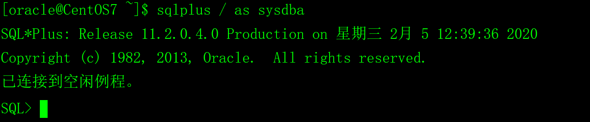
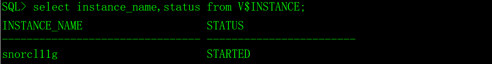
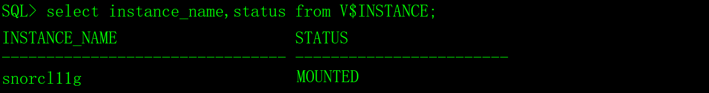
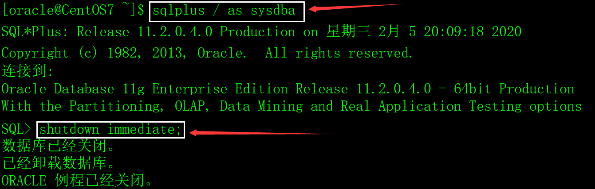

Oracle数据库的启用和关闭需要DBA权限，本文介绍的全部操作由sysdba来执行。

在运行数据库实例的操作系统的shell里执行以下命令就可以获得sysdba权限。

```sql
sqlplus / as sysdba
```



# 一、数据库的启动

Oracle数据库实例的启动要经历三个阶段。

1）nomount：启动实例（Start an instance）。

2）mount：装载数据库（Mount the database）。

3）open：打开数据库（Open the database）。

## 1、启动实例

执行以下命令启动数据库实例：

```sql
startup nomount;
```

 

nomount状态启动Oracle的可执行程序，初始化数据库实例，包括以三步骤：

1）读取参数文件pfile或spfile，pfile是文本文件，spfile是二进制文件，它们的内容相同，只是格式不一样，oracle推荐使用spfile。spfile存放在$ORACLE_HOME/dbs目录下，默认名字是spfile$ORACLE_SID.ora，如/oracle/home/dbs/spfilesnorcl11g.ora。

2）根据参数文件中的参数，分配系统全局区SGA；

3）启动后台进程，包括数据库写入进程DBWR，日志写入进程LGWR，检查点进程CKPT，系统监控进程SMON，进程监控进程PMON，归档进程ARCH等。

SGA和后台进程组合起来组成实例（Oracle Instance）。

执行以下SQL查询实例的状态：

```sql
select instance_name,status from V$INSTANCE;
```

 

## 2、装载数据库

执行以下命令装载数据库：

```sql
alter database mount;
```

装载数据库时打开控制文件（Control File）从控制文件中获得数据文件（Data File）和联机日志文件（Redo Log File）信息把实例和数据库关联起来。

mount状态一般用于DBA对数据库进行维护（如数据恢复），对于普通用户，数据库还是不可访问。

执行以下SQL查询实例和数据库的状态：

```sql
select instance_name,status from V$INSTANCE;

select db_unique_name,open_mode from V$DATABASE;
```

 

 

## 3、打开数据库

执行以下命令打开数据库：

```sql
alter database open;
```

Oracle打开数据文件(Data Files)和联机日志文件(Redo Log File)。这时候数据库可以使用，普通用户可以登录数据库，对数据库进行操作。

执行以下SQL查询实例和数据库的状态：

```sql
select instance_name,status from V$INSTANCE;

select db_unique_name,open_mode from V$DATABASE;
```

 

 

## 4、直接启动数据库

执行startup open命令直接启动数据库，相当于以上三个步骤，open可以省略不写。

```sql
startup open;
```

 

# 二、数据库状态切换

## 1、从open切换到mounted状态

```sql
alter database close;
```

## 2、从mounted切换到started状态

```sql
alter database dismount;
```

## 3、把数据库启动到限制模式（Restrict）

在限制模式下，只有create session和restricted session权限的用户可以访问数据库。

1）如果数据库是关闭的。

```sql
startup restrict;
```

2）如果数据库是开启的。

```sql
alter system enable restricted session;
```

## 4、以只读模式（Read Only）打开数据库

1）如果数据库是关闭的。

```sql
startup open read only;
```

2）如果数据库是mount状态。

```sql
alter database open read only;
```

在直读模式下，数据文件和日志文件都禁止写操作，整个数据库是只读的。但是允许数据库恢复（Database Recovery）及其他不会产生事务的操作。

## 5、把数据库启动到恢复模式（Recover）

```sql
startup open recover;
```

# 三、关闭数据库

## 1、数据库关闭的过程

Oracle的关闭也要经历**关闭数据库**、**卸载数据库**和**关闭实例**三个阶段。

1）关闭数据库（Close the database）

Oracle首先把SGA中的数据写到数据文件和日志文件中，然后再关闭数据文件和联机日志文件。

2）卸载数据库（Dismount the database）

数据库关闭完成之后，Oracle将分离数据库和实例之间的联系，这个阶段叫做“卸载数据库”或者叫“Dismount数据库”。

3）关闭实例（Shut down the instance）

这个阶段Oracle将从释放SGA占用的内存，终止全部的后台服务进程。

## 2、shutdown immediate

 

使用immediate方式关闭数据库时：

1）新的用户不能登录数据库；

2）未提交的事务将会被回滚；

3）Oracle不会等待所有的用户（连接）退出数据库。

特点：

1）这种关闭方式可能会造成数据丢失；

2）数据库重启时不需要实例恢复。

推荐使用immediate方式关闭数据库。

## 3、shutdown transactional

以transactional方式关闭数据库时：

1）不允许新的用户登录数据库；

2）不允许建立新的事务；

3）所有的事务完成以后才关闭数据库；

4）一个用户（会话）执行完当前的事务后将被强行断开与数据库的连接。

特点：

1）这种关闭方式不会造成数据丢失；

2）数据库重启时不需要实例恢复；

3）这是最安全的关闭方式。

## 4、shutdown abort

以abort方式关闭数据库时：

1）不允许建立新的连接和新的事务；

2）客户端的SQL语句立刻终止；

3）未提交的事务不被回滚；

4）Oracle立刻终止所有连接（会话）。

特点：

1）只有数据库出现问题时候，才使用这种方式关闭数据库；

2）这是一种最不安全的关闭方式，数据库重启时需要实例恢复。

## 5、shutdown normal

使用normal方式关闭数据库时：

（1）允许新的用户注登录数据库；

（2）要等所有的用户自动退出Oracle以后，Oracle才关闭数据库。如果有未退出的用户，那么Oracle就一直等待，直到这个用户退出才关闭数据库。

normal是最慢的数据库关闭方式，不推荐。

## 6、重启数据库（Reset）

```sql
startup force;
```

相当于shutdown abort和startup。