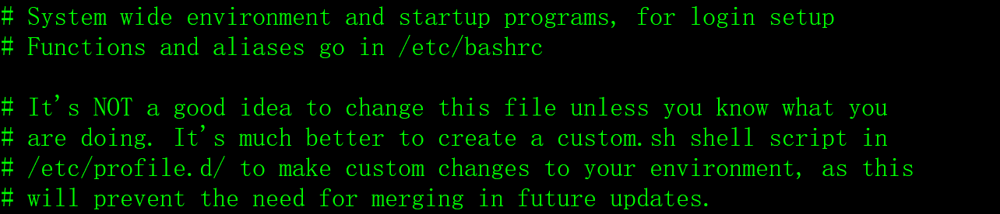

# 一、Oracle环境变量

Oracle数据库的安装和运行都需要环境变量，常用的Oracle环境变量如下。

## 1、ORACLE_HOME

Oracle软件安装的根目录，存放了Oracle的可执行程序、管理工具、函数库、java虚拟机、帮助文档、示例代码等。

## 2、ORACLE_BASE

Oracle实例（数据库）的根目录，存放了实例的控制文件、数据文件、日志文件、审计日志、错误报告等。

## 3、ORACLE_SID

Oracle的实例名。

## 4、NLS_LANG

Oracle客户端的字符集，必须与服务端的Oracle实例保持一致，否则会出现中文乱码。

## 5、PATH

PATH是Linux操作系统的环境变量（可执行程序的搜索目录），在PATH中增加$ORACLE_HOME/bin是为了方便执行Oracle的应用程序。

## 6、LD_LIBRARY_PATH

LD_LIBRARY_PATH是Linux操作系统的环境变量（动态链接库文件的搜索目录），在LD_LIBRARY_PATH中增加$ORACLE_HOME/lib。只有C/C++程序员才关心LD_LIBRARY_PATH环境变量。

## 7、CLASSPATH

CLASSPATH是Linux操作系统的环境变量，在CLASSPATH中增加$ORACLE_HOME/jdk/jre:$ORACLE_HOME/jlib:$ORACLE_HOME/rdbms/jlib，只有java程序员才关心CLASSPATH环境变量。

## 8、其它环境变量

Oracle其它的环境变量意义不大，一般不必设置，如TNS_ADMIN、ORACLE_OWNER、ORACLE_TERM等。

# 二、Oracle环境的配置

在Linux中，配置Oracle环境变量有多种方法，假设环境变量的内容如下：

```sh
export ORACLE_HOME=/oracle/home

export ORACLE_BASE=/oracle/base

export ORACLE_SID=snorcl11g

export NLS_LANG='Simplified Chinese_China. AL32UTF8 '

export PATH=$PATH:$HOME/bin:$ORACLE_HOME/bin:.

export LD_LIBRARY_PATH=$LD_LIBRARY_PATH:$ORACLE_HOME/lib:.

CLASSPATH=$ORACLE_HOME/jdk/jre:$ORACLE_HOME/jlib:$ORACLE_HOME/rdbms/jlib:.

export CLASSPATH
```

## 1、在oracle用户的.bash_profile中配置

如果在oracle用户的.bash_profile中配置Oracle的环境变量，只对oracle一个用户生效。

## 2、在/etc/profile中配置

在/etc/profile文件中配置Oracle的环境变量，可以对全部的用户生效。

但是，/etc/profile文件开始几行的内容如下：

​                               

Linux不建议在/etc/profile文件中配置环境变量。

## 3、在/etc/profile.d中配置

在/etc/profile.d目录中增加环境变量配置文件，如oracle.sh。

如果把Oracle环境变量的配置文件放在/etc/profile.d中，可以对全部的用户生效。

# 三、在sqlplus中实现命令的上翻下翻功能

在Oracle的sqlplus中，使用SQL语句不太方便，sqlplus没有提供类似于shell中命令上翻下翻功能。

安装rlwrap软件包，可以解决sqlplus中命令上翻下翻功能，非常好用。

## 1、安装rlwrap软件包

用root用户执行：

```shell
rpm -Uvh https://dl.fedoraproject.org/pub/epel/epel-release-latest-7.noarch.rpm

yum -y install rlwrap
```

## 2、设置指令的别名

修改.bash_profile文件，增加以下内容：

```shell
alias sqlplus='rlwrap sqlplus'
```

退出登录或执行source .bash_profile就可以了。

OK，试试看，翻页功能，很棒呦。