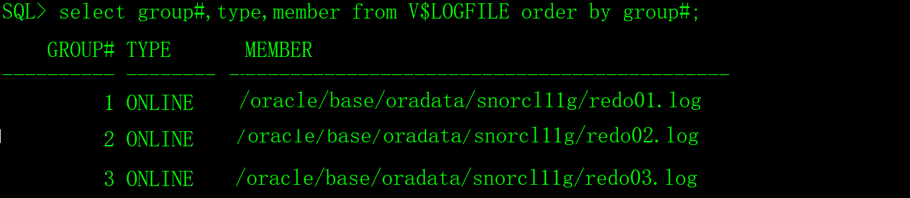
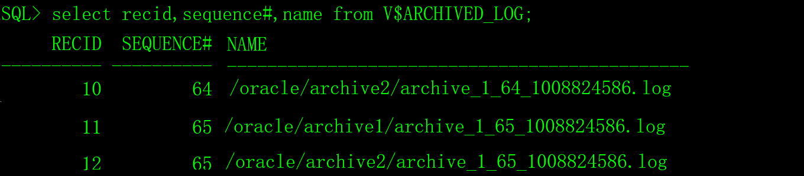
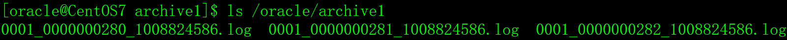

# 一、重做日志

Oracle以SQL脚本的形式实时记录了数据变化的详细日志，这些日志保存在重做日志文件中。根据重做日志文件，可以对数据库进行备份和恢复。在下文中，把重做日志简称为日志。

可以简单的认为，数据库每次在commit之前，会把操作数据的SQL脚本写入日志文件。

日志文件有两种：在线日志和归档日志。

创建Oracle数据库实例的时候，缺省建立三组在线日志，每组一个日志文件。三组日志中只有一组处于活动状态，这组活动的日志也称为当前日志，数据库不断的往当前日志里写入SQL脚本，当前日志写满后，Oracle会切换到下一组日志，继续写入，就这样循环切换。

日志组在切换时，如果数据库是归档模式，则将当前日志文件的内容转存为操作系统文件，成为归档日志；若当前数据库是非归档模式，则不进行归档操作，当前日志文件中的内容会被下一次覆盖。

如果数据库运行在归档模式下，当数据库出现介质失败时，使用备份文件、归档日志和在线日志可以完全恢复数据库。

# 二、日志管理

## 1、查看日志

1）查看日志组和日志文件信息。

```sql
select group#,type,member from V$LOGFILE order by group#;
```



2）查看当前日志组。

```sql
select group#,status,archived from V$LOG order by group#;
```

 

3）查看数据库的日志模式。

方法一：

```sql
archive log list;
```


方法二：

```sql
select name,log_mode from V$DATABASE;
```

 

4）查询已归档的日志文件清单。

```sql
select recid,sequence#,name from V$ARCHIVED_LOG order by sequence#;
```

 

## 2、日志组和日志文件操作

DBA可以增加、删除和移动日志组或日志文件。

1）增加/删除日志组。

语法：

```sql
alter database add logfile group 组编号 ('日志文件名1','日志文件名2',......) size 大小;

alter database drop logfile group 组编号;
```

例如，增加日志组编号为4，本组有两个日志文件/oracle/base/oradata/snorcl11g/redo04_1.log和/oracle/base/oradata/snorcl11g/redo04_2.log，两个文件互为备份，大小为256M。

```sql
alter database add logfile group 4 ('/oracle/base/oradata/snorcl11g/redo04_1.log','/oracle/base/oradata/snorcl11g/redo04_2.log') size 256M;

alter database drop logfile group 4;
```

删除日志组后，要手工的删除磁盘上的日志文件。

```sh
rm /oracle/base/oradata/snorcl11g/redo04_1.log

rm /oracle/base/oradata/snorcl11g/redo04_2.log
```

2）增加/删除日志文件。

语法：

```sql
alter database add logfile member '日志文件名n' to group 组编号;

alter database drop logfile member '日志文件名n';
```

示例：

```sql
alter database add logfile member '/oracle/base/oradata/snorcl11g/redo04_3.log' to group 4;

alter database drop logfile member '/oracle/base/oradata/snorcl11g/redo04_3.log';
```

删除日志组后，要手工的删除磁盘上的日志文件。

```sh
rm /oracle/base/oradata/snorcl11g/redo04_3.log
```

3）移动日志文件。

```sql
alter database rename file '/oracle/base/oradata/snorcl11g/redo04_2.log' to '/oracle/base/oradata/snorcl11g/redo04_4.log';
```

执行该命令之前必须保证该日志文件物理上已经移动到新目录。

## 3、修改日志模式

1）关闭数据库

```sql
shutdown immediate;
```

2）把数据库启动到mount模式。

```shell
startup mount;
```

3）查看日志模式。

```sql
archive log list;
```

 

4）设置归档日志文件存放的目录。

首先，根据您的实际需求，创建用于存放归档日志文件的目录，例如：

```shell
mkdir /oracle/archive1
```

然后，修改数据库参数：

```sql
alter system set log_archive_dest_1='location=/oracle/archive1' scope=spfile;
```

5）修改归档日志文件的格式。

```sql
alter system set log_archive_format='%T_%S_%r.log' scope=spfile;
```

日志文件名缺省是'%t_%s_%r.dbf'，详细的格式含义如下：

> %s 日志序列号。
>
> %S 日志序列号，但带前导0。
>
> %t 日志线程号。
>
> %T 日志线程号，但带前导0。
>
> %a 活动ID号。
>
> %d 数据库ID号。
>
> %r resetlogs的ID值。

6）启用日志归档模式。

```sql
alter database archivelog;
```


7）修改参数后，需要**重启数据库到正常模式**，确认修改后参数。

```sql
archive log list;
```

 

```sql
show parameter log_archive_format;
```

 

8）手工切换在线日志。

```sql
alter system switch logfile;
```

用DBA执行以上命令，不管当前日志是否写懣，都立即归档。

 

 

9）禁用日志归档模式。

```sql
alter database noarchivelog;
```

## 4、归档日志的清理

如果Oracle启用了日志归档模式，必须保证有足够的磁盘空间存放归档日志文件，如果空间不足，在线日志不能归档，也不会切换，数据库将暂停运行，错误代码为ORA-00257。

所以，归档日志文件要定期清理，运维人员经常用shell脚本加crontab任务的方法清理归档日志文件，但是，对我们程序员来，写程序清理是最好的方法。归档日志文件切换频率由数据库事务操作的繁忙程度决定的，只保留最近n个文件，其它的全部清理。

# 三、归档/非归档模式优缺点

## 1、归档模式的优点

1）可以进行完全、不完全恢复

由于对数据库所做的全部改动都记录在日志文件中，如果发生硬盘故 障等导致数据文件丢失的话，则可以利用物理备份和归档日志完全恢复数据库，不会丢失任何数据。

2）可以进行联机热备

所谓联机热备，就是在数据库运行状态下，对数据库进行备份。备份时用户对 数据库的使用不受任何影响。

3）可以实施 Data Guard

可以部署 1 个或多个备用数据库，从而最大限度地提供灾难保护手段。

4）可以实施 Stream

利用 Stream 技术，可以实现最简单的单向复制到复杂的双向复制、多向复制， 提供更加灵活的数据冗余方案。

5）表空间可以脱机

可以备份部分数据库，比如重要的表空间。

6）能够增量备份

只需做一次完全备份，以后只备份发生改变的数据，可以提高备份速度。

7）更多的优化选项

随着 Oracle 版本升级，在联机热备方面不断有新的优化策略出现。

## 2、归档模式的缺点

1）需要更多的磁盘空间保存归档日志；

2）DBA会有更多的管理工作，包括维护归档空间、备份归档日志。

## 3、非归档模式的优点

1）DBA 的管理工作减少，因为非归档模式不产生归档日志，因此 DBA 不用考虑对归档的管理；

2）性能会有微弱的提升。

## 4、非归档模式的缺点

1）只能进行脱机备份，也就是所谓的“ 冷备份”，和联机备份的“ 热备份” 相对应，数据库必须完全 关闭后备份，在备份过程中数据库不可用；

2）必须备份整个数据库，不能只备份部分数据库；

3）不能增量备份，对于 TB 级数据库（VLDB） ，这是一个非常大的缺点；

4）只能部分恢复，如果数据文件丢失需要恢复，DBA 只能恢复最后一次的完全备份，而之后的所有 数据库改变全部丢失。

非归档模式不生成归档日志，从数据安全角度来说，这种模式缺点是主要的，而优点可以忽略不计。