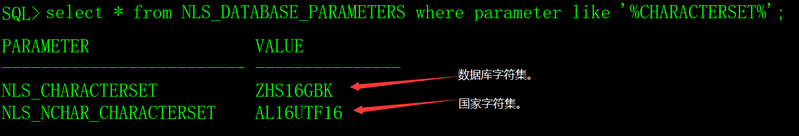
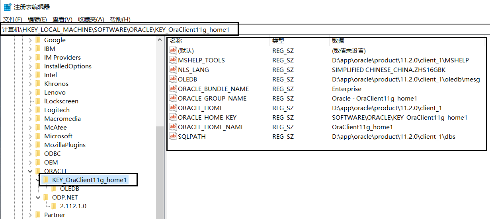

# 一、字符集的概念

## 1、字符编码（character encoding）：

字符编码是一种法则，在数字与符号之间建立的对应关系。不同的国家有不同的语言，包含的文字、标点符号、图形符号各有不同。例如在ASCII编码中，用数字97表达字符'a'与字符集相对应，常见的字符编码有ASCII，GBK，GB18030，Unicode等。

## 2、字符集（Character set）

字符集是字符的集合，字符是文字和符号的总称，用ASCII编码的字符集称之为ASCII字符集，用GBK编码的字符集称之为GBK字符集。

## 3、国际编码（Unicode）

为了解决传统的字符编码方案的局限，1994年发布了Unicode（国际编码、统一码、万国码、单一码、通用码），它是计算机科学领域里的一项业界标准，包括字符集、编码方案等。Unicode 将全世界所有的字符统一化，统一编码，再也不存在字符集不兼容和字符转换的问题。

Unicode 有以下三种编码方式：

1）UTF-8：兼容ASCII编码；拉丁文、希腊文等使用两个字节；包括汉字在内的其它常用字符使用三个字节；剩下的极少使用的字符使用四个字节。

2）UTF-16：对相对常用的60000余个字符使用两个字节进行编码，其余的使用4字节。

3）UTF-32：固定使用4个字节来表示一个字符，存在空间利用效率的问题。

## 4、汉字的编码

支持汉字（简体中文）的编码有GB2312、GB13000、GBK、GB18030和Unicode（UTF-8、UTF-16、UTF-32）。

1）GB2312

仅包含大部分的常用简体汉字，但已经不能适应现在的需要。

2）GB13000

由于GB2312的局限性，国家标准化委员会制定了GB13000编码； 但由于当时的硬件和软件都已经支持了GB2312，而GB13000与GB2312完全不兼容，所以没有能够得到大范围的推广使用。

3）GBK

有了GB13000的教训，中国国家标准化委员会制定了GBK标准，并兼容了GB2312标准，同时在GB2312标准的基础上扩展了GB13000包含的字； 由于该标准有微软的支持，得到了广泛的应用。

4）GB18030

GB18030编码比GBK又新增了几千个汉字，但由于码位不足使用了2byte与4byte混合编码方式，这给软件开发增加了难度。

5）Unicode

包含全世界所有国家需要用到的字符，是国际编码，通用性强。

## 5、汉字的编码选择

在操作系统和数据库中，常用的汉字编码有GBK、GB18030和Unicode，GBK和GB18030的优势是占用空间小，Unicode的优势是全球化的支持。

在应用开发中，如果不考虑全球化，最好的选择是GBK和GB18030。

## 6、编码的转换

GBK和GB18030与Unicode编码之间需要转换，否则会出现汉字乱码。

# 二、Oracle的字符集

## 1、字符集和国家字符集

字符集在创建数据库实例时指定，可以指定字符集（CHARACTER SET）和国家字符集（NATIONAL CHARACTER SET）。

1）字符集（CHARACTER SET）

用来存储char、varchar2、clob、long等类型数据，还可以用来标识表名、列名以及PL/SQL变量等。

2）国家字符集（NATIONAL CHARACTER SET）

用以存储nchar、nvarchar2、nclob等类型数据。国家字符集实质上是为Oracle选择的附加字符集，主要作用是为了增强字符处理能力，因为nchar数据类型可以提供对亚洲使用定长多字节编码的支持，而数据库字符集则不一定能。国家字符集只能在unicode编码中的AF16UTF16和UTF8中选择，默认值是AF16UTF16。

## 2、支持中文的字符集

Oracle支持汉字（简体中文，繁体不介绍）的字符集有多种，常用的有ZHS16GBK、UTF8、AL32UTF8和AL16UTF16。

1）ZHS16GBK

表示简体中文，一个字符需要16位比特，采用GBK编码标准。

 2）UTF8

Oracle从8i版本开始使用的属于UTF-8编码的字符集，采用的Unicode标准为3.0，在11.2版本中，UTF8已经不是推荐字符集列表中的一员了。

3）AL32UTF8

与UTF8相比，它采用的Unicode版本更新，在10g版本中使用的是Unicode 4.01标准，而UTF8因为兼容性的考虑，在10g版本中用的是Unicode 3.0标准。

4）AL16UTF16

是ORACLE第一种采用UTF-16编码方式的字符集，从ORACLE9开始使用，是作为缺省的国家字符集使用，它不能被用作数据库的字符集。

## 3、NLS_LANG参数

Oracle数据库字符集最重要的参数是NLS_LANG参数。

格式: NLS_LANG='language_territory.charset'，不区分大小写，例如' SIMPLIFIED CHINESE_CHINA.ZHS16GBK'。

它有三个组成部分：语言（language）、地域（territory）和字符集（charset）。

其中:

language：数据库服务器提示信息的语言。

territory：数据库的日期和数字格式，意义不大。

charset：数据库的字符集。

真正影响数据库字符集的其实是第三部分charset，两个数据库之间的字符集只要第三部分相同，交换数据时中文不会出现乱码。language影响的只是提示信息是中文还是英文。

# 三、服务端的字符集

## 1、查看服务端字符集

执行以下SQL可以查看服务端的字符集。

```sql
select * from NLS_DATABASE_PARAMETERS where parameter like '%CHARACTERSET%';
```



执行以下SQL也可以查看客户端的字符集。

```sql
select userenv('language') from dual;
```

 

## 2、修改服务端字符集

Oracle数据库实例创建后，如果没有开始业务运行，可以修改字符集，如果已经业务化运行，不建议修改字符集，会造成数据中的汉字乱码。

用DBA权限，执行以下步骤修改Oracle数据库的字符集（例如修改为ZHS16GBK）。

1）修改服务端操作系统的NLS_LANG环境变量。

```sh
export NLS_LANG='Simplified Chinese_China.ZHS16GBK'
```

2）关闭Oracle数据库。

```sql
shutdown immediate;
```

3）把数据库启动到mount状态。

```sql
startup mount;
```

4）把数据库改为restricted模式。

```sql
alter system enable restricted session;

alter system set job_queue_processes=0;

alter system set aq_tm_processes=0;
```

5）打开数据库。

```sql
alter database open;
```

6）修改数据库的字符集。

```sql
alter database character set internal_use ZHS16GBK;
```

7）重启数据库。

```sql
shutdown immediate;

startup;
```

# 四、客户端的字符集

Oracle客户端的字符集必须与服务端相同，否则中文会出现乱码。

## 1、Linux环境

客户端的字符集由NLS_LANG环境变量控制。

1）查看NLS_LANG环境变量。

```sh
env|grep NLS_LANG
```

 

2）设置环境变量

修改环境变量参数文件（系统或用户的profile文件）。

```sh
export NLS_LANG='Simplified Chinese_China.ZHS16GBK'
```

## 2、Windows环境

打开注册表（ 执行regedit.exe）

```sh
HKEY_LOCAL_MACHINE -> SOFTWARE -> ORACLE -> KEY_OraClient11g_home1
```

 

# 五、应用经验

1）数据库在业务化之前，就应该确定Oracle的字符集，然后不再改变。数据库在业务化后，修改字符集是一件很麻烦的事情，最好别惹这个麻烦。

2）如果项目没有全球化的需求，数据库字符集建议采用ZHS16GBK，操作系统语言建议采用gbk。

3）只要把客户端和服务端设置成相同的字符集，就不会有乱码，没什么技术难点。

4）虽然GB18030字符集比GBK更丰富，但是GB18030中有部分汉字是4字节，这一点让程序员很郁闷，所以，程序员更倾向GBK字符集。