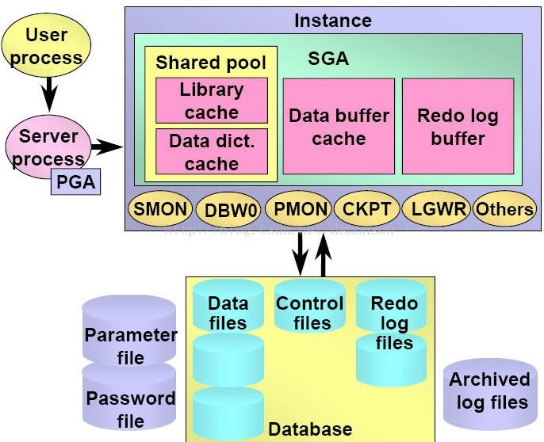
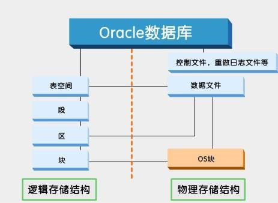

# 一、概述

Oracle的体系结构是数据库的组成、工作过程，以及数据库中数据的组织和管理机制，包含一系列组件（软件）、用户进程（User process）、服务进程（Server process、PGA）、SGA（共享池、数据缓存、日志缓冲区）、后台进程（SMON、DBWn、PMON、CKPT、LGWR、其它进程）、参数文件（Parameter file）、密码文件（Password）、数据文件（Data files）、控制文件（Control files）、在线重做日志文件（Redo log files）、归档日志文件（Archived log files）。

# 二、用户进程和服务进程

## 1、用户进程

用户进程（User process），是指用户通过客户端，比如SQL Plus、PL/SQL Developer、SQL Load、应用程序等工具连接上Oracle数据库而产生的进程。用户进程处理用户输入并与服务器进程通信。用户进程还负责表现用户请求的信息，必要时可以将信息处置成更可用的形式。

## 2、服务进程

服务进程（Server Process），当客户端发起连接时，Oracle创建一个用户进程来处理这个连接。

用户进程启动后，Oracle还会创建一个服务进程来处理连接到实例的用户进程提交的请求。用户进程连接到数据库并创建一个会话时，Oracle服务器进程会分配专门用于当前用户会话的内存区，即PGA区，该区域是私有的，当进程创建时分配，进程结束后被释放，只能被一个服务进程使用。

以客户端执行一条SQL为例：

1）服务进程接收SQL语句；

2）服务进程去共享池找SQL和执行计划，如果没找到，则解析SQL；

3）服务进程根据执行计划去数据缓存中找相关的数据，如没有才到数据文件中取出数据放到数据缓存中，再返给客户端；

4）若需要修改数据，服务进程把数据读取到数据缓存后再修改数据，修改后返给客户端。

用户进程与服务器进程可以是一对一的关系（配置为专用服务器模式时）。一个服务器也可连接多个用户进程（配置为多线程服务器时），但这样做会减少对系统资源的占用。

# 三、系统全局区SGA

系统全局区SGA（System Global Area），是Oracle实例的重要组成部分，在实例启动时分配，是一组包含Oracle数据和控制信息的[共享内存](https://baike.baidu.com/item/共享内存/2182364)。一个SGA只属于一个实例，也就是说，当一个服务器上有多个实例运行时，每个实例都有一个自己的SGA，实例之间不能相互访问。SGA包括共享池（Share pool）、数据缓存（Data buffer cache）和重做日志缓冲区（Redo log buffer），其中共享池又包括Library cache（库缓存）和Data dict cache（数据字典缓存）。

# 四、后台进程

Oracle后台进程是一组运行于Oracle服务器端的后台程序，也是Oracle实例的重要组成部分。这些后台进程分别完成不同的功能。其中SMON、PMON、DBWR、LGWR和CKPT这5个后台进程必须正常启动，否则数据库实例无法工作。此外，还有很多辅助进程，用于实现辅助的功能，如果这些辅助进程发生问题，只会使某些功能受到影响，数据库实例仍是可用的。

1）数据写入进程（DBWR）

 数据写入进程的主要任务是负责将内存中的“脏”数据块回写到数据文件中。“脏”数据块是指高速数据缓冲区中的被修改过的数据块，这些数据块的内容与数据文件的数据块内容不一致。但DBWR并不是随时将所有的“脏”数据块都写入数据文件，只有满足一定的条件时，DBWR进程才开始成批量的将“脏”数据块写入数据文件Oracle这样做的目的是为了尽量减少I/O操作，提高Oracle服务器性能。

2）检查点进程（CKPT）

检查点进程可以看作一个事件，当检查点事件发生时，CKPT会要求DBWR将某些“脏”数据块回写到数据文件。当用户进程发出数据请求时，Oracle系统从数据文件中读取需要的数据并存放到高速数据缓冲区中，用户对数据的操作时在缓冲区中进行的。当用户操作数据时，就会产生大量的日志信息并存储在重做日志缓冲区，当Oracle系统满足一定条件时，日志写入进程（LGWR）会将日志信息写入到重做日志文件组中，当发生日志切换时（写入操作正要从一个日志文件组切换到另一组时），就会启动检查点进程。

另外，DBA还可以通过修改初始化参数文件SPFILE中的CHECKPOINT_PROCESS参数为TRUE来启动检查点进程。

3）日志写入进程（LGWR）

日志写入进程用于将重做日志缓冲区中的数据写入重做日志文件。Oracle系统将用户所做的修改日志信息写入日志文件，然后将修改结果写入数据文件。

Oracle实例在运行中会产生大量日志信息，这些日志信息首先被记录在SGA的重做日志缓冲区中，当发生提交命令、或者重做日志缓冲区的信息满1/3、或者日志信息存放超过3秒钟时，LGWR进程就将日志信息从重做日志缓冲区中读出并写入日志文件组中序号较小的文件中，一个日志组写满后接着写另外一组。当LGWR进程将所有䣌日志文件都写过一遍后，它将再次转向第一个日志文件组重新覆盖。

4）归档进程（ARCH）

归档进程是一个可选择的进程，只有当Oracle数据库处于归档模式时，该进程才可能起到作用。若Oracle数据库处于归档模式，当各个日志文件组都被写满即将被覆盖之前，先由归档进程（ARCH）把即将覆盖的日志文件中的日志信息读出，然后再把这些“读出的日志信息”写入到归档日志文件中。

当系统比较繁忙而导致LGWR进程处于等待ARCH进程时，可通过修改LOG_ARCHIVE_MAX_PROCESSES参数启动多个归档进程，从而提高归档写磁盘的速度。

5）系统监控进程（SMON）

系统监控进程是在数据库启动时执行恢复工作的强制性进程。比如，在并行服务器模式下，SMON可以恢复另一个处于失败的数据库，使系统切换到另外一台正常的服务器上。

6）进程监控进程（PMON）

进程监控进程用于监控其他进程的状态，当有进程启动失败时，PMON会清除失败的用户进程，用于数据不一致时进行恢复工作。

7）锁定进程（LCKN）

这是一个可选进程，并行服务器模式下可以出现多个锁定进程以利于数据库通信。

8）恢复进程（RECO）

这是在分布式数据库模式下使用的一个可选进程，用于数据不一致时进行恢复工作。

9）调度进程（DNNN）

 这是一个可选进程，在共享服务器模式下使用，可以启动多个调度进程。

10）快照进程（SNPN）：

快照进程用于处理数据库快照的自动刷新，并通过DBMS_JOB包运行预定的数据库存储过程。

# 五、存储结构

Oracle分为逻辑存储结构和物理存储结构，逻辑存储结构用来描述Oracle内部组织和管理数据的方式，是一种层次结构，是面向用户的；物理存储结构是实际的数据存储单元，就是数据库存放在操作系统上的文件。

 

## 1、逻辑存储结构

Oracle数据库中的数据文件被分组到一个或多个表空间中。在每个表空间中，逻辑数据库结构（如表和索引）都是片段，被进一步细分为“盘区”（extent）和“块”（block）。这种存储的逻辑细分c让Oracle更有效的控制磁盘。

1）表空间

表空间是Oracle数据库的最大逻辑划分区域，常用来存放数据表，索引等数据对象，任何实体对象在创建时必须指定表空间。

表空间与数据文件相对应，一个表空间由一个或多个数据文件组成，一个数据文件只属于一个表空间。

Oracle数据的存储空间在逻辑上变现为表空间而在物理上表现为数据文件，表空间相当于文件夹，数据文件相当于文件夹中的文件。

2）段

数据库中的下一个逻辑分组级别是段。段是一组盘区，这组盘区组成了被Oracle视为一个单位的数据库对象，如表或索引。因此，段一般是数据库终端用户要处理的最小存储单位。Oracle数据库中可看到4种类型的段：数据段（非分区表和分区表的每个分区）、索引段、临时段和回滚段。

3）盘区

它由一个或多个数据库块组成。当扩大数据库对象时，为该对象添加的空间将分配为一个盘区。

4）块

数据库块是Oracle数据库最小的存储单位。块的大小是数据库内给定表空间中特定数量的存储字节。默认块大小是8KB。

## 2、物理存储结构

1）数据文件

数据文件用于存储数据库中的所有数据，包含系统数据、数据字典数据、临时数据、索引数据、应用数据等。

安装Oracle数据库时系统会自动为数据库创建几个数据文件，用户对数据库的操作本质是对数据文件的操作。一个表空间可以对应多个数据文件，一个数据文件只能从属于一个表空间。在逻辑上，数据对象都存放在表空间中，实质上是存放在空间对应的数据文件中。

2）控制文件

每个Oracle数据库有一组控制文件(control file)，用于记录和描述数据库的物理存储结构信息，包含数据库名、数据库数据文件和日志文件的名字和位置和数据库的时间戳。

3）参数文件

参数文件用于设置数据库启动时的参数初始值。

4）密码文件：

用于保存具有SYSDBA、SYSOPER权限的用户名和SYS用户密码。

5）日志文件

Oracle以SQL脚本的形式实时记录了数据变化的详细日志，这些日志保存在重做日志文件中。根据重做日志文件，可以对数据库进行备份和恢复。

日志文件有两种：在线日志和归档日志。

创建Oracle数据库实例的时候，缺省建立三组在线日志，每组一个日志文件。三组日志中只有一组处于活动状态，这组活动的日志也称为当前日志，数据库不断的往当前日志里写入SQL脚本，当前日志写满后，Oracle会切换到下一组日志，继续写入，就这样循环切换。

日志组在切换时，如果数据库是归档模式，则将当前日志文件的内容转存为操作系统文件，成为归档日志；若当前数据库是非归档模式，则不进行归档操作，当前日志文件中的内容会被下一次覆盖。

如果数据库运行在归档模式下，当数据库出现介质失败时，使用备份文件、归档日志和在线日志可以完全恢复数据库。

6）跟踪文件

用户记录用户进程、数据库后台进程的运行情况。