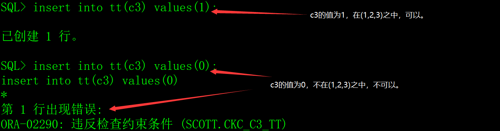

# 一、表的概念

表是数据库最基本的逻辑结构，一切数据都存放在表中，其它数据库对象（索引、视图、同义词等）都是为了更方便的操作表中的数据。Oracle数据库是由若干个表组成，每个表由列和行组成，如下表所示。


| 编号 | 姓名       | 颜值 | 身材       | 体重 | 身高 | 出生时间            | 备注                                                       |
| ---- | ---------- | ---- | ---------- | ---- | ---- | ------------------- | ---------------------------------------------------------- |
| 0101 | 西施       | 漂亮 | 火辣       | 48.5 | 170  | 2000-01-01 01:12:35 | 这是一个非常漂亮姑娘，老公是夫差，男朋友是范蠡。           |
| 0102 | 貂禅       | 漂亮 | 火辣       | 45.2 | 168  | 1997-08-02 12:20:38 | 王允真不是男人，干不过董卓就把美人往火坑里推，千古罪人啊。 |
| 0103 | 妲已       | 漂亮 | 丰满       | 53.6 | 172  | 1998-03-03 10:50:33 | 如果商真的因我而亡，您们男人做什么去了？                   |
| 0104 | 芙蓉  姐姐 | 猪扒 | 膘肥  体壮 | 85.8 | 171  | 1980-05-05 10:11:55 | 如果不努力学习技术，将来就会娶个芙蓉姐姐，哼哼。           |
| 0105 | 神密  猫女 |      |            | 48.5 | 171  | 1989-12-08 12:10:35 | 不知道是什么人，她脸上有一个%符号，很神密。                |


## 1、表的列

表的结构是由列组成，习惯上把列也称之为字段，字段的基本属性如下：

1）字段名：字段的名称。

2）数据类型：该字段存放数据的类型和长度。

3）是否允许空值：该字段是否为必填，如果不是必填，表示可以为空。

## 2、列的数据类型 

表的每个列一定会有它的数据类型，表示该列存放的是什么数据，常用的数据类型如下：

1）字符串类型：char和varchar2，可表达任何字符串。

2）数字类型：number(m,n)，可表达任何数字，m是数字的总长度，n是小数点后的位数，如果n为0则表示是存放整数。

3）日期类型：date，存放日期和时间，包括年（yyyy）、月（mm）、日（dd）、小时（hh24）、分（mi）、秒（ss）。

4）clob类型，存放单字节字符串或多字节字符数据，如文本文件、xml文件。

5）blob类型，存放非结构化的二进制数据，如图片、音频、视频、office文档等。

6）rowid类型，存放表中记录在数据库中的物理地址。

更详细的介绍请阅读《Oracle数据类型》文章。

## 3、表的行

表中的数据是由行组成的，每一行就是一条数据，也称之为记录，数据越多，记录就越多。

# 二、创建表

## 1、创建表

Oracle数据库创建表是用create table命令来完成的，我们通过创建T_GIRL表（超女基本信息表）来讲解create table 命令的使用。

建表命令如下：

```sql
create table 表名

(

 字段名1 数据类型 null,

 字段名2 数据类型 not null,

 ......,

 字段名n 数据类型 null

);
```

表名是标识符，从语法上来说，表名只要符合Oracle的规定就行了，但是，在实际开发中，我会遵守两个原则：1）表名以T_打头，可读性比较好；2）表名尽可能有意义，用完整的英文单词或简写、或中文拼音都可以，方便理解和记忆就好。

创建超女基本信息表：

```sql
create table T_GIRL

(

 id    char(4)     not null,  -- 编号

 name   varchar2(30)  not null,  -- 姓名

 yz    varchar2(20)    null,  -- 颜值

 sc    varchar2(20)    null,  -- 身材

 weight  number(4,1)   not null,  -- 体重

 height  number(3)    not null,  -- 身高

 birthday date      not null,  -- 出生时间

 memo   varchar2(1000)   null  -- 备注

);
```


注意：1）在Oracle数据库的SQL命令中，关键字、表名和字段名都不区分大小写，CREATE和create没有区别，表名T_GIRL和t_girl也没有区别，字段名ID和id也没有区别；2）两根短线“--”是说明文字，就像C/C++语言中的“//”。

## 2、创建表的主键

在现实世界中，很多数据具有唯一的特性，例如身份证号码，在国家人口基本信息表中，一定不会存在多个人用同一个身份证号码的情况，再例如手机号码、QQ号码、银行帐号等等，还有学生管理系统，学生的年级、班级和学号三个字段组合起来是唯一的标识。

如果表中一个字段或多个字段组合起来的值是唯一的，就可以作为表的主键，在创建或修改表时用primay key关键字来指定主键。一个表只能有一个主键，而且组成主键的每个字段值都不能为[空](https://baike.baidu.com/item/空值)。

主键的作用：

1）体现数据结构设计的合理性。

2）提升数据操作的速度。

3）保证数据的完整性，在表中添加或修改记录时，数据库会检查该记录主键的值，不允许与其它记录主键的值重复，这种做法有个专业的名词：主键约束。

例如超女基本信息表，编号的字段名是id，在超女选秀活动中，每个超女的编号肯定是唯一的，不可能存在两个编号相同的超女，否则会引起混乱，我们可以把id字段设置为T_GIRL表的主键，后面的工作交给数据库，如果试图往表中插入多条id相同的记录，数据库将拒绝。

指定表的主建有两种方法。

1）在create table时指定。

```sql
create table T_GIRL

(

 id    char(4)     not null,  -- 编号

 name   varchar2(30)  not null,  -- 姓名

 yz    varchar2(20)    null,  -- 颜值

 sc    varchar2(20)    null,  -- 身材

 weight  number(4,1)   not null,  -- 体重

 height  number(3)    not null,  -- 身高

 birthday date      not null,  -- 出生时间

 memo   varchar2(1000)   null,  -- 备注

 primary key(id)            -- 指定id为表的主键

);
```

2）修改已经建好的表，增加主键约束。

alter table 表名 add constraint 主键名 primary key(字段名1,字段名2,......字段名n);

例如：

```sql
alter table T_GIRL add constraint PK_GIRL primary key(id);
```

在Oracle数据库中，虽然主键不是必需的，但是最好为每个表都设置一个主键，不管是单字段主键还是多字段主键（复合主键），它的存在代表了表结构的完整性，主键还可以用于其他表的外键关联，外键的知识以后再介绍。

# 三、表记录的插入、修改和删除

## 1、向表中插入记录

insert into命令用于向表中插入记录，语法如下：

insert into 表名 (字段名1, 字段名2,...... 字段名n) values (字段1的值, 字段2的值,..... 字段n的值);

注意，表名后的字段名列表与values后面字段值列表必须一一对应。

例如：

```sql
insert into T_GIRL(id,name,yz,birthday,sc,weight,height,memo)

 values('0101','西施','漂亮',to_date('2000-01-01 01:12:35','yyyy-mm-dd hh24:mi:ss'),

​     '火辣',48.5,170,'这是一个非常漂亮姑娘，老公是夫差，男朋友是范蠡。');

insert into T_GIRL(id,name,yz,birthday,sc,weight,height,memo)

 values('0102','貂禅','漂亮',to_date('1997-08-02 12:20:38','yyyy-mm-dd hh24:mi:ss'),

​     '苗条',45.2,168,'王允真不是男人，干不过董卓就把美人往火坑里推，千古罪人啊。');

insert into T_GIRL(id,name,yz,birthday,sc,weight,height,memo)

 values('0103','妲已','漂亮',to_date('1998-03-03 10:50:33','yyyy-mm-dd hh24:mi:ss'),

​     '火辣',53.6,172,'如果商真的因我而亡，您们男人做什么去了？');

insert into T_GIRL(id,name,yz,birthday,sc,weight,height,memo)

 values('0104','芙蓉姐姐','猪扒',to_date('1980-05-05 10:11:55','yyyy-mm-dd hh24:mi:ss'),

​     '膘肥体壮',85.8,166,'如果不努力学习技术，将来就会娶个芙蓉姐姐，哼哼。');

insert into T_GIRL(id,name,yz,birthday,sc,weight,height,memo)

 values('0105','神密猫女',null,to_date('1989-12-08 12:10:35','yyyy-mm-dd hh24:mi:ss'),

​     null,48.5,171,'不知道是什么人，她脸上有一个%符号，很神密。');
```

在上面的insert语句中，字段的值如果是字符串，要用单引号包含起来，日期字段要用to_date函数转换，数字直接书写。

插入数据的SQL语句还有一种写法，如下：

```sql
insert into 表名 values (字段1的值, 字段2的值,..... 字段n的值);
```

这种写法省略了字段名列表，但是，这种写法一定不能出现在程序中，因为只要表结构发生改变，或字段的位置改变，SQL语句就会出错。

## 2、查询表中的记录

select命令用于从表中查询记录，语法如下：

```sql
select 字段名1,字段名2,......字段名n from 表名 where 条件1 and 条件2 ...... 条件n;
select * from 表名 where 条件1 and 条件2 ...... 条件n;
```

例如：

```sql
select name,to_char(birthday,'yyyy-mm-dd hh24:mi:ss') from T_GIRL where yz='漂亮' and sc='火辣';
```

在select关键字之后，可以用星号表示全部的字段。

```sql
select * from T_GIRL where yz='漂亮' and sc='火辣';
```

在上面的SQL语句中，用星号*表示列出全部的字段，这种写法一定不能出现在程序中，因为只要表结构发生改变，或字段的位置改变，程序就会出现混乱。

where关键字后面的条件表达式涉及的知识非常多，以后再详细介绍。

## 3、修改表中的记录

update命令用于修改表中的记录，语法如下：

```sql
update 表名 set 字段名1=值1,字段名2=值2,......字段名n=值n where 条件1 and 条件2 ...... 条件n;
```

在set关键字之后把需要修改的字段名和新的值一一列出来。

where关键字后面是条件表达式，如果没有条件表达式，就会更新表中全部的记录。

超女选秀活动开始后，芙蓉姐姐体重反弹了3公斤，像个大恐龙，出生日期也有隐瞒，组委会修改了她的基本资料，如下：

```sql
update T_GIRL set weight=89.5,yz='恐龙',birthday=to_date('1978-01-01 01:12:35','yyyy-mm-dd hh24:mi:ss') where name='芙蓉姐姐';
```

## 4、删除表中的记录

delete命令用于删除表中的记录，语法如下：

```sql
delete from 表名 where 条件1 and 条件2 ...... 条件n;
```

where关键字后面是条件表达式，如果没有条件表达式，就删除表中全部的记录。

随着超女选秀活动的继续，芙蓉姐姐的体重在持续反弹中，组委会实在受不了了，决定把芙蓉姐姐除名。

```sql
delete from T_GIRL where name='芙蓉姐姐';
```

# 四、表的约束

表的约束有非空约束、唯一性约束、检查约束、主建约束和外键约束四种，主键约束和外键约束涉及到数据结构方面的知识，以后再介绍。

## 1、非空约束

创建表的时候，可以指定字段的值是否允许为空，缺省是null允许为空（表示是可选字段），not null不允许为空（表示是必填字段）。

例示：

```sql
create table tt (c1 varchar2(10),c2 varchar2(10) not null);
```

创建表tt，c1字段允许为空，c2字段不允许为空。

​                               

## 2、唯一性约束

唯一性约束有两种，一种是表的主键，另一种是表的唯一索引，唯一索引以后再介绍。

表的主键字段不允许存在值相同的记录。

```sql
create table tt (id varchar2(10),name varchar2(10),primary key(id));
```

创建表tt，id字段是主键。

 

## 3、检查约束

检查约束是指检查字段的值是否合法。

示例：

```sql
create table TT 

(

  c1  number(6) constraint CKC_C1_TT check (c1 >= 10), 

  c2  number(6) constraint CKC_C2_TT check (c2 <= 20), 

  c3  number(6) constraint CKC_C3_TT check (c3 in (1,2,3))

);
```

创建表TT，c1字段的最小值是10，c2字段的最大值是20，C3字段的取值必须在(1,2,3)中取其一。

 

 

# 五、字段的缺省值

在创建表的时候，可以为字段指定缺省值。

示例：

```sql
create table TT

(

  name   varchar2(10) not null,

  crttime date     default sysdate not null,

  rsts   number(1)  default 1 not null constraint CKC_RSTS_TT check (rsts in (1,2))

);
```

创建表，字段crttime的缺省值是sysdate（当前时间），rsts的缺省值是1。

 

# 六、表的存储空间

每个数据库用户有一个缺省表空间，创建的表、主键和索引存放在缺省表空间中，也可以指定其它的表空间。

## 1、查看当前用户的缺省表空间

从数据字典USER_USERS中可以查看当前用户的缺省表空间。

 

## 2、指定表的表空间

指定表空间的语法如下：

```sql
create table 表名

(

 ......  -- 字段列表

) tablespace 表空间名;
```

例如创建T_GIRL表，指定使用USERS表空间。

```sql
create table T_GIRL

(

 id    char(4)     not null,  -- 编号

 name   varchar2(30)  not null,  -- 姓名

 yz    varchar2(20)    null,  -- 颜值

 sc    varchar2(20)    null,  -- 身材

 weight  number(4,1)   not null,  -- 体重

 height  number(3)    not null,  -- 身高

 birthday date      not null,  -- 出生时间

 memo   varchar2(1000)   null  -- 备注

) tablespace USERS;
```

表还有其它与存储相关的选项，但应用场景比较少，本文就不介绍了。

# 七、修改表结构


Oracle修改表的命令是alter table，它的选项非常多，本文只介绍修改表结构的相关知识。

## 1、增加字段

语法：

alter table 表名 add 字段名 数据类型 其它选项;

例如：

```sql
alter table T_GIRL add address varchar2(50) null;

alter table T_GIRL add rsts number(1) constraint CKC_RSTS_GIRL check (rsts in (1,2));
```

## 2、修改字段的属性

语法：

```sql
alter table 表名 modify 字段名 数据类型 其它选项;
```

例如：

```sql
alter table T_GIRL modify address varchar2(100);

alter table T_GIRL modify address varchar2(100) not null;

alter table T_GIRL drop constraint CKC_RSTS_GIRL;

alter table T_GIRL modify rsts constraint CKC_RSTS_GIRL check (rsts in (1,2,3));
```

修改字段属性的时候要注意一个问题，如果表中已存在数据，修改可能会失败，包括但不限于以下的情况：

1）把字段由null改为not null时，表中记录存在null的情况。

2）把字段的取值范围由较大（例如number(10)）改较小（例如number(5)），表中记录存在大于较小取值范围的情况，例如已经存在123456的值，如果把数据类型改为number(5)，无法存放123456。

3）把字段的数据类型时，表中存在记录并且新旧数据类型不兼容的情况。例如原来的数据类型是varchar2(10)，表中存在记录的值是'freecplus'，如果要修改为number(10)，Oracle无法把'freecplus'转换为number(10)。

## 3、修改字段名

语法：

```sql
alter table 表名 rename column 列名 to 新列名;
```

例如：

```sql
alter table T_GIRL rename column memo to remark;
```

## 4、删除字段

语法：

```sql
alter table 表名 dorp column 字段名;
```

例如：

```sql
alter table T_GIRL drop column rsts;

alter table T_GIRL drop column address;
```

# 八、修改表名

语法：

```sql
alter table 表名 rename to 新表名;
```

例如：

```sql
alter table T_GIRL rename to T_BEAUTY;
```

注意，如果修改了表名，表的约束、索引、主键的名称不会改变。

# 九、删除表

语法：

```sql
drop table 表名;
```

示例：

```sql
drop table T_GIRL;
```

