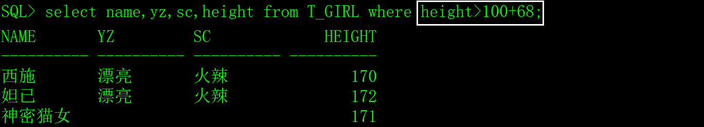

where子句用于从表中或临时数据集中查找满足指定条件的记录，可用于select、update和delete语句中的条件。

# 一、生成测试数据

用以下SQL创建超女基本信息表（T_GIRL），插入一些测试数据。

```sql
create table T_GIRL

(

 id    char(4)     not null,  -- 编号

 name   varchar2(10)  not null,  -- 姓名

 yz    varchar2(10)    null,  -- 颜值

 sc    varchar2(10)    null,  -- 身材

 weight  number(4,1)   not null,  -- 体重

 height  number(3)    not null,  -- 身高

 birthday date      not null,  -- 出生时间

 memo   varchar2(1000)   null  -- 备注

);

insert into T_GIRL(id,name,yz,birthday,sc,weight,height,memo)

 values('0101','西施','漂亮',to_date('2000-01-01 01:12:35','yyyy-mm-dd hh24:mi:ss'),

​     '火辣',48.5,170,'这是一个非常漂亮姑娘，老公是夫差，男朋友是范蠡。');

insert into T_GIRL(id,name,yz,birthday,sc,weight,height,memo)

 values('0102','貂禅','漂亮',to_date('1997-08-02 12:20:38','yyyy-mm-dd hh24:mi:ss'),

​     '苗条',45.2,168,'王允真不是男人，干不过董卓就把美人往火坑里推，千古罪人啊。');

insert into T_GIRL(id,name,yz,birthday,sc,weight,height,memo)

 values('0103','妲已','漂亮',to_date('1998-03-03 10:50:33','yyyy-mm-dd hh24:mi:ss'),

​     '火辣',53.6,172,'如果商真的因我而亡，你们男人做什么去了？');

insert into T_GIRL(id,name,yz,birthday,sc,weight,height,memo)

 values('0104','芙蓉姐姐','猪扒',to_date('1980-05-05 10:11:55','yyyy-mm-dd hh24:mi:ss'),

​     '膘肥体壮',85.8,166,'如果不努力学习技术，将来就会娶个芙蓉姐姐，哼哼。');

insert into T_GIRL(id,name,yz,birthday,sc,weight,height,memo)

 values('0105','神密猫女',null,to_date('1989-12-08 12:10:35','yyyy-mm-dd hh24:mi:ss'),

​     null,48.5,171,'不知道是什么人，她脸上有一个%符号，很神密。');
```

# 二、where子句的语法

select 字段名1,字段名2,......字段名n from 表名 where 字段名 比较运算符 值;

```sql
select * from 表名 where 字段名 比较运算符 值;
```

示例：

```sql
select id,name,yz,sc,height from T_GIRL where id='0101';
```

​                               

```sql
select id,name,yz,sc,height from T_GIRL where height=172;
```

 

以上的示例展示了where子句最简单的用法，接下来我再介绍Oracle的逻辑运算符和比较运算符，以增强where子句的功能。

# 三、逻辑运算符

| 运算符 | 备注                                                         |
| ------ | ------------------------------------------------------------ |
| and    | 双值运算符，如果左右两个条件都为真，则得到的值就为真。       |
| or     | 双值运算符，只要左右两个条件有一个为真，则得到的值就为真。   |
| not    | 单指运算符，如果原条件为真，则得到真，如果元条件为假，反之如果原条件为假，则结果为真。not一般比较运算符中的in、like、null一起使用。 |

逻辑运算符有优先级，但我不想介绍它，在实际应用中，用括号解决全部的优先级问题。

示例：

```sql
select name,yz,sc,height from T_GIRL where yz='漂亮' and sc='火辣';
```


```sql
select name,yz,sc,height from T_GIRL where yz='漂亮' and (sc='火辣' or sc='苗条');
```


看看not的效果，但是很少这么用。

 

# 四、比较运算符

| 运算符             | 含义         | 示例                                                         |
| ------------------ | ------------ | ------------------------------------------------------------ |
| =                  | 等于，不是== | id='0101' and  name='西施' and height=170                    |
| >                  | 大于         | height>170                                                   |
| >=                 | 大于等于     | height>=170                                                  |
| <                  | 小于         | height<170                                                   |
| <=                 | 小于等于     | height<=170                                                  |
| <>和!=             | 不等于       | height<>170等同height!=170，一般用height!=170。              |
| in                 | 在集合内     | sc in ('火辣','苗条') and height in (170,171,172)  sc not in ('火辣','苗条') |
| like               | 模糊查询     | id like '%01'  id not like  '%01'  注意，用百分号%匹配多个字符，下划线_匹配一个字符。 |
| is null            | 为空         | yz is null  yz is not null                                   |
| between ……  and …… | 在范围内     | between 168  and 170  注意，包括边界值（即最小值和最大值）。 |

注意几个问题：

1）比较运算符都可以和not一起使用，但是在实际应用中，in、like和is null与not结合很常用，其它的比较运算符很少与not结合使用，感觉别扭。

2）使用like的时候，用百分号%匹配多个字符，下划线_匹配一个字符，但是如果我们希望把%和_当成普通字符，可以采用转义字符的方法，转义字符的用法如下：

在C语言中，采用反斜线\转义，在Oracle中，用escape关键字定义转义符。

escape 'chr'定义转义字符，当转义符置于通配符之前时，该通配符就解释为普通字符，例如：

```sql
select * from T_GIRL where memo like '%人%/%%' escape '/';
```

第一、第二和第四个%作为通配符，第三个%是普通字符。

 

# 五、where子句的高级用法

where子句条件的值可以是常量（固定的值）或表达式，也可以是函数的返回值或select语句的结果集。

如果是in比较运算符，条件的值可以是多行的结果集，其它的比较运算符必须是单行记录的结果集。

1）条件的值是表达式。

```sql
select name,yz,sc,height from T_GIRL where height>100+68;
```

 

2）条件的值是函数和表达式。

```sql
select name,yz,sc,height from T_GIRL where birthday>sysdate-(30*365);
```

 

3）条件的值是单行的结果集

```sql
select empno,ename,job,sal from EMP

 where deptno=(select deptno from DEPT where dname='ACCOUNTING');
```

 

如果条件的值是多行，在逻辑上存在问题，将提示错误。

 

4）比较运算符in后面条件的值支持多行的结果集。

 

# 六、对where子句的列使用运算和函数

在where子句中，对列可以进行运算和使用函数。

## 1、对列进行运算

```sql
select id,name,height from T_GIRL where height-170>0;
```

 

## 2、对列使用函数

```sql
select id,name,to_char(birthday,'yyyy-mm-dd hh24:mi:ss') from T_GIRL

 where to_char(birthday,'yyyy-mm-dd hh24:mi:ss')='1998-03-03 10:50:33';
```

 

## 3、存在的问题

以上第一个SQL对height列进行了运算，第二个SQL是对birthday列使用了to_char函数，这两种写法得零分。**因为在where子句中，如果对列使用函数或运算，SQL语句的无法利用索引（函数索引除外），性能很低（采用了table scan），程序员一定不能犯这种低级错误。**

正确的写法是对条件的值进行运算或使用函数，如下：

```sql
select id,name,height from T_GIRL where height>170;

select id,name,to_char(birthday,'yyyy-mm-dd hh24:mi:ss') from T_GIRL

 where birthday=to_date('1998-03-03 10:50:33','yyyy-mm-dd hh24:mi:ss');
```

补充说明一下，对select关键字后的列名进行运算和使用函数对SQL语句的性能没有任何影响。