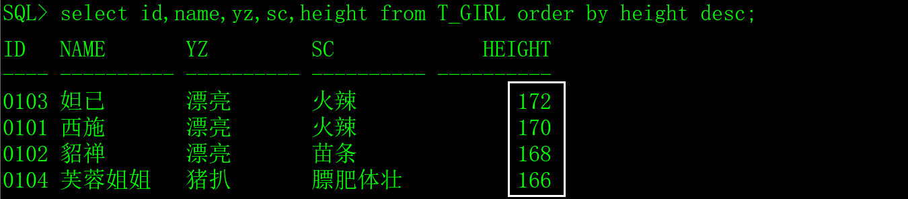
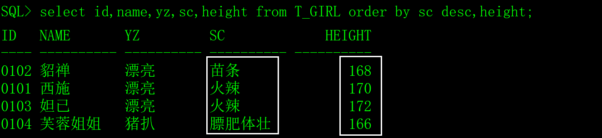
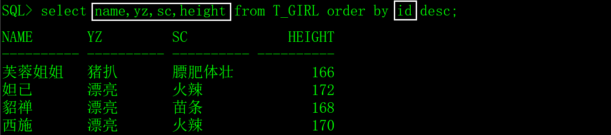

order by关键字用于对查询的结果集进行排序。

我们通过示例来介绍order by关键字的用法。

# 一、生成测试数据

用以下SQL创建超女基本信息表（T_GIRL），插入一些测试数据。

```sql
create table T_GIRL

(

 id    char(4)     not null,  -- 编号

 name   varchar2(10)  not null,  -- 姓名

 yz    varchar2(10)    null,  -- 颜值

 sc    varchar2(10)    null,  -- 身材

 weight  number(4,1)   not null,  -- 体重

 height  number(3)    not null,  -- 身高

 birthday date      not null,  -- 出生时间

 memo   varchar2(1000)   null  -- 备注

);

insert into T_GIRL(id,name,yz,birthday,sc,weight,height,memo)

 values('0101','西施','漂亮',to_date('2000-01-01 01:12:35','yyyy-mm-dd hh24:mi:ss'),

​     '火辣',48.5,170,'这是一个非常漂亮姑娘，老公是夫差，男朋友是范蠡。');

insert into T_GIRL(id,name,yz,birthday,sc,weight,height,memo)

 values('0102','貂禅','漂亮',to_date('1997-08-02 12:20:38','yyyy-mm-dd hh24:mi:ss'),

​     '苗条',45.2,168,'王允真不是男人，干不过董卓就把美人往火坑里推，千古罪人啊。');

insert into T_GIRL(id,name,yz,birthday,sc,weight,height,memo)

 values('0103','妲已','漂亮',to_date('1998-03-03 10:50:33','yyyy-mm-dd hh24:mi:ss'),

​     '火辣',53.6,172,'如果商真的因我而亡，您们男人做什么去了？');

insert into T_GIRL(id,name,yz,birthday,sc,weight,height,memo)

 values('0104','芙蓉姐姐','猪扒',to_date('1980-05-05 10:11:55','yyyy-mm-dd hh24:mi:ss'),

​     '膘肥体壮',85.8,166,'如果不努力学习技术，将来就会娶个芙蓉姐姐，哼哼。');
```

# 二、order by的语法

```sql
select 字段名1,字段名2,......字段名n from 表名 order by 字段名1 asc,字段名2 desc,......;
```

order by关键字用于对结果集按一个或者多个字段进行排序，默认是升序asc（从小到大），如果需要按降序对记录进行排序，可以用 desc。

如果排序字段有多个，可以对每个字段指定asc或desc。

1）从T_GIRL表中查出全部的记录，按身高降序

```sql
select id,name,yz,sc,height from T_GIRL order by height desc;
```

​                               

2）从T_GIRL表中查出全部的记录，按身材（降）和身高（升）排序。

```sql
select id,name,yz,sc,height from T_GIRL order by sc desc,height;
```

 

3）注意，order by排序的字段可以不在select的字段列表中。

```sql
select name,yz,sc,height from T_GIRL order by id desc;
```

 

