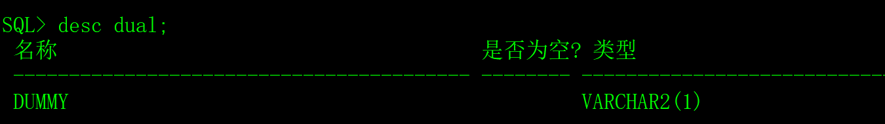
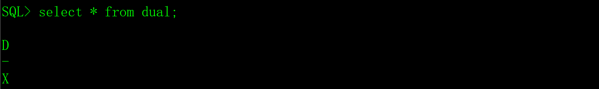

Oracle数据库中存在一个特别的表dual，它是一个虚拟表，用来构成select的语法规则。Oracle对dual虚表的操作做了一些特别的处理，保证dual表里面永远只有一条记录。dual虚表存在给程序员带来了一些方便。

# 一、测试dual虚表

dual虚表只有一个字段，有一条记录。

## 1、dual虚表的结构

​                               

## 2、查询dual虚表中的记录

 

## 3、对dual虚表做增、删、改操作

普通用户对dual虚表只有查询权限，没有增、删、改的权限。DBA对dual虚表有全部的权限，但是，我不建议采用DBA对dual虚表进行操作，没什么意义，大家可以玩玩，但是，**某些操作（删除表）可能造成数据库无法启动，请慎重，一定不能在生产环境中折腾。**

 

# 二、dual虚表的用途

利用dual虚表可以调用Oracle的函数和获取序列生成器的值，虽然还可以用来做一些其它的事情，比如说计算，但是对程序员来说利用dual虚表做计算毫无意义。

## 1、执行Oracle的函数

1）查看当前登录用户。

 

2、获取数据库的日期时间

 

## 2、获取序列生成器的值

```sql
create sequence SEQ_FREECPLUS;     -- 创建序列生成器SEQ_FREECPLUS。

select SEQ_FREECPLUS.nextval from dual;  -- 从序列SEQ_FREECPLUS获取下一个值。

select SEQ_FREECPLUS.currval from dual;  -- 从序列SEQ_FREECPLUS获取当前值。
```

细心的读者可能会思考一个问题，在insert和update语句中，可以把序列生成器直接填写到SQL语句中，不需要dual虚表。不一定，在实际开发中，可能要把序列生成器的值取出来，比如说参与运算。