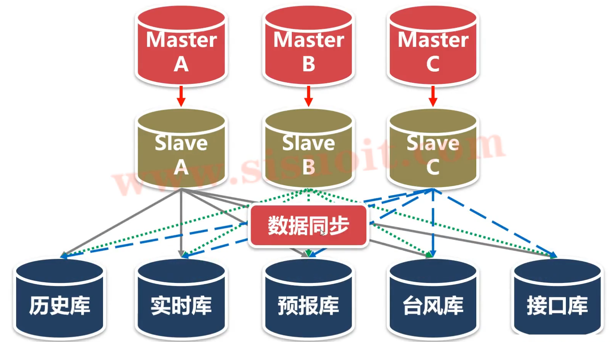

# weatherCenterNote

## 简介

气象行业的业务系统有几十个（主要围绕 预警预报 和 公共服务 这两个模块）

气象数据中心是气象行业的基础系统，为业务提供数据支撑环境

气象数据中心的项目特点就是：数据种类很多，数据量很庞大，业务系统很复杂

 如上图所示，在没有数据中心的情况下，业务系统如果想要使用数据，只能自己到处找，非常麻烦

有了数据中心后，数据的采集，管理，存储 等操作都交给数据中心，业务只需要通过数据中心就能拿到所需的数据，不用到处去寻找获取

这个是数据中心架构图，左边是数据源，中间是数据中心，右边是业务系统。数据中心从数据源采集数据，经过处理加工后存储到数据中心的数据库中。因为数据量非常大，所以需要一个数据库集群，业务系统通过数据服务总线访问数据中心的数据

## 项目中重要的功能模块

### 数据采集子系统

该功能模块的主要作用是把数据从数据源拿回来，有3中方式进行采集

- ftp客户端，采用ftp协议，采集数据文件
- http客户端，采用http协议，从WEB服务接口采集数据
- 直连数据源的数据库，从表中抽取数据

### 数据处理和加工子系统

本项目中，这个子模块不做过多介绍，因为他的业务相关性很强，不同的业务场景他的数据类型不一样，数据含义也不一样。

- 把各种格式的原始数据解码转换成xml格式的数据文件
- 对原始数据进行二次加工，生成高可用的数据集

### 数据入库子系统

该子系统的功能是把处理好的数据放入到数据中心的数据中

- 把数百种数据存储到数据中心的表中（数据中心的数据类型很多，如果为每一种数据类型都提供一个入库程序，技术含量不高，而且增删改查的工作量很大，在项目中会用一个很巧妙的方法来解决）

### 数据同步子系统（数据复制）

- MySql的高可用方案只能解决部分问题（只支持数据库之间的复制，不支持表之间的复制），不够灵活，效率不高
- 把核心数据库（Slave）表中的数据按条件同步到业务数据库中
- 把核心数据库（Slave）表中的数据增量同步到业务数据库中

数据中心的数据库集群是这样设计的，MySql的高可用方案至少需要两个数据，一个master，一个slave。假设数据中心有300种数据，每一个master处理100种，如果数据规模继续增加，就再增加一组数据库（M-S），按照数据规模横向的扩张。这个master-slave数据集群我摸称为核心数据库，下面的数据库我摸称为业务数据库，用于为业务提供数据服务。业务数据库所存放的数据量和数据总类由业务需要决定，它绝对不会是我们某一个核心数据库的副本

例如历史数据库：他的功能是备份历史数据和提供历史数据的访问，存放了全部300种数据，历史数据库的数据量很大，性能比较低，但是业务系统对历史数据的访问量也很少，慢一点也没有关系。

实时数据库：也存放了全部的300种数据，但是每一个表只保留最近7天的数据。实时数据库的数据类型很多，但是每一个表的数据量很少，所以效率非常高。

再例如台风库，非常典型。台风是极端灾害天气，一年可能就只有几天，在没有台风的时候，与台风相关的业务系统就没有人关心，有台风的时候，所有人的焦点就都在台风系统上，台风库只存放了与台风相关的十几种业务数据，数据量很少，整个数据库可以在内存中运行，效率极高。

业务场景很复杂，上面也只列举了几个。业务数据库的数据都是从核心数据库复制过来的，但是他与核心数据库的关系不是一对一的关系，也不是简单的master和slave的关系，甚至表与表之间的关系也不是一对一的关系。比如说核心数据的某一个表，他有80个字段，接口库的数据字段只有十个，不多。MySql数据库的数据复制是从一个实例到另外一个实例，通过配置参数可以达到库的级别。但是达到库这个级别还不够细

### 数据管理子系统 

- 清理（删除）历史数据。比如过去的天气历史数据，这种数据对于实时天气系统来说，是没有价值的，还有一种是数据本身有价值的数据，但是某个业务数据库中，不需要保存那么长的时间，比如实时库吗，它只保存7天的数据，7天之后的数据就删除了
- 把历史数据备份，归档。可以简单理解成吧当前数据迁移到归档表或者历史表 

### 数据交换子系统

数据中心项目需要承担一个职能，就是需要和其他的部门系统进行数据交换，把有用的数据拿过来，同时把别人需要用的气象数据推送过去

- 把数据中心的数据从表中导出来，生成数据文件
- 采用ftp协议，把数据文件推送到对方的ftp服务器中
- 基于tcp协议的快速文件传输系统

### 数据服务总线

- 使用c++开发一个WEB服务，为业务系统提供数据访问接口
- 效率极高（数据库连接池，线程池）

### 网络代理服务

- 用于运维而开发的一个工具
- I/O复用技术（select / poll / epoll）

## 重点难点

1. 服务程序稳定性
2. 数据处理和数据服务的效率
3. 功能模块的通用性

## 源码目录结构

开发框架介绍

