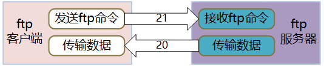
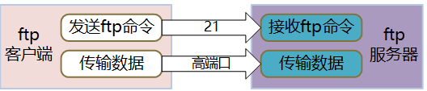

# 一、ftp简介

ftp（File Transfer Protocol文件传输协议）是基于TCP/IP 协议的应用层协议，用于文件的传输，包括ftp服务器（或服务端）和ftp客户端。

ftp客户端与服务器创建网络连接，请求登录服务器，登录成功后，就可以进行文件传输，主要包括开载文件和上传文件两种操作。

ftp协议很古老，有人说它技术太落后，不安全，对于这种说法我不于评论。但是，在内部网络环境中，ftp仍是应用最广泛文件传输协议。

在Linux系统中，ftp客户端和ftp服务器是操作系统自带的，但不一定会缺省安装。

# 二、安装ftp软件包

在CentOS7中，采用yum来安装ftp软件包，包括ftp服务器和ftp客户端。如果已经安装，再次执行yum就会把软件包升级到最新版本。

## 1、安装ftp服务器

```shell
yum -y install vsftpd
```

## 2、安装ftp客户端

```shell
yum -y install ftp
```

# 三、配置ftp服务器

ftp的传输模式有被动模式和主动式两种，缺省是被动模式，主动模式的应用场景极少，为了方便表达，在接下来的内容中只介绍被动模式，主动模式在本文中也有介绍。

## 1、关闭SELINUX

修改/etc/selinux/config文件，把SELINUX参数的值改为disabled。

```shell
SELINUX =disabled
```

重启linux系统或执行 setenforce 0 使修改马上生效。

## 2、配置ftp数据端口参数

ftp的数据端口也称为高端口，在/etc/vsftpd/vsftpd.conf文件中配置，由pasv_min_port和pasv_max_port两个参数指定，如果文件中没有这两个参数，手工的加进去。

```shell
pasv_min_port=5000  # 高端口范围的最小值。

pasv_max_port=5500  # 高端口范围的最大值。
```

## 3、开通防火墙

开通防火墙的方法有两种：

1）开通ftp服务。

```shell
firewall-cmd --zone=public --add-service=ftp --permanent
```

2）开通ftp服务需要的端口，21是控制端口，5000-5500是数据端口范围，也就是上一节中在/etc/vsftpd/vsftpd.conf文件中配置的pasv_min_port和pasv_max_port参数。

```shell
firewall-cmd --zone=public --add-port=21/tcp --permanent

firewall-cmd --zone=public --add-port=5000-5500/tcp --permanent
```

重启防火墙：

```shell
systemctl restart firewalld.service
```

## 4、启动vsftpd服务

ftp服务器的服务名是vsftpd，相关的操作如下：

```shell
systemctl start  vsftpd  # 启动服务。

systemctl stop  vsftpd  # 停止服务。

systemctl restart vsftpd  # 重启服务。

systemctl status vsftpd  # 查看服务状态。

systemctl enable vsftpd  # 启用开机自动动vsftpd服务。

systemctl disable vsftpd  # 禁用开机自动动vsftpd服务。
```

## 5、云平台访问策略配置

如果您购买的是云服务器上，需要登录云服务器提供商的管理平台开通访问策略（或安全组），开通21和高端口的访问策略。

不同云服务器提供商的管理平台操作方法不同，具体操作方法阅读操作手册、或者百度，或者咨询云服务器提供商的客服。

如果云服务器的ftp服务不能建立数据会话，在百度中输入**“被动模式下FTP不能建立数据会话问题“**可以找到解决问题的方法，目前的阿里云服务器就存在这个问题。

# 四、主动模式和被动模式

ftp有两种模式，分别是port模式（主动模式）和pasv模式（被动模式）。

## 1、主动模式

客户端给服务端的21端口发命令说：我要输传文件，我已经打开了自己的20端口，您向我的20端口发起TCP连接，我们来传输文件。服务端知道后，就会主动向客户端的20端口发起连接，连接成功后开始传输文件。



在主动模式下，ftp请求是由客户端TCP连接的；传输数据的时候，TCP连接却是由服务端发起的。

## 2、被动模式

客户端给服务器端的21端口发命令说：我要传输文件。服务器端知道后打开一个空闲的高端口，然后告诉客户端，我已经打开了某某端口，您向我这个端口发起TCP连接，然后我们用这个端口来传输文件。

 

在被动模式下，不管是ftp命令，还是传输数据，都是由客户端向服务端发起TCP连接。

## 3、从主动模式到被动模式

在很久以前每台电脑都有一个ip地址，ftp只有主动模式，后来出现了共享上网技术，所以也就有了下面的问题。

共享上网就是多台电脑共享一个公网ip去使用internet，例如某个局域网出口的公网ip是210.33.25.108，当内网用户（192.168.1.100）访问外网的ftp服务器时，如果采用主动模式，192.168.1.100告诉了ftp服务器我需要某个文件和我打开了20端口之后，由于共享上网的原因，192.168.1.100在出网关的时候ip已经被转换成了210.33.25.108，所以ftp服务器端收到的消息是210.33.25.108需要某个文件并打开了20端口，ftp服务器就会尝试连接210.33.25.108的20端口，这样当然不会成功。

在主动模式中，ftp的两个端口是相对固定的，如果命令端口是n的话，那数据端口就是n-1，也就是说默认情况下，命令端口是21，数据端口就是20，如果您把ftp服务的端口改成了521，那么数据端口就是520，这样配置防火墙很方便，只需要开通两个端口就可以了。但是，在共享上网的环境中无法使用主动模式。

在被动模式中，默认情况下命令端口是21，数据端口是随机分配的。但是，被动模式中数据端口的范围可以配置，防火墙也可以配置端口范围。