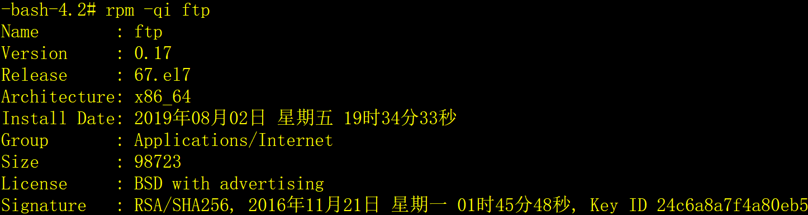

Linux有多种发行版本，各种发行版本之间安装软件包的方法和命令不一样，同发行版本之间安装软件包的方法也有不同。Linux主要有三大派系：红帽子派系（Redhat、Centos、Oracle Linux）、Debian派系（Ubuntu、Kali），SUSE派系（SuSe、OpenSUSE）等。

红帽子派是Linux服务器操作系统的主流，本文重点介绍红帽子派系中rpm和yum安装软件包的方法。

# 一、rpm安装

RPM是RedHat Package Manager的缩写，由RedHat推出的软件包管理管理工具，在Fedora 、Redhat、CentOS、Mandriva、SuSE、YellowDog等主流发行版本，以及在这些版本基础上二次开发出来的发行版采用。

RPM包里面包含可执行的二进制程序，自身所带的附加文件，版本文件（软件包的依赖关系）。

## 1、查看系统中已安装的软件包

1）查看已安装的软件包。

```shell
rpm -q 软件包名
```

例如查看ftp客户端和ftp服务端软件包：

​                               

2）查看软件包安装的目录和文件（包括了可执行程序、配置文件和帮助文档）。

```shell
rpm -ql 软件包名
```

例如查看ftp客户端：

```shell
rpm -ql ftp
```

 

3）查看已安装软件包的详细信息。

```shell
rpm -qi 软件包名
```

例如查看ftp客户端（显示内容太多，部分截图）：

 

4）查看已安装软件包的配置。

```shell
rpm -qc 软件包名
```

例如查看ftp服务端：

 

5）查看已安装软件包所依赖的软件包及文件。

```shell
rpm -qR 软件包名
```

例如查看ftp客户端（显示内容太多，部分截图）：

 

## 2、查看软件包的安装文件

安装包文件的后缀是.rpm，以CentOS7为例，系统安装的光盘映像文件是CentOS-7-x86_64-DVD-1908.iso，解开后在Packages目录中有软件包的安装文件，如下：

 

接下来以ftp的客户端安装包文件ftp-0.17-67.el7.x86_64.rpm为例来介绍安装包文件的查看方法。

1）查看一个软件包的安装文件的详细信息。

```shell
rpm -qpi 软件包的安装文件名
```

（显示内容太多，部分截图）

2）查看软件包的安装文件所包含的文件。

```shell
rpm -qpl 软件安装包文件名
```

 

3）查看软件包的依赖关系。

```shell
rpm -qpR 软件包的安装文件名
```

（显示内容太多，部分截图）

 

## 3、安装/升级软件包

如果待安装/升级的软件与其它的软件有依赖关系，请解决依赖关系，即先安装/升级依赖关系的软件包。如果没有解决好依赖关系，可以强制安装/升级，不推荐采用强制的方法，因为有可能导致软件不可用。

1）安装软件包。

```shell
rpm -ivh 软件包的安装文件名
```


2）升级软件包。

```shell
rpm -Uvh 软件包的安装文件名
```


3）强制安装软件包。

```shell
rpm -ivh 软件包的安装文件名 --nodeps --force
```

4）强制升级软件包。

```shell
rpv -Uvh 软件包的安装文件名 --nodeps --force
```

## 4、删除软件包

```shell
rpm -e 软件包名
```

例如删除ftp客户端软件包：

 

# 二、yum安装

rpm安装软件包的虽然方便，但是需要手工解决软件包的依赖关系。很多时候安装一个软件包需要安装多个其他软件包，还有不同版本的兼容性问题，很复杂。yum（Yellow dog Updater, Modified）解决了这些问题，yum是rpm的前端程序，设计的主要目的就是为了自动解决rpm的依赖关系，有以下优点：

1. 自动解决依赖关系；
2. 可以对rpm进行分组，基于组进行安装操作；
3. 引入仓库概念，支持多个仓库；
4. 配置简单。

## 1、yum的语法

```shell
yum [options] [command] [package ...]
```

options：可选参数：1）-h帮助；2）-y，当安装过程提示选择全部为yes，不需要再次确认；3）-q，不显示安装的过程。

command：待操作的命令。

package：待操作的软件包名，多个软件包之间用空格分开，支持用星号*匹配。

## 2、yum的常用命令

最最常用的命令加粗显示。

**1****）安装/升级软件包。**

```shell
yum install 软件包名/软件包文件名
```

**2****）升级软件包。**

```bash
yum update 软件包名
```

**3****）删除软件包。**

```bash
yum remove 软件包名
```

**4****）查找软件包。**

```bash
yum search 软件包名
```

5）列出所有可更新的软件包清单。

```bash
yum check-update
```

6）更新所有软件包。

```bash
yum update
```

7）列出所有可安装软件包的清单；

```bash
yum list
```

8）清除缓存。

```bash
yum clean [headers|packages|metadata|dbcache|plugins|expire-cache|all]
```

## 3、示例

1）安装/升级ftp客户端软件包。

```bash
yum -y install ftp
```

或

```bash
yum -y install ftp-0.17-67.el7.x86_64.rpm
```

2）升级ftp客户端软件包

```bash
yum -y update ftp
```

3）删除ftp客户端软件包。

```bash
yum -y remove ftp
```

# 三、应用经验

1）rpm安装/升级软件包需要手工的解决包的依赖关系，这一点让人确实很烦，所以，软件包的安装/升级一般采用yum命令。

2）rpm的某些功能，例如查看软件包的详细信息、软件包的安装目录、软件包的配置文件等还是有实用价值的。