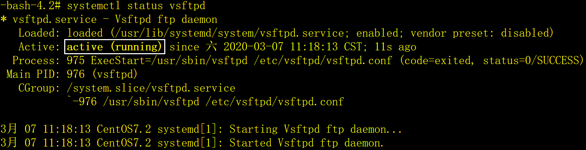

# 一、systemctl介绍

CentOS7启用了新的系统和服务管理器，采用systemctl命令代替了老版本的service和chkconfig。为了保持兼容性，在CentOS7中，老版本的service和chkconfig命令仍然可以使用。

systemctl命令是system（系统）和control（控制）两个单词的简写，它是一个功能强大的命令，本文只介绍与服务管理相关的用法。

systemctl命令有一点不足，就是很多命令执行后没有提示信息，例如下图：

​                  

上图中，执行启动和停止服务命令后没有“服务已启动”或“服务已关闭”等提示信息，让人很不习惯。还有，start和stop各执行了两次，也没有任何提示信息，这也让人很不习惯。

# 二、systemctl常用命令

## 1、启动服务

```shell
systemctl start name.service
```

注意name.service的.service可以省略不写，以下两条命令的效果相同。

```shell
systemctl start vsftpd       # 启动ftp服务。

systemctl start vsftpd.service   # 启动ftp服务。
```

## 2、停止服务

```shell
systemctl stop name.service
```

## 3、重启服务

如果服务没有启动，就启动它。

```shell
systemctl restart name.service
```

## 4、查看服务是否已启动

```shell
systemctl is-active name.service
```

## 5、查看服务的状态

```shell
systemctl status name.service
```

示例：

 

Loaded：关于服务是否已经加载的信息，文件的绝对路径以及是否被启用的注释。

Active：服务是否正在运行,然后是启动时间信息。

Process：进程额外信息。

Main PID：服务主进程pid。

CGroup:Control Groups额外信息。

## 6、启用开机自启动服务

```shell
systemctl enable name.service
```

## 7、停用开机自启动服务

```shell
systemctl disable name.service
```

## 8、查看服务是否为开机自启动

```shell
systemctl is-enabled name.service
```

## 9、只重启正在运行中的服务

```shell
systemctl try-restart name.service
```

## 10、显示所有的服务状态

按空格键显示下一页，按q键退出。

```shell
systemctl list-units --type service --all
```

## 11、查看启动成功的服务列表

```shell
systemctl list-unit-files|grep enabled
```

## 12、查看启动失败的服务列表

```shell
systemctl --failed
```

## 13、查看所有服务的状态

按空格键显示下一页，按q键退出。

```shell
systemctl list-unit-files --type service
```

## 14、列出在指定服务之前启动的服务（依赖）

按空格键显示下一页，按q键退出。

```shell
systemctl list-dependencies --after name.service
```

## 15、列出在指定服务之后启动的服务（被依赖）

按空格键显示下一页，按q键退出。

```shell
systemctl list-dependencies --before name.service
```
