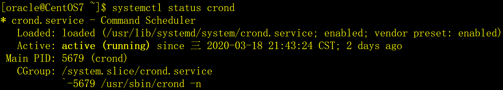
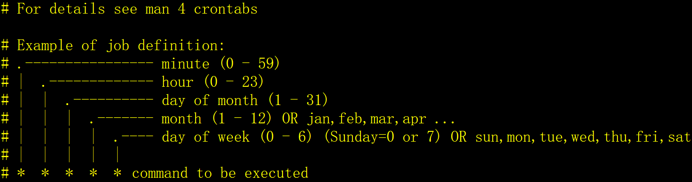
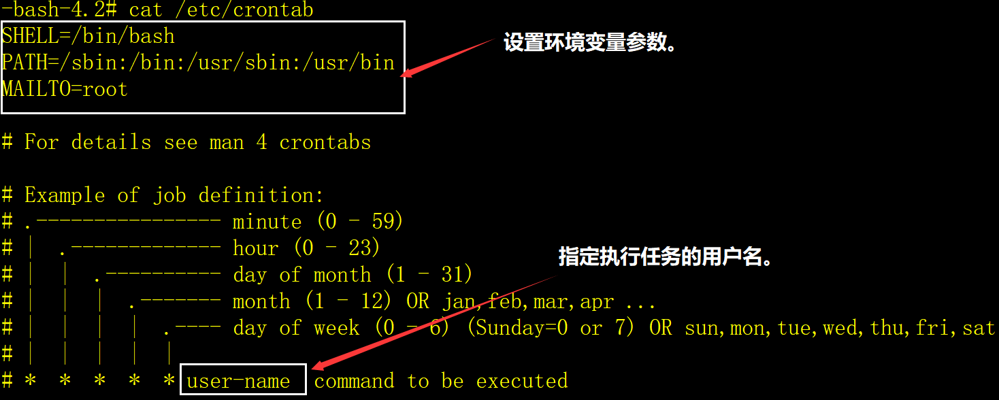
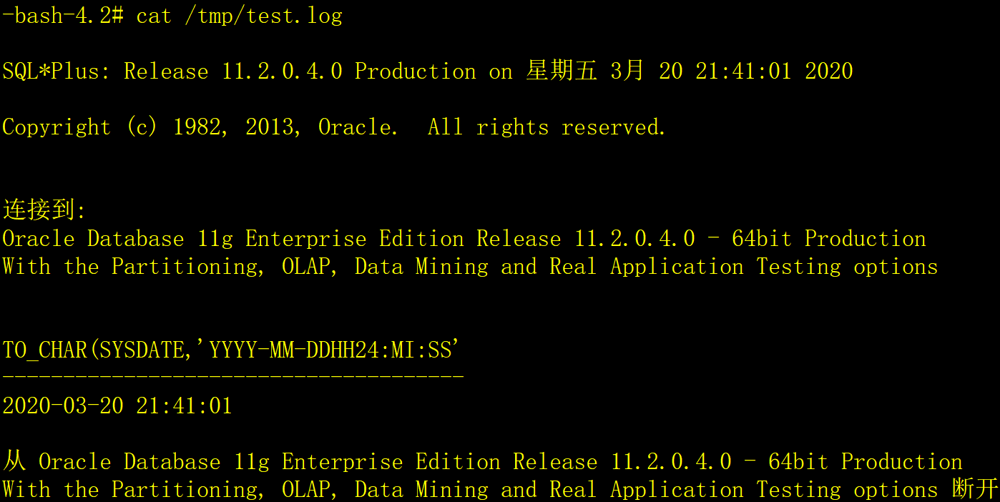
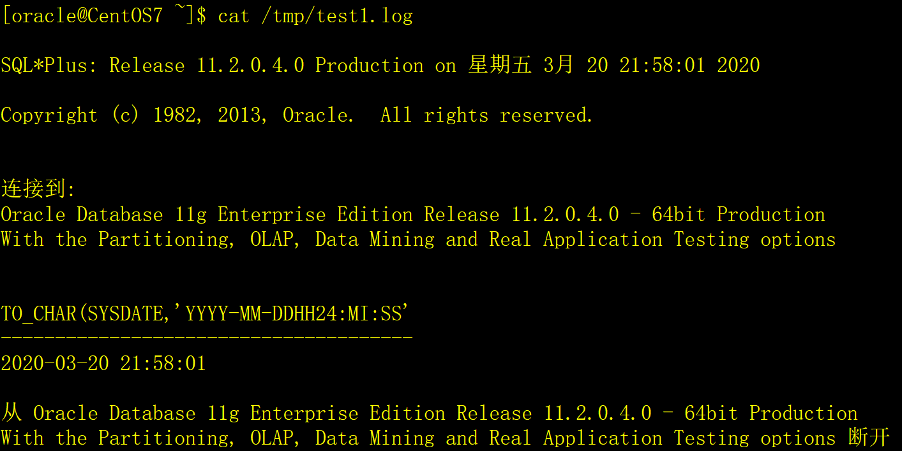

# 一、计划任务的基本概念

linux系统采用crond守护进程来控制系统和用户的计划任务，实现周期性的执行某种任务或处理某些事件。

Linux系统本身就有很多的计划任务，所以crond服务是默认安装和启动的。crond服务每分钟都会检查是否有需要执行的任务，如果有则自动执行该任务。执行以下命令可以看到crond服务的运行情况：

```shell
systemctl status crond
```



Linux下的计划任务分为两种：用户计划任务和系统计划任务。

# 二、用户计划任务


Linux的每个用户可以定义自己的计划任务，周期性的执行脚本或程序。计划任务的内容存放在crontab文件中，每个用户都有自己的crontab文件。

## 1、查看crontab文件

```shell
crontab -l [-u 用户名]
```

root用户可以用-u参数查看指定用户的计划任务，如果没有-u参数，表示查看自己的计划任务。普通用户只查看自己的计划任务，不允许使用-u参数。

## 2、编辑crontab文件

```shell
crontab -e [-u 用户名]
```

root用户可以用-u参数编辑指定用户的计划任务，如果没有-u参数，表示编辑自己的计划任务。普通用户只能编辑自己的计划任务，不允许使用-u参数。crontab缺省的编辑工具是vi。

## 3、删除crontab文件

```shell
crontab -r [-u 用户名]
```

root用户可以用-u参数删除指定用户的计划任务，如果没有-u参数，表示删除自己的计划任务。普通用户只删除自己的计划任务，不允许使用-u参数。

## 4、crontab文件格式

 

crontab文件中的每个任务由两部分组成，执行时间和执行命令。

**1）执行时间，有5个参数：**

第1部分：分钟（minute），取值0-59。

第2部分：小时（hour），取值0-23。

第3部分：月当中的天（day of month），取值1-31，。

第4部分：月份（month），取值1-12，或采用月份单词的英文简写。

第5部分：星期中的天（day of week），取值0-6，或采用星期单词的英文简写。

在以上各部分中，还可以使用以下特殊字符：

星号（*）：代表全部的值，例如day of month字段如果是星号，则表示在满足其它字段的制约条件后每天执行该任务。

逗号（,）：可以用逗号分隔开的值指定一个列表，例如，“1,2,5,7,8,9”。

中杠（-）：可以中杠表示一个范围，例如“2-6”表示“2,3,4,5,6”。

正斜线（/）：可以用正斜线指定时间的间隔频率，例如minute字段，“0-30/5”表示在0-30的范围内每5分钟执行一次；“*/5”表示每十分钟执行一次。

**2）执行命令：任务执行的程序，可以是shell脚本，也可以是其它的可执行文件，但是要注意几个问题：**

a）crontab中执行程序的时候，不会先执行系统和用户的环境变量文件，如果待执行的程序需要环境变量，程序将无法执行；

b）crontab中执行的程序必须采用全路径。

## 5、crontab示例

1）每两分钟执行一次date命令，结果输出到/tmp/date.log文件（下同）。

```shell
*/2 * * * * /usr/bin/date > /tmp/date.log
```

2）在每个小时的05、10、15分执行一次date命令。

```shell
5,10,15 * * * * /usr/bin/date > /tmp/date.log
```

3）在每个小时20-30分之间的每一分钟执行一次date命令。

```shell
20-30 * * * * /usr/bin/date > /tmp/date.log
```

4）在每天的10:30分执行一次date命令。

```shell
30 10 * * * /usr/bin/date > /tmp/date.log
```

5）在每个月1号的02:30分执行一次date命令。

```shell
30 02 1 * * /usr/bin/date > /tmp/date.log
```

6）在每星期天的02:30分执行一次date命令。

```shell
30 02 * * 0 /usr/bin/date > /tmp/date.log
```

# 三、系统计划任务

网上很多文章认为系统计划任务是执行系统级别的周期性任务，例如系统备份、把缓存数据写入硬盘、清理日志文件等。这些说法有些片面，我不这么认为，我先介绍系统计划任务的相关知识，然后通过示例来演示。

系统计划任务在/etc/crontab文件配置，以下缺省/etc/crontab文件的内容：

 

系统计划任务的/etc/crontab文件中，**可以设置环境变量，可以指定执行任务的用户。**系统计划任务的执行时间的与用户计划任务的执行时间含义相同，不再描述。

示例：

Oracle数据库提供了sqlplus工具，执行sqlplus需要环境变量，如ORACLE_HOME、ORACLE_BASE等，如果采用系统计划任务执行一个SQL脚本，步骤如下：

1）准备/tmp/test.sql脚本文件，内容如下：

```shell
select to_char(sysdate,'yyyy-mm-dd hh24:mi:ss') from dual;

exit;
```

2）在/etc/crontab文件中增加环境变量和任务，如下：

```shell
\# 设置Oracle的环境变量。

ORACLE_BASE=/oracle/base

ORACLE_HOME=/oracle/home

ORACLE_SID=snorcl11g

NLS_LANG='Simplified Chinese_China.ZHS16GBK'

LD_LIBRARY_PATH=$ORACLE_HOME/lib:/usr/lib

\# 每分钟调用sqlplus执行/tmp/test.sql脚本，结果输出到/tmp/test.log文件。

*/1 * * * * oracle /oracle/home/bin/sqlplus scott/tiger @/tmp/test.sql > /tmp/test.log
```

3）每隔一分钟查看/tmp/test.log文件的内容，如下：

 

# 四、如何在用户计划任务中执行需要环境变量的程序

用户的计划任务无法设置环境变量，那么如何在用户计划任务中执行需要环境变量的程序呢？我们可以这么做：

1. 编写一个shell脚本；
2. 在脚本中设置环境变量；
3. 在脚本中执行需要环境变量的程序。

示例：

1）编写/tmp/test.sh脚本文件，内容如下：

```shell
\# 设置系统环境变量。

source /etc/profile

\# 设置oracle用户的环境变量。

source /oracle/.bash_profile

\# 执行/tmp/test.sql脚本。

/oracle/home/bin/sqlplus scott/tiger @/tmp/test.sql > /tmp/test1.log
```

2）准备/tmp/test.sql脚本文件，内容如下：

```shell
select to_char(sysdate,'yyyy-mm-dd hh24:mi:ss') from dual;

exit;
```

3）设置oracle用户的计划任务文件，内容如下：

```shell
\# 每分钟执行一次/tmp/test.sh脚本。

*/1 * * * * /bin/sh /tmp/test.sh
```

4）每隔一分钟查看/tmp/test1.log文件的内容，如下：

 

# 五、应用经验

用户计划任务和系统计划任务没有本质的区别，都可以达到相同的目的。

在实际项目中我偏向用户的计划任务，虽然用户计划任务的crontab文件中不能设置环境变量，但可以通过脚本文件来解决，并且，脚本文件中编写指令比crontab文件更灵活。