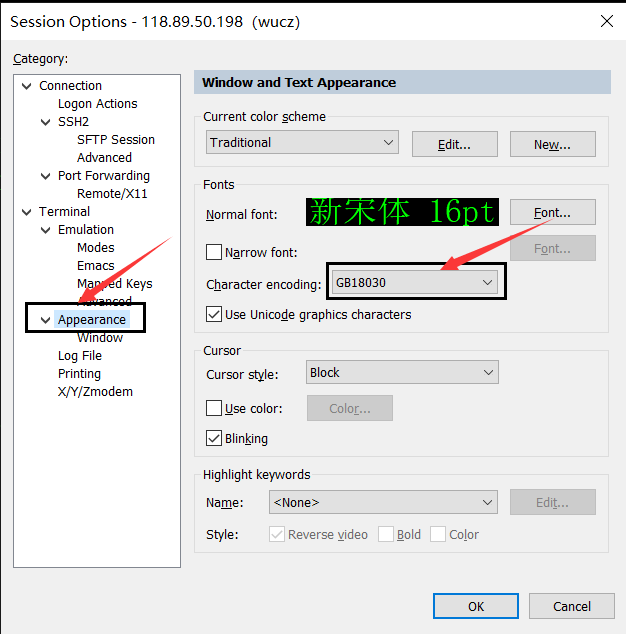

# 一、 字符编码和字符集

计算机中处理和储存信息都是用二进制数表示的；而我们在屏幕上看到的英文、汉字等字符是二进制数转换之后的结果。通俗的说，按照某种规则将字符存储在计算机中，如'a'用97表示，称为"编码"；反之，将计算机中的二进制数解析显示出来，称为"解码"。在解码过程中，如果使用了错误的解码规则，就会产生乱码。

## 1、字符编码（character encoding）

字符编码是一种法则，在数字与字符之间建立的对应关系。

不同的国家有不同的字符，包含的文字、标点符号、图形符号各有不同。

常见的字符编码有ASCII，GBK，GB18030，Unicode等。

## 2、字符集（Character set）

字符是文字和符号的总称，字符集是字符的集合，是数字与字符的对照表。

用ASCII编码的字符集称之为ASCII字符集，用GBK编码的字符集称之为GBK字符集。

## 3、国际编码（Unicode）

为了解决传统的字符编码方案的局限，1994年发布了Unicode（国际编码、统一码、万国码、单一码、通用码），它是计算机科学领域里的一项业界标准，包括字符集、编码方案等。Unicode 将全世界所有的字符统一统一编码，再也不存在字符集不兼容和字符转换的问题。

Unicode 有以下三种编码方式：

1）UTF-8：兼容ASCII编码；拉丁文、希腊文等使用两个字节；包括汉字在内的其它常用字符使用三个字节；剩下的极少使用的字符使用四个字节。

2）UTF-16：对相对常用的60000余个字符使用两个字节进行编码，其余的使用4字节。

3）UTF-32：固定使用4个字节来表示一个字符，存在空间利用效率的问题。

# 二、汉字的编码

## 1、汉字的编码

支持汉字（简体中文）的编码有GB2312、GB13000、GBK、GB18030和Unicode（UTF-8、UTF-16、UTF-32）。

1）GB2312

仅包含大部分的常用简体汉字，但已经不能适应现在的需要。

2）GB13000

由于GB2312的局限性，国家标准化委员会制定了GB13000编码； 但由于当时的硬件和软件都已经支持了GB2312，而GB13000与GB2312完全不兼容，所以没有能够得到大范围的推广使用。

3）GBK

有了GB13000的教训，中国国家标准化委员会制定了GBK标准，并兼容了GB2312标准，同时在GB2312标准的基础上扩展了GB13000包含的字； 由于该标准有微软的支持，得到了广泛的应用。

4）GB18030

GB18030编码比GBK又新增了几千个汉字，但由于码位不足使用了2byte与4byte混合编码方式，这给软件开发增加了难度。

5）Unicode

包含全世界所有国家需要用到的字符，是国际编码，通用性强。

## 2、汉字的编码选择

在操作系统和数据库中，常用的汉字编码有GBK、GB18030和Unicode，GBK和GB18030的优势是占用空间小，Unicode的优势是全球化的支持。

## 3、编码的转换

GBK和GB18030与Unicode编码之间需要转换，否则会出现汉字乱码。

# 三、设置Linux的字符集

## 1、查看当前系统已安装的字符集

1）locale命令用于查看当前系统全部的已安装的字符集，Linux支持的符集约800种。

```shell
locale -a
```

2）查看已安装的中文字符集（只查看中国大陆的，不包括香港和台湾）

```shell
locale -a|grep zh_CN
```

​       

上图表示已经安装了中文字符集。

## 2、安装中文字符集

如果您的Linux系统没有安装中文字符集，可以用yum命令安装。

我查了一些资料，安装中文字符集软件包的方法比较多，没找到准确的说法，所以把多种方法都写了进来，以下命令用root用户执行，不会有副作用。

```shell
yum -y groupinstall chinese-support

yum -y install chinese-support

yum -y install kde-l10n-Chinese

yum -y install ibus-table-chinese-1.4.6-3.el7.noarch
```

安装后，执行locale -a|grep zh_CN，如果显示的内容如下，表示安装成功。

 

## 3、修改字符集配置文件

CentOS6.x字符集配置文件在/etc/sysconfig/i18n文件中。

CentOS7.x字符集配置文件在/etc/locale.conf文件中，内容如下：

 

执行以下命令或者重启系统使修改生效。

CentOS6.x

```shell
source /etc/sysconfig/i18n
```

CentOS7.x:

```shell
source /etc/locale.conf
```

# 四、LANG环境变量

LANG环境变量存放的是Linux系统的语言、地区、字符集，它不需要系统管理员手工设置，/etc/profile会调用/etc/profile.d/lang.sh脚本完成对LANG的设置。

# 五、修改客户端的字符集

客户端的字符集必须与Linux服务端一致，否则会出现乱码，以SecureCRT为例。修改会话的属性，在Appearance界面中的Character encoding下拉框中选择。

 

# 六、字符集转换工具

Linux提供了iconv命令把文件内容从一种编码转换成另一种编码。

参数说明：

--list：列出iconv支持的编码列表。

-f encoding：源文件内容的编码。

-t encoding：目标文件内容的编码。

-o file：指定输出文件。

-c：忽略输出的非法字符。

-l：列出已知的编码字符集。

-s：禁止警告信息，但不是错误信息。

--verbose：显示进度信息。

示例：

把当前目录的book1.c由gbk转换成utf-8，结果输出到/tmp/book1_utf8.c中。

```shell
iconv -f gbk -t utf-8 book1.c -o /tmp/book1_utf8.c
```

# 七、应用经验

1）Linux系统在业务化之前，就应该确定字符集，然后不再改变。系统在业务化后，修改字符集是一件很麻烦的事情，最好别惹这个麻烦。

2）虽然gb18030字符集比gbk更丰富，但是gb18030中有部分汉字是4字节，这一点让程序员很郁闷。

3）设置Linux的字符集时，还要考虑WEB系统和数据库系统采用的字符集，最好是大家都保持一致。

4）目前，中国应用最广的字符集是UTF-8。
