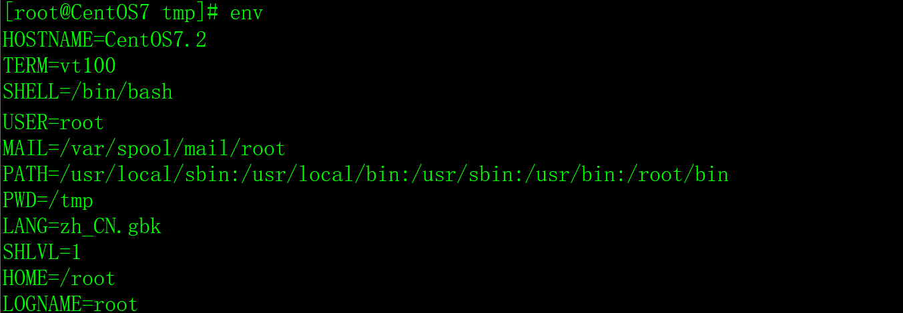
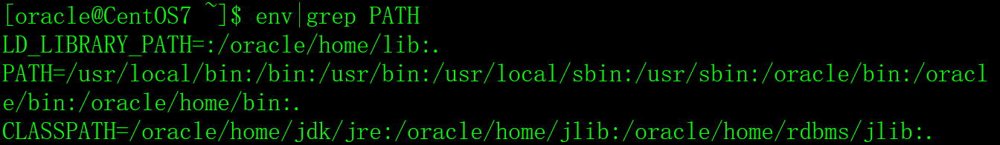
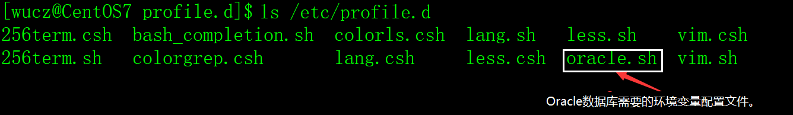
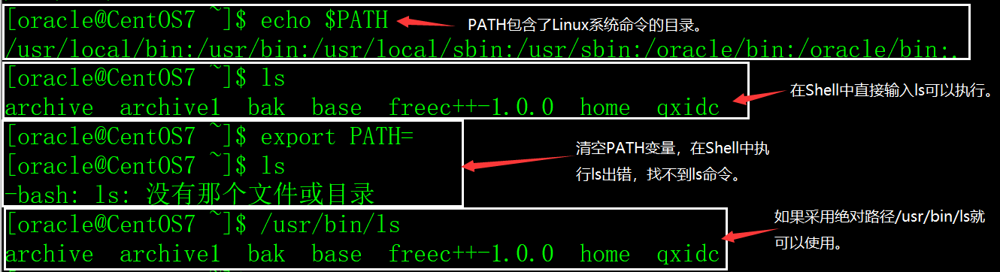
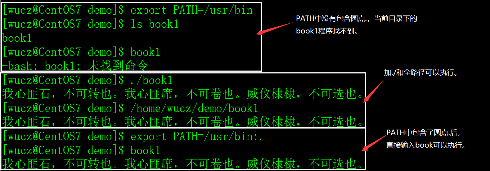

# 一、环境变量的概念

## 1、环境变量的含义

程序（操作系统命令和应用程序）的执行都需要运行环境，这个环境是由多个环境变量组成的。

## 2、环境变量的分类

1）按生效的范围分类。

**系统环境变量**：公共的，对全部的用户都生效。

**用户环境变量**：用户私有的、自定义的个性化设置，只对该用户生效。

2）按生存周期分类。

**永久环境变量**：在环境变量脚本文件中配置，用户每次登录时会自动执行这些脚本，相当于永久生效。

**临时环境变量**：使用时在Shell中临时定义，退出Shell后失效。

## 3、Linux环境变量

Linux环境变量也称之为Shell环境量变，以下划线和字母打头，由下划线、字母（区分大小写）和数字组成，习惯上使用大写字母，例如PATH、HOSTNAME、LANG等。

# 二、常用的环境变量

## 1、查看环境变量

1）env命令

在Shell下，用env命令查看当前用户全部的环境变量。

​        

上图只截取了部分环境变量，并非全部。

用env命令的时候，满屏显示了很多环境变量，不方便查看，可以用grep筛选。

```shell
env|grep 环境变量名
```

例如查看环境变量名中包含PATH的环境变量。

```shell
env|grep PATH
```

 

2）echo命令

```shell
echo $环境变量名
```

 

注意，符号$不能缺少，这是语法规定。

## 2、常用的环境变量

1）PATH

可执行程序的搜索目录，可执行程序包括Linux系统命令和用户的应用程序，PATH变量的具体用法本文后面的章节中有详细的介绍。

 

2）LANG

Linux系统的语言、地区、字符集，LANG变量的具体用法本文后面的章节中有详细的介绍。

 

3）HOSTNAME

服务器的主机名。

4）SHELL

用户当前使用的Shell解析器。

5）HISTSIZE

保存历史命令的数目。

6）USER

当前登录用户的用户名。

7）HOME

当前登录用户的主目录。

8）PWD

当前工作目录。

9）LD_LIBRARY_PATH

C/C++语言动态链接库文件搜索的目录，它不是Linux缺省的环境变量，但对C/C++程序员来说非常重要，具体用法本文后面的章节中有详细的介绍。

10）CLASSPATH

JAVA语言库文件搜索的目录，它也不是Linux缺省的环境变量，但对JAVA程序员来说非常重要，具体用法本文后面的章节中有详细的介绍。

# 三、设置环境量

```shell
变量名='值'

export 变量名
```

或

```shell
export 变量名='值'
```

如果环境变量的值没有空格等特殊符号，可以不用单引号包含。

示例：

```shell
export ORACLE_HOME=/oracle/home

export ORACLE_BASE=/oracle/base

export ORACLE_SID=snorcl11g

export NLS_LANG='Simplified Chinese_China.ZHS16GBK'

export PATH=$PATH:$HOME/bin:$ORACLE_HOME/bin:.

export LD_LIBRARY_PATH=$LD_LIBRARY_PATH:$ORACLE_HOME/lib:.
```

采用export设置的环境变量，在退出Shell后就会失效，下次登录时需要重新设置。如果希望环境变量永久生效，需要在登录脚本文件中配置。

## 1、系统环境变量

系统环境变量对全部的用户生效，设置系统环境变量有三种方法。

1）在/etc/profile文件中设置。

用户登录时执行/etc/profile文件中设置系统的环境变量。但是，Linux不建议在/etc/profile文件中设置系统环境变量。

2）在/etc/profile.d目录中增加环境变量脚本文件，这是Linux推荐的方法。

/etc/profile在每次启动时会执行 /etc/profile.d下全部的脚本文件。/etc/profile.d比/etc/profile好维护，不想要什么变量直接删除 /etc/profile.d下对应的 shell 脚本即可。

/etc/profile.d目录下有很多脚本文件，例如：

 

在以上示例中，/etc/profile.d目录中的oracle.sh是Oracle数据库的环境变量配置文件，内容如下：

 

3）在/etc/bashrc文件中设置环境变量。

该文件配置的环境变量将会影响全部用户使用的bash shell。但是，Linux也不建议在/etc/bashrc文件中设置系统环境变量。

## 2、用户环境变量

用户环境变量只对当前用户生效，设置用户环境变量也有多种方法。

在用户的主目录，有几个特别的文件，用`ls`是看不见的，用`ls .bash_*`可以看见。

 

1）.bash_profile（推荐首选）

当用户登录时执行，每个用户都可以使用该文件来配置专属于自己的环境变量。

2）.bashrc

当用户登录时以及每次打开新的Shell时该文件都将被读取，不推荐在里面配置用户专用的环境变量，因为每开一个Shell，该文件都会被读取一次，效率肯定受影响。

3）.bash_logout

当每次退出系统（退出bash shell）时执行该文件。

4）.bash_history

保存了当前用户使用过的历史命令。

## 3、环境变量脚本文件的执行顺序

环境变量脚本文件的执行顺序如下：

```shell
/etc/profile->/etc/profile.d->/etc/bashrc->用户的.bash_profile->用户的.bashrc
```

同名的环境变量，如果在多个脚本中有配置，以最后执行的脚本中的配置为准。

还有一个问题需要注意，在/etc/profile中执行了/etc/profile.d的脚本，代码如下：

```shelll
for i in /etc/profile.d/*.sh ; do

  if [ -r "$i" ]; then

​    if [ "${-#*i}" != "$-" ]; then

​      . "$i"

​    else

​      . "$i" >/dev/null

​    fi

  fi

done
```

所以，/etc/profile.d和/etc/profile的执行顺序还要看代码怎么写。

# 四、重要环境变量的详解

## 1、PATH环境变量

可执行程序的搜索目录，可执行程序包括Linux系统命令和用户的应用程序。如果可执行程序的目录不在PATH指定的目录中，执行时需要指定目录。

1）PATH环境变量存放的是目录列表，目录之间用冒号:分隔，最后的圆点.表示当前目录。

```shell
export PATH=目录1:目录2:目录3:......目录n:.
```

2）PATH缺省包含了Linux系统命令所在的目录（/usr/local/bin:/usr/bin:/usr/local/sbin:/usr/sbin），如果不包含这些目录，Linux的常用命令也无法执行（要输入绝对路径才能执行）。

示例：

 

3）在用户的.bash_profile文件中，会对PATH进行扩充，如下：

```shell
export PATH=$PATH:$HOME/bin
```

4）如果PATH变量中没有包含圆点.，执行当前目录下的程序需要加./或使用绝对路径。

示例：

 

## 2、LANG环境变量

LANG环境变量存放的是Linux系统的语言、地区、字符集，它不需要系统管理员手工设置，/etc/profile会调用/etc/profile.d/lang.sh脚本完成对LANG的设置。

[CentOS](https://www.linuxidc.com/topicnews.aspx?tid=14)6.x 字符集配置文件在/etc/syscconfig/i18n文件中。

CentOS7.x 字符集配置文件在/etc/locale.conf文件中，内容如下：

 

## 3、LD_LIBRARY_PATH环境变量

C/C++语言动态链接库文件搜索的目录，它不是Linux缺省的环境变量，但对C/C++程序员来说非常重要。

LD_LIBRARY_PATH环境变量存放的也是目录列表，目录之间用冒号:分隔，最后的圆点.表示当前目录，与PATH的格式相同。

```shell
export LD_LIBRARY_PATH=目录1:目录2:目录3:......目录n:.
```

## 4、CLASSPATH

JAVA语言库文件搜索的目录，它也不是Linux缺省的环境变量，但对JAVA程序员来说非常重要。

CLASSPATH环境变量存放的也是目录列表，目录之间用冒号:分隔，最后的圆点.表示当前目录，与PATH的格式相同。

# 五、环境变量的生效

1）在Shell下，用export设置的环境变量对当前Shell立即生效，Shell退出后失效。

2）在脚本文件中设置的环境变量不会立即生效，退出Shell后重新登录时才生效，或者用source命令让它立即生效，例如：

```shell
source /etc/profile
```

# 六、应用经验

虽然设置环境变量的方法有多种，但是建议系统环境变量建议在/etc/profile.d目录中配置，用户环境变量在用户的.bash_profile中配置，不建议在其它脚本文件中配置环境变，会增加运维的麻烦，容易出错。

# Ubuntu 设置 LD_LIBRARY_PATH

具体修改方法为

首先寻找库的路径，可以在文件中搜索libboost_python39.so，找到路径后，执行

```shell
$ sudo gedit ~/.bashrc
在文件中加上这一行：
export LD_LIBRARY_PATH=/上文找到的库路径/lib/:$LD_LIBRARY_PATH

或者执行：
$ echo 'export LD_LIBRARY_PATH=/上文找到的库路径/lib/:$LD_LIBRARY_PATH' >> ~/.bashrc
$ source ~/.bashrc
```

来修改环境变量 LD_LIBRARY_PATH，加入库文件所在路径。

若修改变量 LD_LIBRARY_PATH 不奏效，则修改变量 LIBRARY_PATH 。(重点！！！而且我亲测只修改LD_LIBRARY_PATH 不得行~所以还要修改LIBRARY_PATH)

```shell
$ sudo gedit ~/.bashrc
在文件中加上这一行：
export LIBRARY_PATH=/上文找到的库路径/lib/:$LIBRARY_PATH
```

或者执行：

```shell
$ echo 'export LIBRARY_PATH=/上文找到的库路径/lib/:$LIBRARY_PATH' >> ~/.bashrc
$ source ~/.bashrc
```

