# 一、查看IP地址

## 1、ifconfig命令

ifconfig是Linux查看和配置网卡的命令，

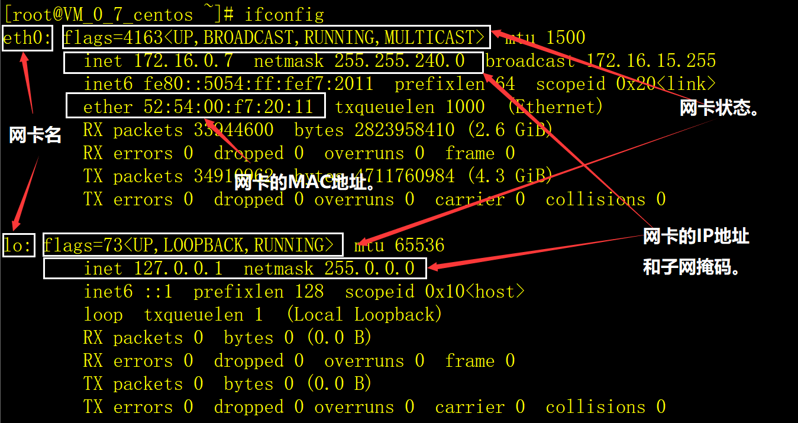

上图中，我们重点关注五方面信息：

1）网卡名：即网卡设备名，lo是本机（全称loopback，是回环地址，经常被分配到127.0.0.1地址上，用于本机通信，经过内核处理后直接返回，不会在任何网络中出现）；eth0是真实的网卡，如果服务器有多个网卡，网卡命名将是eth0、eth1、eth2、……。注意：真实网卡的名称不一定是eth打头，还可以是no（由主板bios内置的网卡）、ens（代表有主板bios内置的PCI-E网卡）、enp2s（PCI-E独立网卡）等，后面的编号也不一定从0开始。

2）IP地址：inet后的内容是IP地址，我们现在常说的IP地址是指IPV4，IPV6的地址是inet6之后的内容，暂时不关注。

3）子网掩码：netmask后的内容是子网掩码。

4）网卡状态：

```shell
<UP,BROADCAST,RUNNING,MULTICAST>
```

 UP：网卡处于启动状态。

BROADCAST：网卡有广播地址，可以发生广播包。

MULTICAST：网卡可以发生多播包。

LOWER_UP：L1是启动的，即网线是插着的。

5）MAC地址：MAC地址是生产厂家定的，每个网卡拥有的一个地址，相当于设备的序列号。

## 2、ip addr命令

 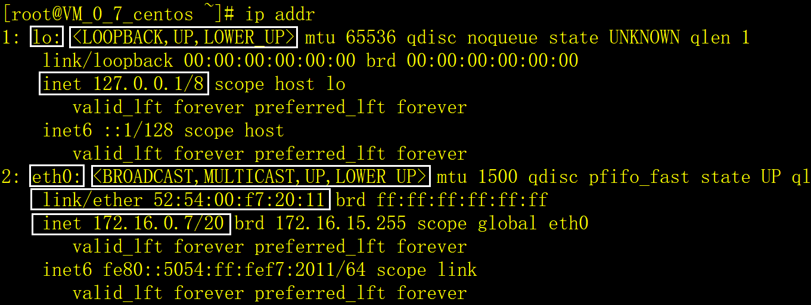

ip addr命令显示的内容和ifconfig差不多，就不解释了。注意：ip addr命令把IP地址和子网掩码在一起显示，如：`172.16.0.7/20`。

# 二、配置网卡

每一个网卡都有一个配置文件，存放在/etc/sysconfig/network-scripts目录中，文件名是ifcfg-网卡，网卡`eth0`的配置文件是`ifcfg-eth0`，如下：

 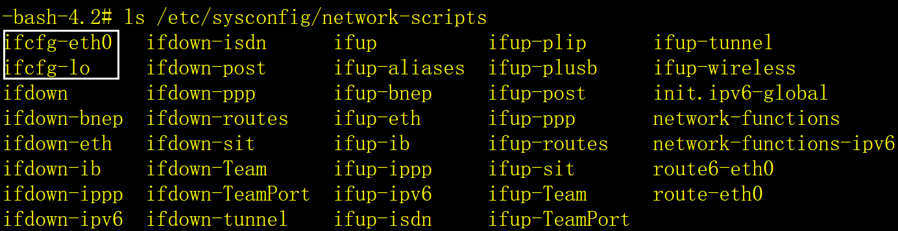

## 1、动态IP地址

如果采用的是动态分配IP的方法，ifcfg-eth0的配置如下：

```shell
TYPE=Ethernet # 网卡类型。

PROXY_METHOD=none # 代理模式。

BROWSER_ONLY=no # 只是浏览器。

BOOTPROTO=dhcp # dhcp-动态分配，static-静态分配（重要）。

DEFROUTE=yes # 启动默认路由。

IPV4_FAILURE_FATAL=no # 不启用IPV4错误检测功能。

IPV6INIT=yes # 启用IPV6协议。

IPV6_AUTOCONF=yes # 自动配置IPV6地址。

IPV6_DEFROUTE=yes # 用IPV6默认路由。

IPV6_FAILURE_FATAL=no # 不启用IPV6错误检测功能。

IPV6_ADDR_GEN_MODE=stable-privacy # IPV6地址生成模型。

NAME=eth0 # 网卡物理设备名称（重要）。

UUID=63749b32-6852-4535-96a9-58d24732771d

DEVICE=eth0 # 网卡设备名称, 必须和NAME值相同（重要）。

ONBOOT=yes # 是否开机引导。
```

以上参数是系统缺省的，只需要关注NOBOOT参数就可以了。

## 2、静态IP地址

如果采用的是静态设置IP，ifcfg-eth0的配置如下：

```shell
TYPE=Ethernet # 网卡类型。

PROXY_METHOD=none # 代理模式。

BROWSER_ONLY=no # 只是浏览器。

BOOTPROTO=static # dhcp-动态分配，static-静态分配（重要）。

DEFROUTE=yes # 启动默认路由。

IPV4_FAILURE_FATAL=no # 不启用IPV4错误检测功能。

IPV6INIT=yes # 启用IPV6协议。

IPV6_AUTOCONF=yes # 自动配置IPV6地址。

IPV6_DEFROUTE=yes # 用IPV6默认路由。

IPV6_FAILURE_FATAL=no # 不启用IPV6错误检测功能。

IPV6_ADDR_GEN_MODE=stable-privacy # IPV6地址生成模型。

NAME=eth0 # 网卡物理设备名称（重要，不必修改）。

UUID=63749b32-6852-4535-96a9-58d24732771d

DEVICE=eth0 # 网卡设备名称, 必须和NAME值相同（重要，不必修改）。

ONBOOT=yes # 是否开机引导。

 

DNS1=114.114.114.114 # 第1个DSN服务器的IP地址（重要）。

DNS2=1.2.4.8 # 第2个DSN服务器的IP地址（重要）。

 

IPADDR=192.168.126.128 # IP地址（重要）。

NETMARSK=255.255.255.0 # 子网掩码（重要）。

GATEWAY=192.168.126.2 # 网关（重要）。
```

 

## 3、重启网卡

采用root用户，执行以下命令重启网络服务：

```shell
systemctl restart network
```

# 三、注意事项

**1）如果在VMWare虚拟机中，CentOS7最小安装的网卡设备名缺省是ens33，配置文件名是ifcfg-ens33。**

**2）CentOS7最小化安装缺省是不启动网卡的，需要手工修改网卡配置文件，设置`ONBOOT=yes`。**

**3）DNS服务器的参数可以在网卡的配置文件中设置，也可以在/etc/resolv.conf文件中设置，如下：**

```shell
\# Generated by NetworkManager

nameserver 114.114.114.114

nameserver 1.2.4.8
```

**4）如果在VMWare虚拟机中，把CentOS7修改为静态IP后，可能无法上网，处理方法见下一章节。**

# 四、本地虚拟机设置静态IP后不能上网的解决方法 

在VMWare中安装的本地虚拟机CentOS7操作系统，动态IP地址会经常变化，设置成静态IP地址后，本地局域网可以互相访问，但CentOS7系统无法访问互联网，按以下步骤解决这个问题。

## 1、以系统管理员打开VMWare

 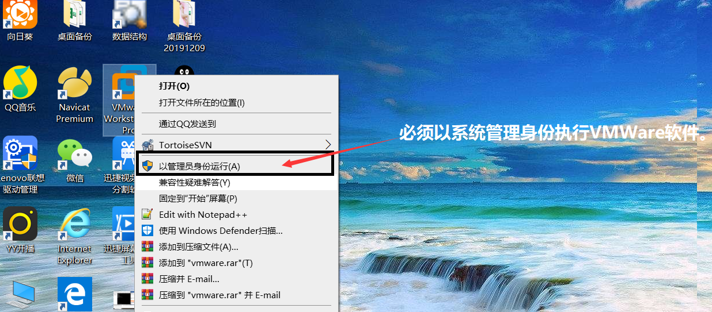

## 2、选择虚拟网络编辑器菜单

 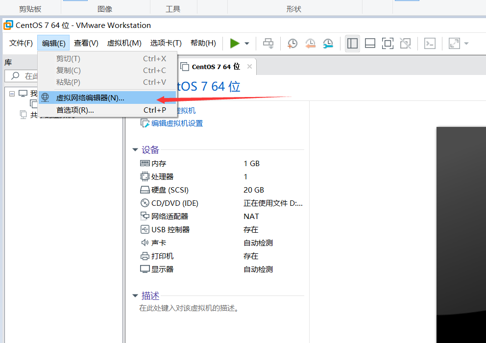

## 3、选择VMnet8这一行

 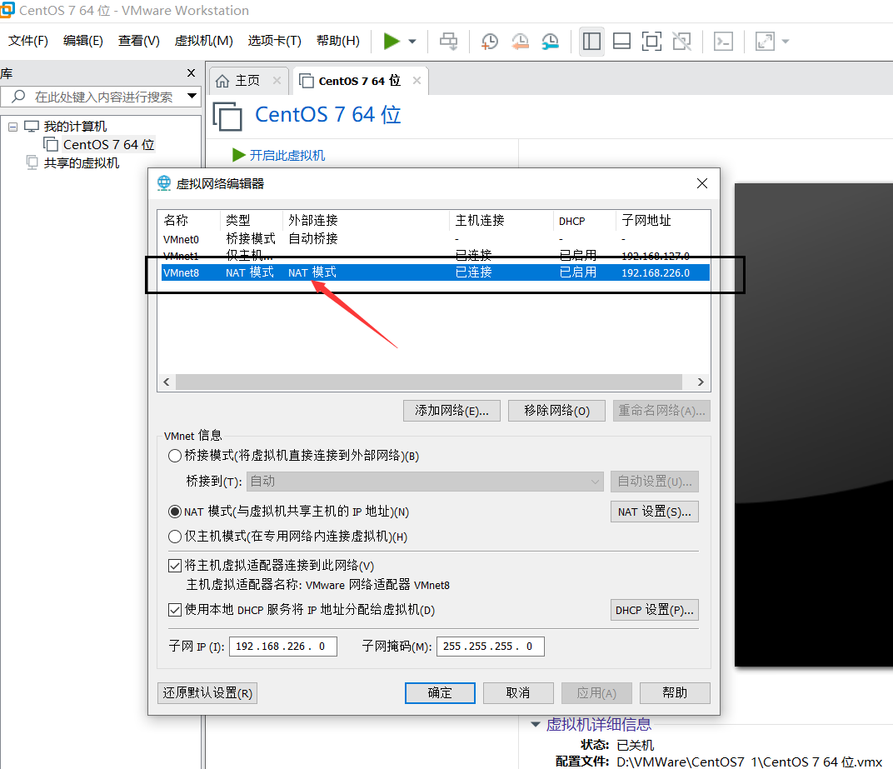

## 4、还原VMnet8的默认设置

 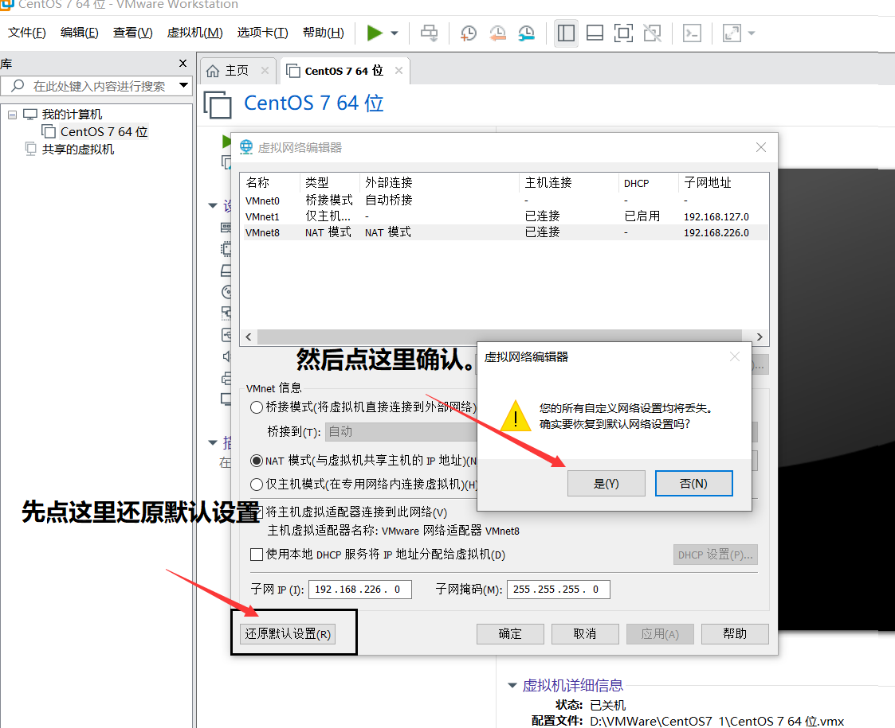

## 5、修改VMnet8的参数

 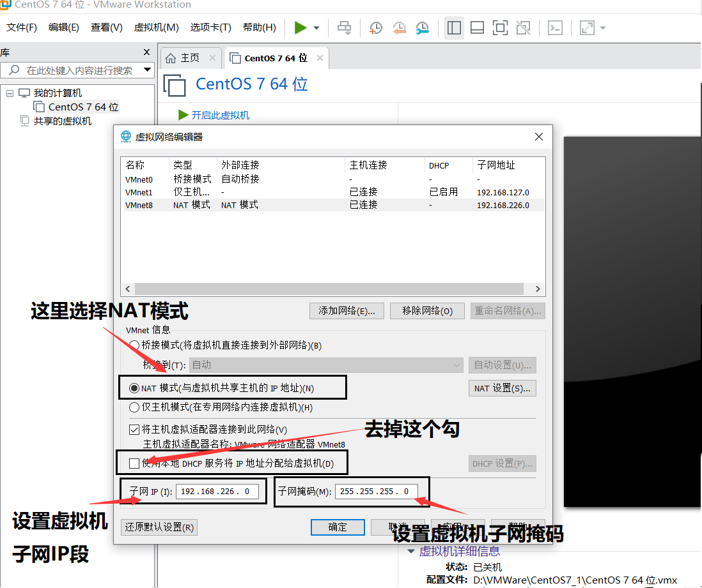

**虚拟机子网IP地址段和子网掩码由您自己来定，如果你不熟练，就按上图中的内容来设置也没有问题。**

## 6、NAT设置

 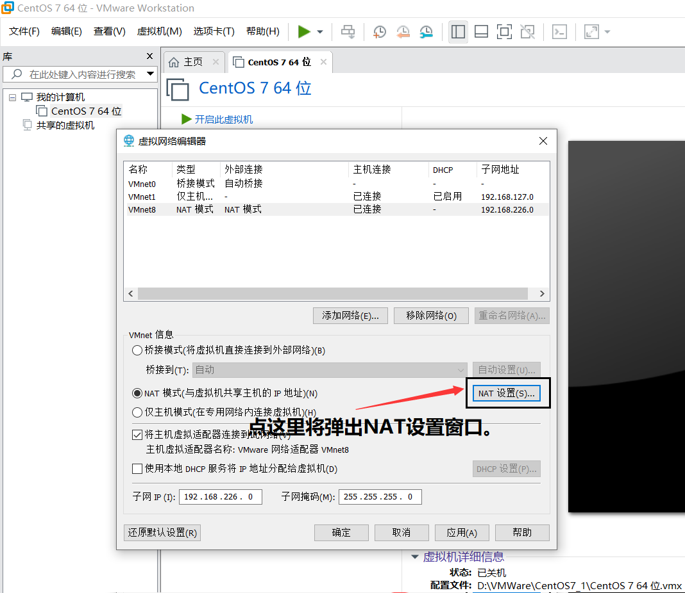

 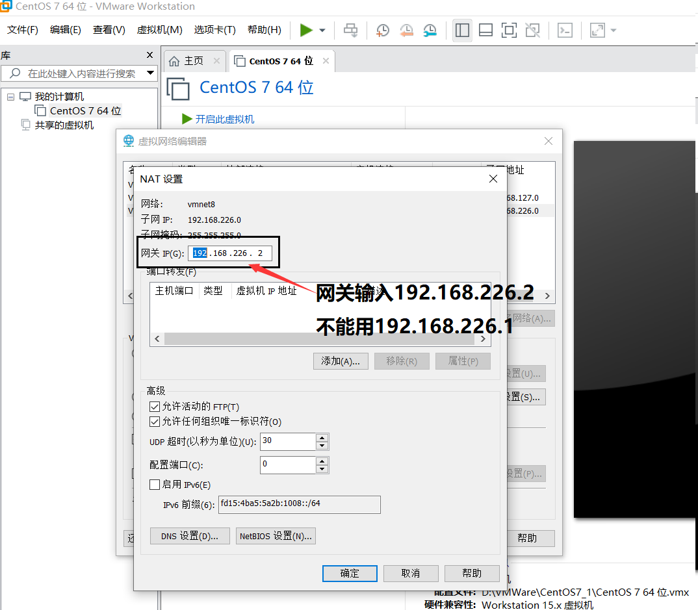

## 7、保存设置

 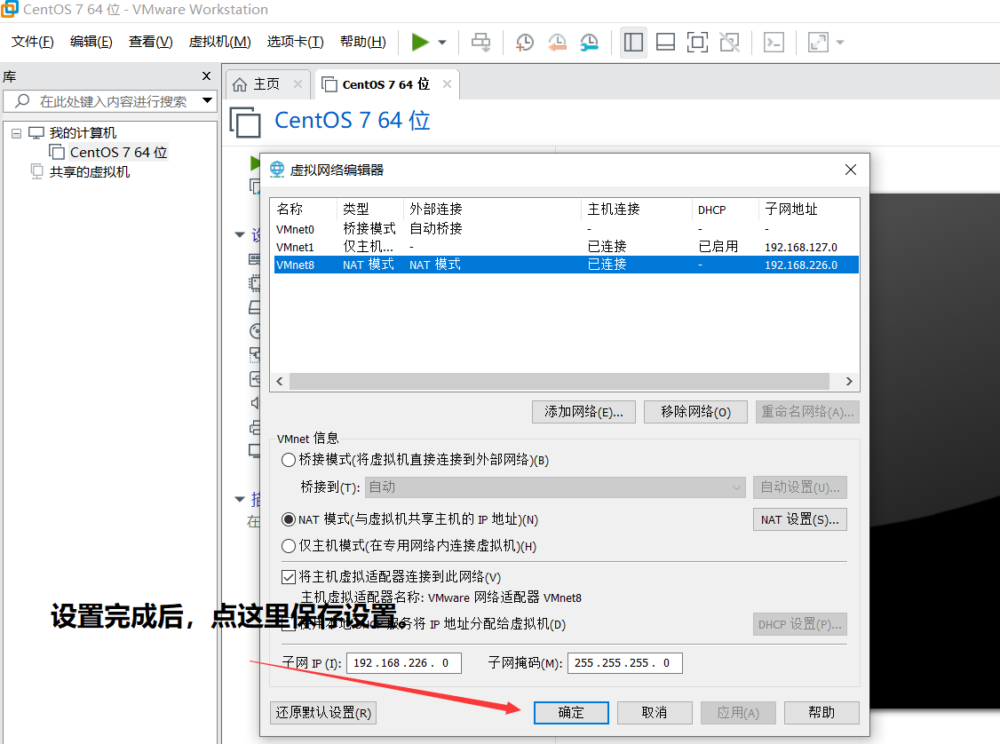

## 8、确认虚拟机为NAT模式

 

## 9、启动虚拟机CentOS7

## 10、设置CentOS7的不静态IP地址

修改虚拟机网卡配置文件，如/etc/sysconfig/network-scripts/ifcfg-ens33，注意，文件名不一定是ifcfg-ens33，根据您的实际情况决定。

1）修改BOOTPROTO参数，把地址协议改为静态IP方式。

```shell
BOOTPROTO=static # dhcp-动态分配，static-静态分配（重要）。
```

2）修改ONBOOT参数，把开机启动选项ONBOOT设置为yes。

```shell
ONBOOT=yes # 是否开机引导。
```

3）设置DSN服务器的IP，添加以下内容。

```shell
DNS1=114.114.114.114 # 第1个DSN服务器的IP地址。
DNS2=1.2.4.8 # 第2个DSN服务器的IP地址。
```

4）设置CentOS7的IP地址、子网掩码和网关参数，添加以下内容。

```shell
IPADDR=192.168.226.128 # IP地址（重要）。

NETMARSK=255.255.255.0 # 子网掩码（重要）。

GATEWAY=192.168.226.2  # 网关（重要）。
```

## 11、重启CentOS7的网络服务

```shell
systemctl restart network
```

## 12、测试效果

ping一下百度。

 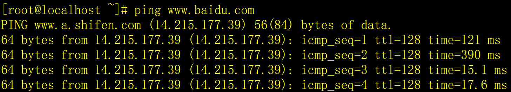

ok。

## 13、注意事项

如果您对网络知识不熟悉，或对虚拟机不熟悉，建议按本文章依葫芦画瓢，照抄参数。