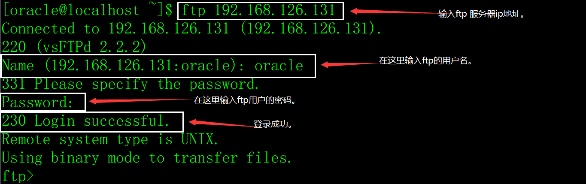
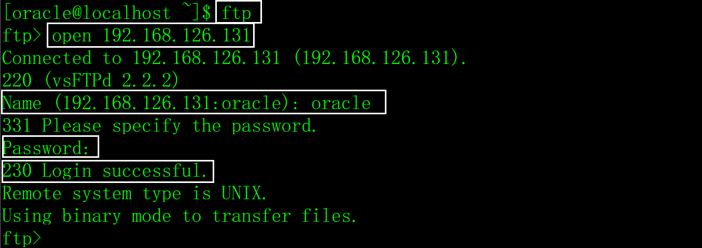
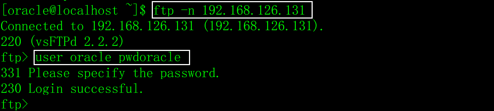
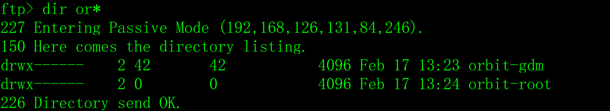
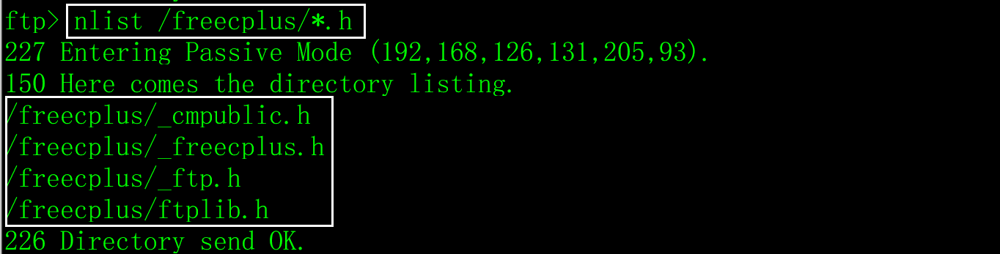
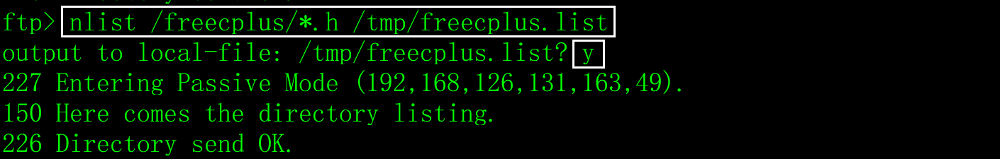
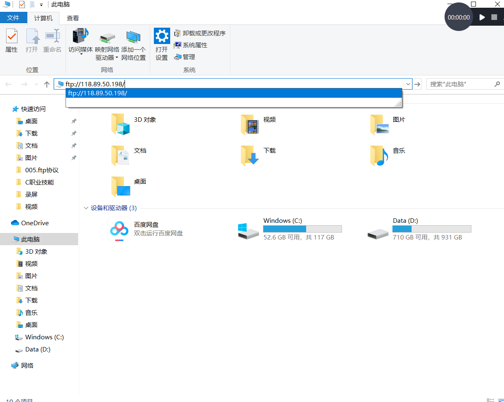
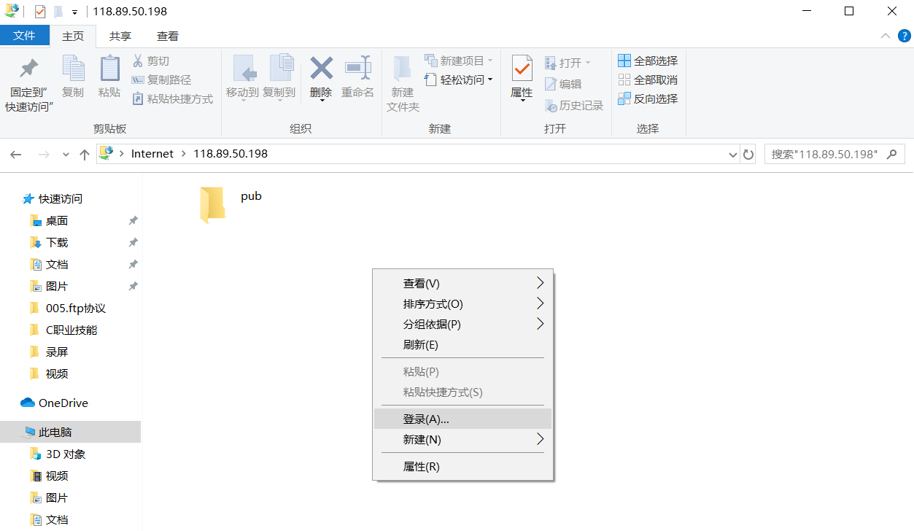
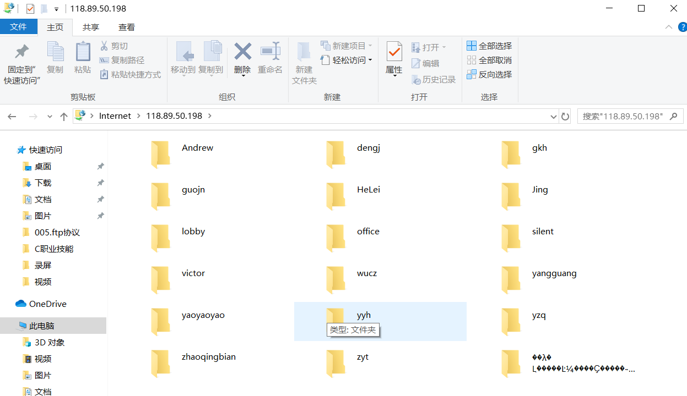

# 一、安装ftp客户端软件包

在CentOS7中，用root登录执行yum安装ftp客户端软件包，如果已经安装，再次执行yum就会把软件包升级到最新版本。

```shell
yum -y install ftp
```

# 二、ftp的用户

缺省情况下，ftp服务器操作系统用户名/密码也是ftp客户端登录的用户名/密码。root用户的权限过大，不允许登录ftp服务器。

# 三、登录服务器

方法一：输入`ftp 服务器ip地址`，回车后根据提示输入用户名和密码，如下图：

​                        

方法二：输入`ftp`，用`open 服务器ip地址`，连上服务器后再输入用户名和密码，如下图：

 

方法三：输入`ftp -n 服务器ip地址`，再输入`user 用户名 密码登录`，如下图：

 

# 四、切换工作目录

注意，如果目录名中有特殊符号，如空格，可以用双引号把目录名包含起来。

## 1、查看服务器工作目录

```shell
pwd
```

## 2、切换服务器工作目录

```shell
cd 目录名
```

## 3、切换本地工作目录

```shell
lcd 目录名
```

# 五、查看服务器上的目录和文件

## 1、列出目录或文件名的详细信息

```shell
ls  目录或文件名

dir 目录或文件名
```

ls和dir都可以用于查看目录和文件信息，常用ls，语法和Linux的ls命令相同。

 

## 2、仅列出目录和文件名

```shell
nlist 目录或文件名 [本地文件名]
```

1）列出/freecplus目录下的匹配*.h的文件名信息。

 

2）列出/freecplus目录下的匹配*.h的文件名信息，结果输出到本地的/tmp/freecplus.list文件中。

 

查看/tmp/freecplus.list内容。

 

# 六、下载/上传文件

## 1、文件传输入的模式

ftp的传输模式分为二进制和ASCII码两种模式，二进制模式可以传输任何文件，包括压缩包、可执行程序、图片、视频、音频等，而ASCII模式只能传输.txt、.htm等ascii码文件（文本文件）。在实际开发中，不管什么文件，都用二进制方式传输文件。

1）查看当前的传输模式。

```shell
type
```

2）设定传输模式为二进制。

```shell
bin
```

3）设定传输模式为ASCII。

```shell
ascii
```

示例：

 

## 2、下载文件

1）下载单个文件。

```shell
get|recv 服务器文件名 [本地文件名]
```

使用说明：

a）下载文件用get和recv都可以。

b）文件名不允许用通配符。

c）服务器文件名和本地文件名可以用绝对路径，如果不写路径，表示当前工作目录。

d）如果本地文件名省略不写，表示把服务器文件下载到本地的当前工作目录，文件名与服务器文件名相同。

2）下载多个文件。

```shell
mget 服务器文件1 服务器文件2 服务器文件3 …… 服务器文件n
```

使用说明：

a）待下载的文件名，可以一一列出来（用空格分隔），也可以用通配符。

b）下载的文件，存放在本地当前工作目录中。

c）下载文件时，会一一提示，如果想关闭都显示信息，先输入prompt命令。

```shell
prompt
```

## 3、上传文件

1）上传单个文件。

```shell
put|send 本地文件名 [服务器文件名]
```

a）上传文件用put和send都可以。

b）文件名不允许用通配符。

c）本地文件名和服务器文件名可以用绝对路径，如果不写路径，表示当前工作目录。

d）如果服务器文件名省略不写，表示把本地文件上传到服务器的当前工作目录，文件名与本地文件名相同。

2）上传多个文件。

```shell
mput 本地文件1 本地文件2 本地文件3 …… 本地文件n
```

使用说明：

a）待上传的文件名，可以一一列出来（用空格分隔），也可以用通配符。

b）上传的文件，存放在服务器当前工作目录中。

c）上传文件时，会一一提示，如果想关闭都显示信息，先输入prompt命令。

```shell
prompt
```

# 七、其它ftp命令

1）重命名服务器上的文件

```shell
rename 旧文件名 新文件名
```

2）删除ftp服务器上单个文件

```shell
delete 文件名
```

3）删除多个文件。

```shell
mdelete 文件名1 文件名2 文件名3 …… 文件名n
```

4）在服务器上创建目录。

```shell
mkdir pathname
```

5）删除服务器上的目录。

```shell
rmdir pathname
```

6）切换传输模式。

```shell
passive
```

7）显示帮助信息。

```shell
help [命令名]
```

显示ftp命令的帮助信息，如果不输入命令名，则显示全ftp命令的帮助信息。

8）退出ftp。

```shell
bye
```

# 八、Windows的ftp客户端

在Windows的DOS命令提示符下输入ftp命令，但是不好用。

打开资源管理器，输入：<ftp://服务器ip>地址，如下图：

 

在空白的位置点鼠标右键，选择登录菜单，如下图：

 

输入用户名和密码登录ftp服务器，如下图：

 

接下来的操作就像windows的目录文件操作一样了。
