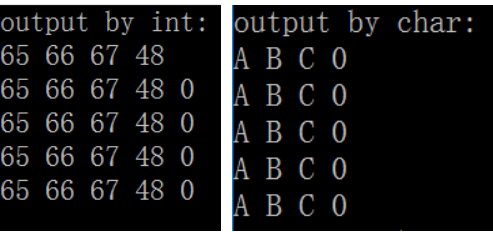

# C语言‘\0’和0和‘0’

‘\0’和‘0’
共同点：都是字符

不同点：'\0'对应的ASCII码是0，是ASCII码表中的第一个字符，即空字符；判断一个字符串是否结束的标志就是看是否遇到‘\0’。

             ‘0’对应的ASCII码是48，48对应的十六进制数就是0x30。

“0”和‘0’
“0”是字符串常量，字符串常量是由一对双引号括起的字符序列。字符串常量可以含一个或多个字符。

‘0’是字符常量，字符常量由单引号括起来。字符常量只能是单个字符。

关于“以0结束”的问题：

char s[4] = {‘A’, ‘B’, ‘C’, ‘0’};   是字符数组，不是字符串

char s[5] = {‘A’, ‘B’, ‘C’, ‘0’, 0}; 既是字符数组，也是字符串

char s[5] = {‘A’, ‘B’, ‘C’, ‘0’}; 既是字符数组，也是字符串

char s[5] = ”ABC0”;   <=>  char s[5] = {‘A’, ‘B’, ‘C’, ‘0’};   <=>  char s[5] = {‘A’, ‘B’, ‘C’, ‘0’, 0};

 

   //完整代码见下面：

```c++
char c1[4] = {'A', 'B', 'C', '0'};
char c2[5] = {'A', 'B', 'C', '0', 0};
char c3[5] = {'A', 'B', 'C', '0', '\0'};
char c4[5] = {'A', 'B', 'C', '0'};
char c5[5] = "ABC0";
```

//从下面的结果可以看出，2 3 4 5 是完全等价的 




ASCII码     十六进制      字符

  48               0x30     数字字符‘0’
————————————————

```c++
#include<stdio.h>
#include<string.h>
 
void printByInt(char c[], int count){
	int i;
	
	//printf("%d\n", sizeof(c));
	for(i = 0; i < count; i++){
		printf("%d ", c[i]);
	}
	printf("\n");	
}
 
void printByChar(char c[], int count){
	int i;
	for(i = 0; i < count; i++){
		printf("%c ", c[i]);
	}
	printf("\n");	
}
void main(void){
	char c1[4] = {'A', 'B', 'C', '0'};
	char c2[5] = {'A', 'B', 'C', '0', 0};
	char c3[5] = {'A', 'B', 'C', '0', '\0'};
	char c4[5] = {'A', 'B', 'C', '0'};
	char c5[5] = "ABC0"; 
	
	printf("output by int: \n");
	printByInt(c1, sizeof(c1));
	printByInt(c2, sizeof(c2));
	printByInt(c3, sizeof(c3));
	printByInt(c4, sizeof(c4));
	printByInt(c5, sizeof(c5));
	printf("\n");
 
	printf("output by char:\n");
	printByChar(c1, sizeof(c1));
	printByChar(c2, sizeof(c2));
	printByChar(c3, sizeof(c3));
	printByChar(c4, sizeof(c4));
	printByChar(c5, sizeof(c5));
}
 
```


所以敞开说，如果要删除一个字符串最后一位，有如下两种写法

```c++

char str[10];
strcpy(str, "abcdefg");

// 方法1
str[strlen(str) - 1] = '\0';

// 方法2
str[strlen(str) - 1] = 0;
```

