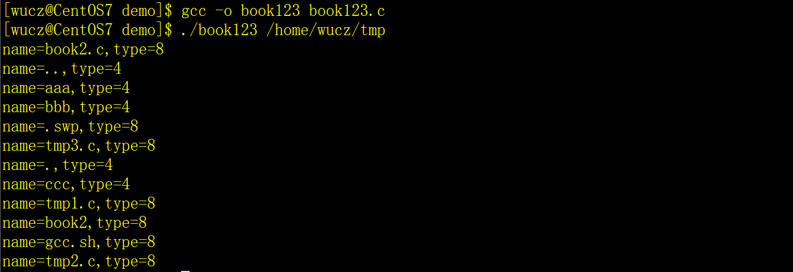

 目录的操作不论是在嵌入式还是应用软件编程都是必不可少的，不同的开发语言可能略有不同，本章节主要是讨论在Linux系统下目录的一系列操作，以我的个人经验，创建目录和列出目录中的文件这两个功能用得最多。

# 一、[获取当前工作目录](https://www.cnblogs.com/virusolf/p/5246660.html)

 在shell中我们可以直接输入命令pwd 来显示当前的工作目录，在C程序中调用getcwd函数可以获取当前的工作目录。函数声明：

```c
char *getcwd(char * buf,size_t size);
```

 getcwd函数把当前工作目录存入buf中，如果目录名超出了参数size长度，函数返回NULL，如果成功，返回buf。例如：

```c
 char strpwd[301];

 memset(strpwd,0,sizeof(strpwd));

 getcwd(strpwd,300);

 printf("当前目录是：%s\n",strpwd);
```

# 二、切换工作目录

函数声明：

```c
int chdir(const char *path);
```

就像我们在shell中使用cd命令切换目录一样，在C程序中使用chdir函数来改变工作目录。 

返回值：0-切换成功；非0-失败。

# 三、目录的创建和删除

 在shell中可以通过mkdir/rmdir命令来创建/删除目录，C程序中用mkdir/rmdir函数来创建/删除目录。

创建目录函数的声明：

```c
int mkdir(const char *pathname, mode_t mode);
```

mode的含义将按open系统调用的O_CREAT选项中的有关定义设置，当然，它还要服从umask的设置况，是不是看不明白？那先固定填0755，注意，0不要省略哦，它表示八进制。 例如：

```c
 mkdir("/tmp/aaa",0755);  // 创建/tmp/aaa目录
```

删除目录函数的声明：

```c
int rmdir(const char *pathname);
```

# 四、获取目录中的文件列表

在实际开发中，文件是存放在目录中的，在处理文件之前，必须先知道目录中有哪些文件，所以要获取目录中的文件列表。涉及到的库函数如下：

## 1、包含头文件

```c
#include <dirent.h>
```

## 2、相关的库函数

打开目录的函数opendir的声明：

```c
DIR *opendir(const char *pathname);
```

读取目录的函数readdir的声明：

```c
struct dirent *readdir(DIR *dirp);
```

关闭目录的函数closedir的声明：

```c
int closedir(DIR *dirp);
```

## 3、数据结构

1）目录指针DIR

```c
DIR *目录指针名;
```

2）struct dirent结构体

每调用一次readdir函数会返回一个struct dirent的地址，存放了本次读取到的内容，它的原理与fgets函数读取文件相同。

```c
struct dirent

{

  long d_ino;          // inode number 索引节点号

  off_t d_off;          // offset to this dirent 在目录文件中的偏移 

  unsigned short d_reclen;   // length of this d_name 文件名长 

  unsigned char d_type;     // the type of d_name 文件类型

  char d_name [NAME_MAX+1];  // file name文件名，最长255字符

};
```

我们只需要关注结构体的d_type和d_name成员，其它的不必关心。

d_name文件名或目录名。

d_type描述了文件的类型，有多种取值，最重要的是8和4，8-常规文件（A regular file）；4-目录（A directory），其它的暂时不关心。

## 4、读取目录

**示例（book123.cpp）**

```c
/*

 \* 程序名：book123.c，此程序用于演示读取目录下的文件名信息

*/

\#include <stdio.h>

\#include <dirent.h>

 

int main(int argc,char *argv[])

{

 if (argc != 2) { printf("请指定目录名。\n"); return -1; }

 

 DIR *dir;  // 定义目录指针

 

 // 打开目录

 if ( (dir=opendir(argv[1])) == 0 ) return -1;

 

 // 用于存放从目录中读取到的文件和目录信息

 struct dirent *stdinfo;

 

 while (1)

 {

  // 读取一条记录并显示到屏幕

  if ((stdinfo=readdir(dir)) == 0) break;

 

  printf("name=%s,type=%d\n",stdinfo->d_name,stdinfo->d_type);

 }

 

 closedir(dir);  // 关闭目录指针

}
```


**运行效果**

​                               