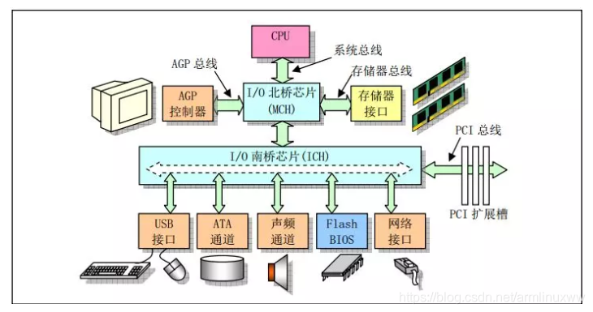
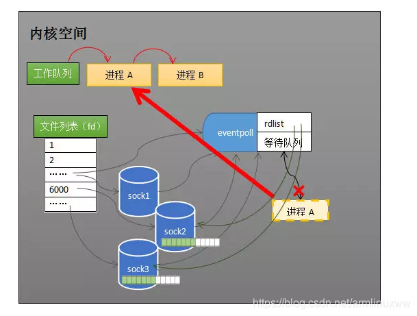

本文核心思想是：要让读者清晰明白epoll为什么性能好。

文章会从网卡接收数据的流程讲起，串联起CPU中断、操作系统进程调度等知识；再一步步分析阻塞接收数据、select 到epoll的进化过程;最后探究epoll的实现细节。

# 一、从网卡接收数据说起

下边是一个典型的计算机结构图，计算机由 CPU、存储器（内存）与网络接口等部件组成，了解epoll本质的第一步，要从硬件的角度看计算机怎样接收网络数据。

​                               

下图展示了网卡接收数据的过程：

l 在1阶段，网卡收到网线传来的数据。

l 经过2阶段的硬件电路的传输。

l 最终3阶段将数据写入到内存中的某个地址上。

这个过程涉及到DMA传输、IO通路选择等硬件有关的知识，但我们只需知道：网卡会把接收到的数据写入内存。

 

通过硬件传输，网卡接收的数据存放到内存中，操作系统就可以去读取它们。

# 二、如何知道接收了数据

了解epoll本质的第二步，要从CPU的角度来看数据接收。理解这个问题，要先了解一个概念：中断。

计算机执行程序时，会有优先级的需求。比如，当计算机收到断电信号时，它应立即去保存数据，保存数据的程序具有较高的优先级（电容可以保存少许电量，供CPU运行很短的一小段时间）。

一般而言，由硬件产生的信号需要CPU立马做出回应，不然数据可能就丢失了，所以它的优先级很高。

CPU理应中断掉正在执行的程序，去做出响应;当CPU完成对硬件的响应后，再重新执行用户程序。

中断的过程如下图，它和函数调用差不多，只不过函数调用是事先定好位置，而中断的位置由“信号”决定。

 

以键盘为例，当用户按下键盘某个按键时，键盘会给CPU的中断引脚发出一个高电平，CPU能够捕获这个信号，然后执行键盘中断程序。

下图展示了各种硬件通过中断与CPU交互的过程：

 

现在可以回答“如何知道接收了数据？”这个问题了：当网卡把数据写入到内存后，网卡向CPU发出一个中断信号，操作系统便能得知有新数据到来，再通过网卡中断程序去处理数据。

# 三、进程阻塞为什么不占用CPU资源

了解epoll本质的第三步，要从操作系统进程调度的角度来看数据接收。阻塞是进程调度的关键一环，指的是进程在等待某事件（如接收到网络数据）发生之前的等待状态，recv、select 和epoll都是阻塞方法。

下边分析一下进程阻塞为什么不占用CPU资源？为简单起见，我们从普通的 recv接收开始分析，先看看下面代码：

```c++
//创建socket

int s =socket（AF_INET， SOCK_STREAM， 0）;  

//绑定 

bind（s， ...） 

//监听 

listen（s， ...） 

//接受客户端连接 

int c = accept（s， ...） 

//接收客户端数据 

recv（c， ...）; 

//将数据打印出来 

printf（...）
```

这是一段最基础的网络编程代码，先新建socket对象，依次调用bind、listen与accept，最后调用recv接收数据。

recv是个阻塞方法，当程序运行到recv时，它会一直等待，直到接收到数据才往下执行。那么阻塞的原理是什么？

# 四、工作队列

操作系统为了支持多任务，实现了进程调度的功能，会把进程分为“运行”和“等待”等几种状态。

运行状态是进程获得CPU使用权，正在执行代码的状态;等待状态是阻塞状态，比如上述程序运行到recv时，程序会从运行状态变为等待状态，接收到数据后又变回运行状态。

操作系统会分时执行各个运行状态的进程，由于速度很快，看上去就像是同时执行多个任务。

下图的计算机中运行着 A、B 与 C 三个进程，其中进程 A 执行着上述基础网络程序，一开始，这 3 个进程都被操作系统的工作队列所引用，处于运行状态，会分时执行。

 

# 五、等待队列

当进程 A 执行到创建socket的语句时，操作系统会创建一个由文件系统管理的socket对象（如下图）。

 

这个socket对象包含了发送缓冲区、接收缓冲区与等待队列等成员。等待队列是个非常重要的结构，它指向所有需要等待该socket事件的进程。

当程序执行到recv时，操作系统会将进程 A 从工作队列移动到该socket的等待队列中（如下图）。

 

由于工作队列只剩下了进程 B 和 C，依据进程调度，CPU会轮流执行这两个进程的程序，不会执行进程 A 的程序。所以进程 A 被阻塞，不会往下执行代码，也不会占用CPU资源。

注：操作系统添加等待队列只是添加了对这个“等待中”进程的引用，以便在接收到数据时获取进程对象、将其唤醒，而非直接将进程管理纳入自己之下。上图为了方便说明，直接将进程挂到等待队列之下。

# 六、唤醒进程

当socket接收到数据后，操作系统将该socket等待队列上的进程重新放回到工作队列，该进程变成运行状态，继续执行代码。

同时由于socket的接收缓冲区已经有了数据，recv可以返回接收到的数据。

# 七、内核接收网络数据全过程

这一步，贯穿网卡、中断与进程调度的知识，叙述阻塞recv下内核接收数据的全过程。

 

如上图所示，进程在recv阻塞期间：

l 计算机收到了对端传送的数据（步骤 ①）

l 数据经由网卡传送到内存（步骤 ②）

l 然后网卡通过中断信号通知CPU有数据到达，CPU执行中断程序（步骤 ③）

此处的中断程序主要有两项功能，先将网络数据写入到对应socket的接收缓冲区里面（步骤 ④），再唤醒进程 A（步骤 ⑤），重新将进程 A 放入工作队列中。

唤醒进程的过程如下图所示：

 

以上是内核接收数据全过程，这里我们可能会思考两个问题：

l 操作系统如何知道网络数据对应于哪个socket？

l 如何同时监视多个socket的数据？

第一个问题：因为一个socket对应着一个端口号，而网络数据包中包含了 IP 和端口的信息，内核可以通过端口号找到对应的socket。

当然，为了提高处理速度，操作系统会维护端口号到socket的索引结构，以快速读取。

第二个问题是多路复用的重中之重，也正是本文后半部分的重点。

# 八、同时监视多个socket的简单方法

服务端需要管理多个客户端连接，而recv只能监视单个socket，这种矛盾下，人们开始寻找监视多个socket的方法。epoll的要义就是高效地监视多个socket。

从历史发展角度看，必然先出现一种不太高效的方法，人们再加以改进，正如select 之于epoll。先理解不太高效的select，才能够更好地理解epoll的本质。

假如能够预先传入一个socket列表，如果列表中的socket都没有数据，挂起进程，直到有一个socket收到数据，唤醒进程。这种方法很直接，也是select 的设计思想。

为方便理解，我们先复习select 的用法。在下边的代码中，先准备一个数组 FDS，让 FDS 存放着所有需要监视的socket。

然后调用select，如果 FDS 中的所有socket都没有数据，select 会阻塞，直到有一个socket接收到数据，select 返回，唤醒进程。

用户可以遍历 FDS，通过 FD_ISSET 判断具体哪个socket收到数据，然后做出处理。 

```c++
int s =socket（AF_INET， SOCK_STREAM， 0）;  

bind（s， ...） 

listen（s， ...） 

 

int fds[] = 存放需要监听的socket

 

while（1）{ 

  int n = select（...， fds， ...） 

  for（int i=0; i < fds.count; i++）{ 

​    if（FD_ISSET（fds[i]， ...））{ 

​      //fds[i]的数据处理 

​    } 

  } 

}
```


# 九、select的流程

select 的实现思路很直接，假如程序同时监视如下图的sock1、sock2 和 sock3 三个socket，那么在调用select 之后，操作系统把进程A分别加入这三个socket的等待队列中。

当任何一个socket收到数据后，中断程序将唤起进程。下图展示了sock2 接收到了数据的处理流程：

 

注：recv和 relect 的中断回调可以设置成不同的内容。

所谓唤起进程，就是将进程从所有的等待队列中移除，加入到工作队列里面，如下图所示：

 

经由这些步骤，当进程A被唤醒后，它知道至少有一个socket接收了数据。程序只需遍历一遍socket列表，就可以得到就绪的socket。

这种简单方式行之有效，在几乎所有操作系统都有对应的实现。但是简单的方法往往有缺点，主要是：

l 每次调用select都需要将进程加入到所有监视socket的等待队列，每次唤醒都需要从每个队列中移除。这里涉及了两次遍历，而且每次都要将整个 FDS 列表传递给内核，有一定的开销。

正是因为遍历操作开销大，出于效率的考量，才会规定select 的最大监视数量，默认只能监视1024个socket。

l 进程被唤醒后，程序并不知道哪些socket收到数据，还需要遍历一次。

那么，有没有减少遍历的方法？有没有保存就绪socket的方法？这两个问题便是epoll技术要解决的。

补充说明：本节只解释了select 的一种情形。当程序调用select 时，内核会先遍历一遍socket，如果有一个以上的socket接收缓冲区有数据，那么select 直接返回，不会阻塞。

这也是为什么select 的返回值有可能大于1的原因之一。如果没有socket有数据，进程才会阻塞。

# 十、epoll的设计思路

epoll是在select 出现 N 多年后才被发明的，是select 和 poll（poll 和 select 基本一样，有少量改进）的增强版本。epoll通过以下一些措施来改进效率：

## 1、措施一：功能分离

select 低效的原因之一是将“维护等待队列”和“阻塞进程”两个步骤合二为一。

 

如上图所示，每次调用select都需要这两步操作，然而大多数应用场景中，需要监视的socket相对固定，并不需要每次都修改。

epoll将这两个操作分开，先用epoll_ctl 维护等待队列，再调用epoll_wait 阻塞进程。显而易见地，效率就能得到提升。

为方便理解后续的内容，我们先了解一下epoll的用法。如下的代码中，先用epoll_create 创建一个epoll对象 epfd，再通过epoll_ctl 将需要监视的socket添加到 epfd 中，最后调用epoll_wait 等待数据： 

```c++
int s =socket（AF_INET， SOCK_STREAM， 0）;  

bind（s， ...） 

listen（s， ...） 

 

int epfd =epoll_create（...）; 

epoll_ctl（epfd， ...）; //将所有需要监听的socket添加到epfd中 

 

while（1）{ 

  int n =epoll_wait（...） 

  for（接收到数据的socket）{ 

​    //处理 

  } 

}
```


功能分离，使得epoll有了优化的可能。

## 2、措施二：就绪列表

select低效的另一个原因在于程序不知道哪些socket收到数据，只能一个个遍历。如果内核维护一个“就绪列表”，引用收到数据的socket，就能避免遍历。

 

如上图所示，计算机共有三个socket，收到数据的sock2和sock3 被就绪列表rdlist 所引用。

当进程被唤醒后，只要获取rdlist 的内容，就能够知道哪些socket收到数据。

# 十一、epoll的原理与工作流程

本节会以示例和图表来讲解epoll的原理和工作流程。

## 1、创建epoll对象

如下图所示，当某个进程调用epoll_create 方法时，内核会创建一个 eventpoll 对象（也就是程序中 epfd 所代表的对象）。

 

eventpoll 对象也是文件系统中的一员，和socket一样，它也会有等待队列。

创建一个代表该epoll的 eventpoll 对象是必须的，因为内核要维护“就绪列表”等数据，“就绪列表”可以作为 eventpoll 的成员。

## 2、维护监视列表

创建epoll对象后，可以用epoll_ctl 添加或删除所要监听的socket。以添加socket为例。

 

如上图，如果通过epoll_ctl 添加sock1、sock2 和sock3 的监视，内核会将 eventpoll 添加到这三个socket的等待队列中。

当socket收到数据后，中断程序会操作 eventpoll 对象，而不是直接操作进程。

## 3、接收数据

当socket收到数据后，中断程序会给 eventpoll 的“就绪列表”添加socket引用。

 

如上图展示的是sock2 和sock3 收到数据后，中断程序让rdlist 引用这两个socket。

eventpoll 对象相当于socket和进程之间的中介，socket的数据接收并不直接影响进程，而是通过改变 eventpoll 的就绪列表来改变进程状态。

当程序执行到epoll_wait 时，如果rdlist 已经引用了socket，那么epoll_wait 直接返回，如果 rdlist 为空，阻塞进程。

## 4、阻塞和唤醒进程

假设计算机中正在运行进程 A 和进程 B，在某时刻进程 A 运行到了epoll_wait 语句。

 

如上图所示，内核会将进程 A 放入 eventpoll 的等待队列中，阻塞进程。

当socket接收到数据，中断程序一方面修改rdlist，另一方面唤醒 eventpoll 等待队列中的进程，进程 A 再次进入运行状态（如下图）。

 

也因为rdlist 的存在，进程 A 可以知道哪些socket发生了变化。

# 十二、epoll的实现细节

至此，相信读者对epoll的本质已经有一定的了解。但我们还需要知道 eventpoll 的数据结构是什么样子？

此外，就绪队列应该使用什么数据结构？eventpoll 应使用什么数据结构来管理通过epoll_ctl 添加或删除的socket？

 

如上图所示，eventpoll 包含了 Lock、MTX、WQ（等待队列）与 rdlist 等成员，其中rdlist 和 RBR 是我们所关心的。

## 1、就绪列表的数据结构

就绪列表引用着就绪的socket，所以它应能够快速的插入数据。程序可能随时调用epoll_ctl 添加监视socket，也可能随时删除。

当删除时，若该socket已经存放在就绪列表中，它也应该被移除。所以就绪列表应是一种能够快速插入和删除的数据结构。

双向链表就是这样一种数据结构，epoll使用双向链表来实现就绪队列（对应上图的rdlist）。

## 2、索引结构

既然epoll将“维护监视队列”和“进程阻塞”分离，也意味着需要有个数据结构来保存监视的socket，至少要方便地添加和移除，还要便于搜索，以避免重复添加。

红黑树是一种自平衡二叉查找树，搜索、插入和删除时间复杂度都是 O（log2(N)=log(N)），效率较好，epoll使用了红黑树作为索引结构（对应上图的 RBR）。

注：因为操作系统要兼顾多种功能，以及有更多需要保存的数据，rdlist 并非直接引用socket，而是通过 epitem 间接引用，红黑树的节点也是 epitem 对象。

同样，文件系统也并非直接引用着socket。为方便理解，本文中省略了一些间接结构。

# 十三、总结

epoll在 select 和poll 的基础上引入了 eventpoll 作为中间层，使用了先进的数据结构，是一种高效的多路复用技术。

这里也以表格形式简单对比一下select、poll 与epoll，希望读者能有所收获。

 

 

# 附、水平触发与边缘触发的性能差异

平时大家使用 epoll 时都知道其事件触发模式有默认的 level-trigger 模式和通过 EPOLLET 启用的 edge-trigger 模式两种。从 epoll 发展历史来看，它刚诞生时只有 edge-trigger 模式，后来因容易产生 race-cond 且不易被开发者理解，又增加了 level-trigger 模式并作为默认处理方式。

二者的差异在于 level-trigger 模式下只要某个 fd 处于 readable/writable 状态，无论什么时候进行 epoll_wait 都会返回该 fd；而 edge-trigger 模式下只有某个 fd 从 unreadable 变为 readable 或从 unwritable 变为 writable 时，epoll_wait 才会返回该 fd。

通常的误区是：level-trigger 模式在 epoll 池中存在大量 fd 时效率要显著低于 edge-trigger 模式。

但从 kernel 代码来看，edge-trigger/level-trigger 模式的处理逻辑几乎完全相同，差别仅在于 level-trigger 模式在 event 发生时不会将其从 ready list 中移除，略为增大了 event 处理过程中 kernel space 中记录数据的大小。

然而，edge-trigger 模式一定要配合 user app 中的 ready list 结构，以便收集已出现 event 的 fd，再通过 round-robin 方式挨个处理，以此避免通信数据量很大时出现忙于处理热点 fd 而导致非热点 fd 饿死的现象。统观 kernel 和 user space，由于 user app 中 ready list 的实现千奇百怪，不一定都经过仔细的推敲优化，因此 edge-trigger 的总内存开销往往还大于 level-trigger 的开销。

一般号称 edge-trigger 模式的优势在于能够减少 epoll 相关系统调用，这话不假，但 user app 里可不是只有 epoll 相关系统调用吧？为了绕过饿死问题，edge-trigger 模式的 user app 要自行进行 read/write 循环处理，这其中增加的系统调用和减少的 epoll 系统调用加起来，有谁能说一定就能明显地快起来呢？

实际上，epoll_wait 的效率是 O(ready fd num) 级别的，因此 edge-trigger 模式的真正优势在于减少了每次 epoll_wait 可能需要返回的 fd 数量，在并发 event 数量极多的情况下能加快 epoll_wait 的处理速度，但别忘了这只是针对 epoll 体系自己而言的提升，与此同时 user app 需要增加复杂的逻辑、花费更多的 cpu/mem 与其配合工作，总体性能收益究竟如何？只有实际测量才知道，无法一概而论。不过，为了降低处理逻辑复杂度，常用的事件处理库大部分都选择了 level-trigger 模式（如 libevent、boost::asio等）

**结论：**

•   epoll 的 edge-trigger 和 level-trigger 模式处理逻辑差异极小，性能测试结果表明常规应用场景 中二者性能差异可以忽略。

•   使用 edge-trigger 的 user app 比使用 level-trigger 的逻辑复杂，出错概率更高。

•   edge-trigger 和 level-trigger 的性能差异主要在于 epoll_wait 系统调用的处理速度，是否是 user app 的性能瓶颈需要视应用场景而定，不可一概而论