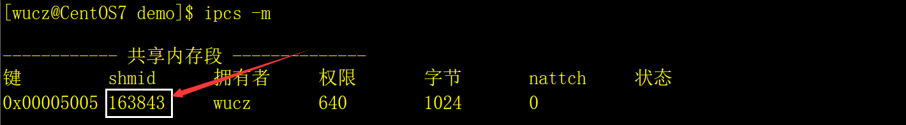
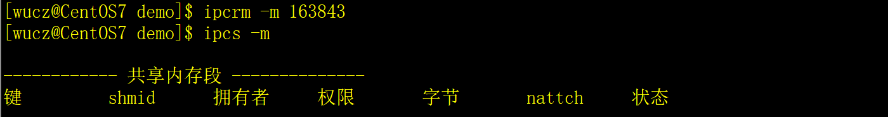

# 一、共享内存的概念

共享内存（Shared Memory）就是允许多个进程访问同一个内存空间，是在多个进程之间共享和传递数据最高效的方式。操作系统将不同进程之间共享内存安排为同一段物理内存，进程可以将共享内存连接到它们自己的地址空间中，如果某个进程修改了共享内存中的数据，其它的进程读到的数据也将会改变。

共享内存并未提供锁机制，也就是说，在某一个进程对共享内存的进行读写的时候，不会阻止其它的进程对它的读写。如果要对共享内存的读/写加锁，可以使用信号量。

# 二、相关函数

Linux中提供了一组函数用于操作共享内存，程序中需要包含以下头文件：

```c
#include <sys/ipc.h>

#include <sys/shm.h>
```

## 1、shmget函数

shmget函数用来获取或创建共享内存，它的声明为：

```c
int shmget(key_t key, size_t size, int shmflg);
```

参数key是共享内存的键值，是一个整数，typedef unsigned int key_t，是共享内存在系统中的编号，不同共享内存的编号不能相同，这一点由程序员保证。key用十六进制表示比较好。

参数size是待创建的共享内存的大小，以字节为单位。

参数shmflg是共享内存的访问权限，与文件的权限一样，0666|IPC_CREAT表示全部用户对它可读写，如果共享内存不存在，就创建一个共享内存。

## 2、shmat函数

把共享内存连接到当前进程的地址空间。它的声明如下：

```c
void *shmat(int shm_id, const void *shm_addr, int shmflg);
```

参数shm_id是由shmget函数返回的共享内存标识。

参数shm_addr指定共享内存连接到当前进程中的地址位置，通常为空，表示让系统来选择共享内存的地址。

参数shm_flg是一组标志位，通常为0。

调用成功时返回一个指向共享内存第一个字节的指针，如果调用失败返回-1.

## 3、shmdt函数

该函数用于将共享内存从当前进程中分离，相当于shmat函数的反操作。它的声明如下：

```c
int shmdt(const void *shmaddr);
```

参数shmaddr是shmat函数返回的地址。

调用成功时返回0，失败时返回-1.

## 4、shmctl函数

删除共享内存，它的声明如下：

```c
int shmctl(int shm_id, int command, struct shmid_ds *buf);
```

参数shm_id是shmget函数返回的共享内存标识符。

参数command填IPC_RMID。

参数buf填0。

解释一下，shmctl是控制共享内存的函数，其功能不只是删除共享内容，但其它的功能没什么用，所以不介绍了。

**注意，用root创建的共享内存，不管创建的权限是什么，普通用户无法删除。**

# 三、示例程序

**示例（book258.cpp）**

```c++
\#include <stdio.h>

\#include <stdlib.h>

\#include <string.h>

\#include <unistd.h>

\#include <sys/ipc.h>

\#include <sys/shm.h>

 

struct st_pid

{

 int pid;    // 进程编号。

 char name[51]; // 进程名称。

};

 

int main(int argc,char *argv[])

{

 // 共享内存的标志。

 int shmid;

 

 // 获取或者创建共享内存，键值为0x5005。

 if ( (shmid=shmget(0x5005, sizeof(struct st_pid), 0640|IPC_CREAT))==-1)

 { printf("shmget(0x5005) failed\n"); return -1; }

 

 // 用于指向共享内存的结构体变量。

 struct st_pid *stpid=0;

 

 // 把共享内存连接到当前进程的地址空间。

 if ( (stpid=(struct st_pid *)shmat(shmid,0,0))==(void *)-1)

 { printf("shmat failed\n"); return -1; }

 

 printf("pid=%d,name=%s\n",stpid->pid,stpid->name);

 

 stpid->pid=getpid();

 strcpy(stpid->name,argv[1]);

 

 printf("pid=%d,name=%s\n",stpid->pid,stpid->name);

 

 // 把共享内存从当前进程中分离。

 shmdt(stpid);

 

 // 删除共享内存。

 // if (shmctl(shmid,IPC_RMID,0)==-1)

 // { printf("shmctl failed\n"); return -1; }

 

 return 0;

}
```

# 四、其它的操作命令

用ipcs -m可以查看系统的共享内存，内容有键值（key），共享内存编号（shmid），创建者（owner），权限（perms），大小（bytes）。

​                               

用ipcrm -m 共享内存编号，可以手工删除共享内存，如下：

 