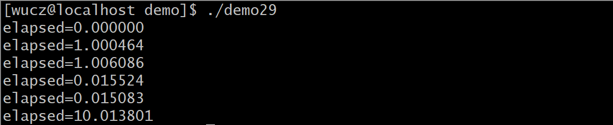

# 一、源代码说明

本文介绍的是开发框架的时间操作函数。

开发框架函数和类的声明文件是/project/public/_public.h。

开发框架函数和类的定义文件是/project/public/_public.h.cpp。

示例程序位于/project/public/demo目录中。

编译规则文件是/project/public/demo/makefile。

# 二、计算机时间的表示方法

 UNIX操作系统根据计算机产生的年代和应用采用1970年1月1日作为UNIX的纪元时间，1970年1月1日0点作为计算机表示时间的是中间点，将从1970年1月1日开始经过的秒数用一个整数存放，这种高效简洁的时间表示方法被称为“Unix时间纪元”，向左和向右偏移都可以得到更早或者更后的时间。

在实际开发中，对日期和时间的操作场景非常多，例如程序启动和退出的时间，程序执行任务的时间，数据生成的时间，数据处理的各环节的时间等等。

在Linux系统中，自定义了time_t类型，如下：

```c
typedef long time_t;  // 时间值time_t为长整型long的别名。
```

# 三、获取操作系统的时间

取操作系统的时间，并把整数表示的时间转换为字符串表示的格式。

函数声明：

```c++
void LocalTime(char *out_stime,const char *in_fmt=0,const int in_interval=0);
```

参数说明：

stime：用于存放获取到的时间字符串。

timetvl：时间的偏移量，单位：秒，0是缺省值，表示当前时间，30表示当前时间30秒之后的时间点，-30表示当前时间30秒之前的时间点。

fmt：输出时间的格式，fmt每部分的含义："yyyy"-年份；"mm"-月份；"dd"-日期；"hh24"-小时；"mi"-分钟；"ss"-秒，缺省是"yyyy-mm-dd hh24:mi:ss"，目前支持以下格式：

 "yyyy-mm-dd hh24:mi:ss"

 "yyyymmddhh24miss"

 "yyyy-mm-dd"

 "yyyymmdd"

 "hh24:mi:ss"

 "hh24miss"

 "hh24:mi"

 "hh24mi"

 "hh24"

 "mi"

注意：

1）小时的表示方法是hh24，不是hh，这么做的目的是为了保持与数据库的时间表示方法一致；

2）以上列出了常用的时间格式，如果不能满足您应用开发的需求，请修改源代码timetostr函数增加更多的格式支持；

3）调用函数的时候，如果fmt与上述格式都匹配，stime的内容将为空。

**示例（demo24.cpp）**

```c++
/*

 \* 程序名：demo24.cpp，此程序演示开发框架中LocalTime时间函数的使用。

*/

#include "../_public.h"

 

int main()

{

 char strtime[20];

 memset(strtime,0,sizeof(strtime));

 

 LocalTime(strtime,"yyyy-mm-dd hh24:mi:ss",-30); // 获取30秒前的时间。

 printf("strtime1=%s\n",strtime);

 

 LocalTime(strtime,"yyyy-mm-dd hh24:mi:ss");   // 获取当前时间。

 printf("strtime2=%s\n",strtime);

 

 LocalTime(strtime,"yyyy-mm-dd hh24:mi:ss",30);  // 获取30秒后的时间。

 printf("strtime3=%s\n",strtime);

 

 printf("=%d\n",time(0));

}


```

# 四、时间转换函数

## 1、把整数表示的时间转换为字符串表示的时间

函数声明：

```c++
void timetostr(const time_t ltime,char *stime,const char *fmt=0);
```

参数说明：

ltime：整数表示的时间。

stime：字符串表示的时间。

fmt：输出字符串时间stime的格式，与LocalTime函数的fmt参数相同，如果fmt的格式不正确，stime将为空。

## 2、把字符串表示的时间转换为整数表示的时间

函数声明：

```c++
time_t strtotime(const char *stime);
```

参数说明：

stime：字符串表示的时间，格式不限，但一定要包括yyyymmddhh24miss，一个都不能少。

返回值：整数表示的时间，如果stime的格式不正确，返回-1。

**示例（demo26.cpp）**

```c++
/*

 \* 程序名：demo26.cpp，此程序演示开发框架中整数表示的时间和字符串表示的时间之间的转换。

*/

\#include "../_public.h"

 

int main()

{

 time_t ltime;

 char strtime[20];

 

 memset(strtime,0,sizeof(strtime));

 strcpy(strtime,"2020-01-01 12:35:22");

 

 ltime=strtotime(strtime);  // 转换为整数的时间

 printf("ltime=%ld\n",ltime); // 输出ltime=1577853322

 

 memset(strtime,0,sizeof(strtime));

 timetostr(ltime,strtime,"yyyy-mm-dd hh24:mi:ss"); // 转换为字符串的时间

 printf("strtime=%s\n",strtime);   // 输出strtime=2020-01-01 12:35:22

}
```

# 五、时间的运算

把字符串表示的时间加上一个偏移的秒数后得到一个新的字符串表示的时间。

函数声明：

```c++
bool AddTime(const char *in_stime,char *out_stime,const int timetvl,const char *fmt=0);
```

参数说明：

in_stime：输入的字符串格式的时间。

out_stime：输出的字符串格式的时间。

timetvl：需要偏移的秒数，正数往后偏移，负数往前偏移。

fmt：输出字符串时间out_stime的格式，与LocalTime函数的fmt参数相同。

注意：in_stime和out_stime参数可以是同一个变量的地址，如果调用失败，out_stime的内容会清空。

返回值：true-成功，false-失败，如果返回失败，可以认为是in_stime的格式不正确。

**示例（demo28.cpp）**

```c++
/*

 \* 程序名：demo28.cpp，此程序演示开发框架中采用AddTime进行时间的运算。

*/

#include "../_public.h"

 

int main()

{

 time_t ltime;

 char strtime[20];

 

 memset(strtime,0,sizeof(strtime));

 strcpy(strtime,"2020-01-01 12:35:22");

 

 AddTime(strtime,strtime,0-1*24*60*60); // 减一天。

 printf("strtime=%s\n",strtime);   // 输出strtime=2019-12-31 12:35:22

 

 AddTime(strtime,strtime,2*24*60*60); // 加两天。

 printf("strtime=%s\n",strtime);   // 输出strtime=2020-01-02 12:35:22

}
```


# 六计时器

CTimer类是一个精确到微秒的计时器。

类声明：

```c++
// 这是一个精确到微秒的计时器。

class CTimer

{

private:

 struct timeval m_start;  // 开始计时的时间。

 struct timeval m_end;   // 计时完成的时间。

 

 // 开始计时。

 void Start();

public:

 CTimer(); // 构造函数中会调用Start方法。

 

 // 计算已逝去的时间，单位：秒，小数点后面是微秒。

 double Elapsed();

};
```


CTimer创建对象后立即开始计时，每次调用Elapsed方法获取已逝去的时间（单位：秒，小数点后面是微秒），并重新开始计时。

**示例（demo29.cpp）**

```c++
/*

 \* 程序名：demo29.cpp，此程序演示开发框架中的CTimer类（计时器）的用法。

*/

#include "../_public.h"

 

int main()

{

 CTimer Timer;

 

 printf("elapsed=%lf\n",Timer.Elapsed());

 sleep(1);

 printf("elapsed=%lf\n",Timer.Elapsed());

 sleep(1);

 printf("elapsed=%lf\n",Timer.Elapsed());

 usleep(1000);

 printf("elapsed=%lf\n",Timer.Elapsed());

 usleep(100);

 printf("elapsed=%lf\n",Timer.Elapsed());

 sleep(10);

 printf("elapsed=%lf\n",Timer.Elapsed());

}
```


**运行效果**

​                               

从demo29运行的效果上看，好像计时有误差，同样是睡1秒，实际耗时却是1.000126或1.000171，这是因为程序本身执行需要时间，虽然时间很短，那也是需要时间。