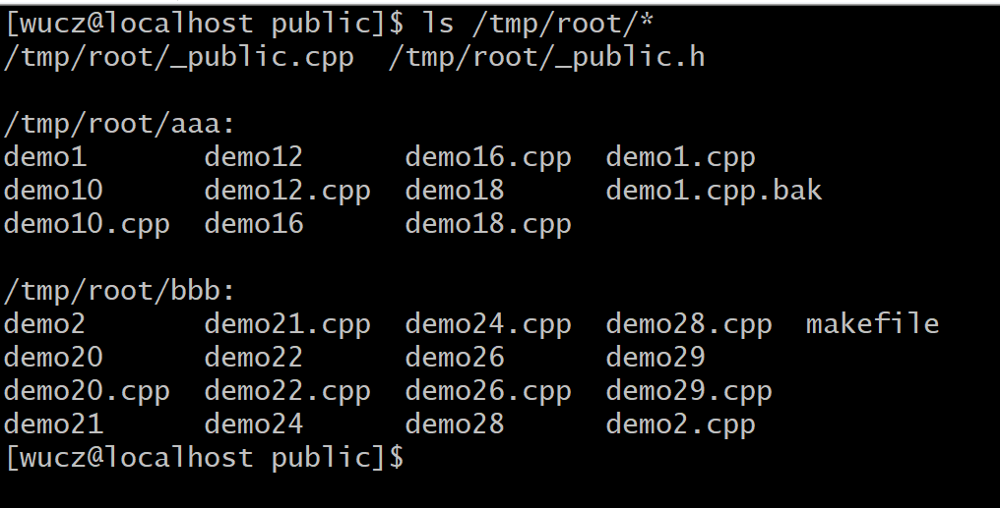
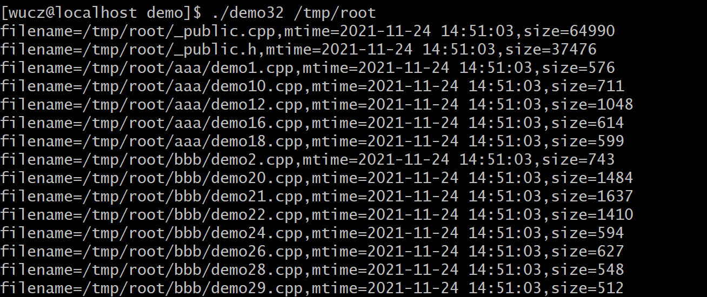

# 一、源代码说明

本文介绍的是开发框架的目录操作函数和类。

开发框架函数和类的声明文件是/project/public/_public.h。

开发框架函数和类的定义文件是/project/public/_public.h.cpp。

示例程序位于/project/public/demo目录中。

编译规则文件是/project/public/demo/makefile。

# 二、创建目录

 在Linux下，如果想创建一个"/tmp/aaa/bbb/ccc/ddd/data.xml"的文件，必须先创建"/tmp/aaa/bbb/ccc/ddd"，步骤如下：

1）如果"/tmp"目录不存在，创建"/tmp"。

2）如果"/tmp/aaa"目录不存在，创建"/tmp/aaa"。

3）如果"/tmp/aaa/bbb"目录不存在，创建"/tmp/aaa/bbb"。

4）如果"/tmp/aaa/bbb/ccc"目录不存在，创建"/tmp/aaa/bbb/ccc"。

5）如果"/tmp/aaa/bbb/ccc/ddd"目录不存在，创建"/tmp/aaa/bbb/ccc/ddd"。

6）创建"/tmp/aaa/bbb/ccc/ddd/data.xml"文件。

这些操作虽然没有多少技术含量，但也很烦人。

MKDIR函数根据绝对路径的文件名或目录名逐级的创建目录。

函数声明：

```c++
bool MKDIR(const char *pathorfilename,bool bisfilename=true);
```

参数说明：

pathorfilename：绝对路径的文件名或目录名。

bisfilename：说明pathorfilename的类型，true-pathorfilename是文件名，否则是目录名，缺省值为true。

返回值：true-创建成功，false-创建失败，如果返回失败，原因有大概有三种情况：1）权限不足；2）pathorfilename参数不是合法的文件名或目录名；3）磁盘空间不足。

**示例（demo30.cpp）**

```c++
/*

 \* 程序名：demo30.cpp，此程序演示开发框架中采用MKDIR函数根据绝对路径的文件名或目录名逐级的创建目录。

*/

\#include "../_public.h"

 

int main()

{

 MKDIR("/tmp/aaa/bbb/ccc/ddd",false);  // 创建"/tmp/aaa/bbb/ccc/ddd"目录。

 

 MKDIR("/tmp/111/222/333/444/data.xml",true);  // 创建"/tmp/111/222/333/444"目录。

}
```

# 三、获取目录下的文件信息

开发框架把获取某目录及其子目录中的文件列表信息的功能封装成CDir类。

类的声明：

```c++
// 获取某目录及其子目录中的文件列表信息。

class CDir

{

public:

 char m_DirName[301];    // 目录名，例如：/tmp/root。

 char m_FileName[301];    // 文件名，不包括目录名，例如：data.xml。

 char m_FullFileName[301];  // 文件全名，包括目录名，例如：/tmp/root/data.xml。

 int m_FileSize;       // 文件的大小，单位：字节。

 char m_ModifyTime[21];   // 文件最后一次被修改的时间，即stat结构体的st_mtime成员。

 char m_CreateTime[21];   // 文件生成的时间，即stat结构体的st_ctime成员。

 char m_AccessTime[21];   // 文件最后一次被访问的时间，即stat结构体的st_atime成员。

 char m_DateFMT[21];     // 文件时间显示格式，由SetDateFMT方法设置。

 

 vector<string> m_vFileName; // 存放OpenDir方法获取到的文件名（文件全名，包括目录名）列表。

 int m_pos;         // 已读取m_vFileName容器的位置，每调用一次ReadDir方法m_pos加1。

 

 CDir(); // 构造函数。

 

 void initdata(); // 初始化成员变量。

 

 // 设置文件时间的格式，支持"yyyy-mm-dd hh24:mi:ss"和"yyyymmddhh24miss"两种，缺省是前者。

 void SetDateFMT(const char *in_DateFMT);

 

 // 打开目录，获取目录中的文件列表信息，存放于m_vFileName容器中。

 // in_DirName，待打开的目录名，采用绝对路径，如/tmp/root。

 // in_MatchStr，待获取文件名的匹配规则，不匹配的文件被忽略。

 // in_MaxCount，获取文件的最大数量，缺省值为10000个。

 // bAndChild，是否打开各级子目录，缺省值为false-不打开子目录。

 // bSort，是否对获取到的文件列表（即m_vFileName容器中的内容）进行排序，缺省值为false-不排序。

 // 返回值：如果in_DirName参数指定的目录不存在，OpenDir方法会创建该目录，如果创建失败，返回false，还有，如果当前用户对in_DirName目录下的子目录没有读取权限也会返回false，其它正常情况下都会返回true。

 bool OpenDir(const char *in_DirName,const char *in_MatchStr,const unsigned int in_MaxCount=10000,const bool bAndChild=false,bool bSort=false);

 

 // 这是一个递归函数，用于OpenDir()的调用，在CDir类的外部不需要调用它。

 bool _OpenDir(const char *in_DirName,const char *in_MatchStr,const unsigned int in_MaxCount,const bool bAndChild);

 

 // 从m_vFileName容器中获取一条记录（文件名），同时得到该文件的大小、修改时间等信息。

 // 调用OpenDir方法时，m_vFileName容器被清空，m_pos归零，每调用一次ReadDir方法m_pos加1。

 // 当m_pos小于m_vFileName.size()，返回true，否则返回false。

 bool ReadDir();

 

 ~CDir(); // 析构函数。

};
```


CDir类的成员变量和函数的说明文字在类的声明中已详细描述。

我们通过一个应用场景来演示CDir类的用法。

先执行以下脚本生成测试目录和文件。

```shell
mkdir /tmp/root

mkdir /tmp/root/aaa

mkdir /tmp/root/bbb

cd /project/public

cp _public.* /tmp/root/.

cp demo/demo1* /tmp/root/aaa/.

cp demo/demo2* /tmp/root/bbb/.

cp demo/makefile /tmp/root/bbb/.
```


执行以上脚本后，在/tmp/root目录中的目录和文件列表如下：

​                                

**示例（demo32.cpp）**

```c++
/*

 \* 程序名：demo32.cpp，此程序演示开发框架中采用CDir类获取某目录及其子目录中的文件列表信息。

 \* 作者：吴从周

*/

\#include "../_public.h"

 

int main(int argc,char *argv[])

{

 if (argc != 2) { printf("请指定目录名。\n"); return -1; }

 

 CDir Dir;

 

 if (Dir.OpenDir(argv[1],"*.h,*cpp",100,true,true)==false)

 {

  printf("Dir.OpenDir(%s) failed.\n",argv[1]); return -1;

 }

 

 while(Dir.ReadDir()==true)

 {

  printf("filename=%s,mtime=%s,size=%d\n",Dir.m_FullFileName,Dir.m_ModifyTime,Dir.m_FileSize);

 }

}
```


**运行效果**



注意事项：

1）每次调用ReadDir方法后，把CDir类其它成员变量的值输出到屏幕，观察运行效果。

2）OpenDir方法的in_MatchStr参数非常重要，在实际开发中应用广泛。

3）如果文件名圆点"."打头，OpenDir方法将不读取这些文件，如果您希望读取这些文件，可以修改_OpenDir方法中的源代码。

4）OpendDir方法的in_MaxCount参数设置了每次扫描目录中的文件数量，建议不超过10000，如果取值过大，打开目录的时间会比较长，还会消耗比较多的内存。

5）OpenDir的bSort参数设置是否对m_vFileName容器进行排序，排序会消耗资源和时间，可以不排序就不排序。