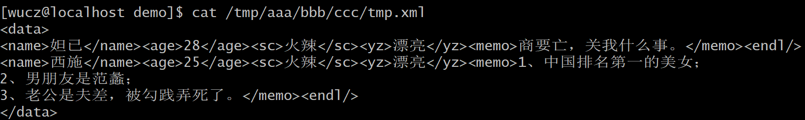
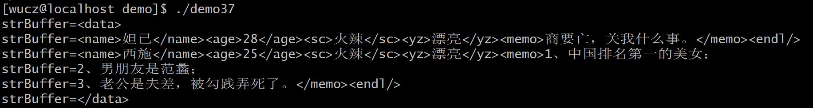
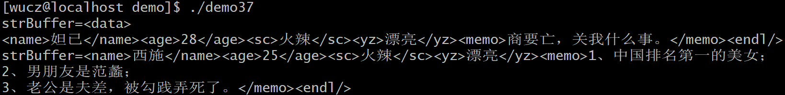
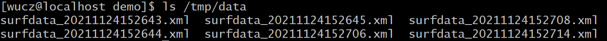
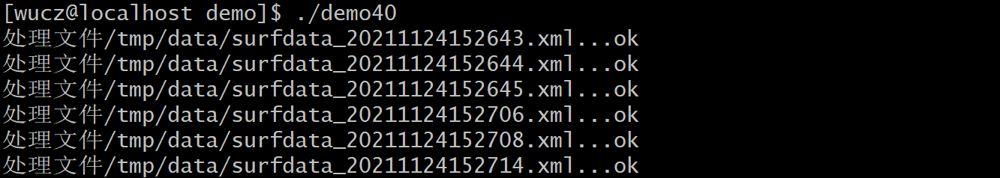

# 一、源代码说明

本文介绍的是开发框架的文件操作的函数和类。

开发框架函数和类的声明文件是/project/public/_public.h。

开发框架函数和类的定义文件是/project/public/_public.h.cpp。

示例程序位于/project/public/demo目录中。

编译规则文件是/project/public/demo/makefile。

# 二、文件操作函数

## 1、删除文件

删除目录中的文件，类似Linux系统的rm命令。

函数声明：

```c++
bool REMOVE(const char *filename,const int times=1);
```

参数说明：

filename：待删除的文件名，建议采用绝对路径的文件名，例如/tmp/root/data.xml。

times：执行删除文件的次数，缺省是1，建议不要超过3，从实际应用的经验看来，如果删除文件第1次不成功，再尝试2次是可以的，更多次就意义不大了。还有，如果执行删除失败，usleep(100000)后再重试。

返回值：true-删除成功；false-删除失败，失败的主要原因是权限不足。

在应用开发中，可以用REMOVE函数代替remove库函数。

## 2、文件重命名

把文件重命名，类似Linux系统的mv命令。

函数声明：

```c++
bool RENAME(const char *srcfilename,const char *dstfilename,const int times=1);
```

参数说明：

srcfilename：原文件名，建议采用绝对路径的文件名。

destfilename：目标文件名，建议采用绝对路径的文件名。

times：执行重命名文件的次数，缺省是1，建议不要超过3，从实际应用的经验看来，如果重命名文件第1次不成功，再尝试2次是可以的，更多次就意义不大了。还有，如果执行重命名失败，usleep(100000)后再重试。

 返回值：true-重命名成功；false-重命名失败，失败的主要原因是权限不足或磁盘空间不够，如果原文件和目标文件不在同一个磁盘分区，重命名也可能失败。

注意，在重命名文件之前，会自动创建destfilename参数中的目录名。

在应用开发中，可以用RENAME函数代替rename库函数。

## 3、复制文件

复制文件，类似Linux系统的cp命令。

函数声明：

```c++
bool COPY(const char *srcfilename,const char *dstfilename);
```

参数说明：

srcfilename：原文件名，建议采用绝对路径的文件名。

destfilename：目标文件名，建议采用绝对路径的文件名。

返回值：true-复制成功；false-复制失败，失败的主要原因是权限不足或磁盘空间不够。

注意：

1）在复制名文件之前，会自动创建destfilename参数中的目录名。

2）复制文件的过程中，采用临时文件命名的方法，复制完成后再改名为destfilename，避免中间状态的文件被读取。

3）复制后的文件的时间与原文件相同，这一点与Linux系统cp命令不同。

## 4、获取文件的大小

函数声明：

```c++
int FileSize(const char *filename);
```

参数说明：

filename：待获取的文件名，建议采用绝对路径的文件名。

返回值：如果文件不存在或没有访问权限，返回-1，成功返回文件的大小，单位是字节。

## 5、获取文件的时间

函数声明：

```c++
bool FileMTime(const char *filename,char *mtime,const char *fmt=0);
```

参数说明：

filename：待获取的文件名，建议采用绝对路径的文件名。

mtime：用于存放文件的时间，即stat结构体的st_mtime。

fmt：设置时间的输出格式，与LocalTime函数相同，但缺省是"yyyymmddhh24miss"。

返回值：如果文件不存在或没有访问权限，返回false，成功返回true。

## 6、重置文件的时间

函数声明：

```c++
int UTime(const char *filename,const char *mtime);
```

参数说明：

filename：待重置的文件名，建议采用绝对路径的文件名。

stime：字符串表示的时间，格式不限，但一定要包括yyyymmddhh24miss，一个都不能少。

返回值：true-成功；false-失败，失败的原因保存在errno中。

## 7、示例程序

**示例（demo34.cpp）**

```c++
/*

 \* 程序名：demo34.cpp，此程序演示开发框架的文件操作函数的用法

*/

\#include "../_public.h"

 

int main()

{

 // 删除文件。

 if (REMOVE("/tmp/root/_public.h")==false)

 {

  printf("REMOVE(/tmp/root/_public.h) %d:%s\n",errno,strerror(errno));

 }

 

 // 重命名文件。

 if (RENAME("/tmp/root/_public.cpp","/tmp/root/aaa/bbb/ccc/_public.cpp")==false)

 {

  printf("RENAME(/tmp/root/_public.cpp) %d:%s\n",errno,strerror(errno));

 }

 

 // 复制文件。

 if (COPY("/project/public/_public.h","/tmp/root/aaa/bbb/ccc/_public.h")==false)

 {

  printf("COPY(/project/public/_public.h) %d:%s\n",errno,strerror(errno));

 }

 

 // 获取文件的大小。

 printf("size=%d\n",FileSize("/project/public/_public.h"));

 

 // 重置文件的时间。

 UTime("/project/public/_public.h","2020-01-05 13:37:29");

 

 // 获取文件的时间。

 char mtime[21]; memset(mtime,0,sizeof(mtime));

 FileMTime("/project/public/_public.h",mtime,"yyyy-mm-dd hh24:mi:ss");

 printf("mtime=%s\n",mtime);  // 输出mtime=2020-01-05 13:37:29

}
```


## 8、打开文件

函数声明：

```c++
FILE *FOPEN(const char *filename,const char *mode);
```

参数说明：

FOPEN函数调用fopen库函数打开文件，如果文件名中包含的目录不存在，就创建目录。

FOPEN函数的参数和返回值与fopen函数完全相同。

在应用开发中，用FOPEN函数代替fopen库函数。

## 9、读取文件

从文本文件中读取一行。

函数声明：

```c++
bool FGETS(const FILE *fp,char *buffer,const int readsize,const char *endbz=0);
```

参数说明：

fp：已打开的文件指针。

buffer：用于存放读取的内容。

readsize：本次打算读取的字节数，如果已经读取到了结束标志，函数返回。

endbz：行内容结束的标志，缺省为空，表示行内容以"\n"为结束标志。

返回值：true-成功；false-失败，一般情况下，失败可以认为是文件已结束。

## 10、示例程序

**示例（demo36.cpp）**

```c++
/*

 \* 程序名：demo36.cpp，此程序演示开发框架中FOPEN函数的用法。

*/

\#include "../_public.h"

 

int main()

{

 FILE *fp=0;

 

 // 用FOPEN函数代替fopen库函数，如果目录/tmp/aaa/bbb/ccc不存在，会创建它。

 if ( (fp=FOPEN("/tmp/aaa/bbb/ccc/tmp.xml","w"))==0)  

 {

  printf("FOPEN(/tmp/aaa/bbb/ccc/tmp.xml) %d:%s\n",errno,strerror(errno)); return -1;

 }

 

 // 向文件中写入两行超女数据。

 fprintf(fp,"<data>\n"\

   "<name>妲已</name><age>28</age><sc>火辣</sc><yz>漂亮</yz><memo>商朝要亡，关我什么事。</memo><endl/>\n"\

   "<name>西施</name><age>25</age><sc>火辣</sc><yz>漂亮</yz><memo>1、中国排名第一的美女；\n"\

   "2、男朋友是范蠡；\n"\

   "3、老公是夫差，被勾践弄死了。</memo><endl/>\n"\

   "</data>\n");

 

 fclose(fp); // 关闭文件。

}
```


demo36.cpp程序生成了数据文件/tmp/aaa/bbb/ccc/tmp.xml，数据内容如下：

​                               

以上数据文件只有两条有效的记录，但是第二条数据是跨多行的，在memo标签里，文字和换行符都是内容的一部分。

**示例（demo37.cpp）**

```c++
/*

 \* 程序名：demo37.cpp，此程序演示开发框架中FGETS函数的用法。

*/

\#include "../_public.h"

 

int main()

{

 FILE *fp=0;

 

 if ( (fp=FOPEN("/tmp/aaa/bbb/ccc/tmp.xml","r"))==0)

 {

  printf("FOPEN(/tmp/aaa/bbb/ccc/tmp.xml) %d:%s\n",errno,strerror(errno)); return -1;

 }

 

 char strBuffer[301];

 

 while (true)

 {

  memset(strBuffer,0,sizeof(strBuffer));

  if (FGETS(fp,strBuffer,300)==false) break;   // 行内容以"\n"结束。

  //if (FGETS(fp,strBuffer,300,"<endl/>")==false) break; // 行内容以"<endl/>"结束。

 

  printf("strBuffer=%s",strBuffer);

 }

 

 fclose(fp);

}c
```


**运行效果**

 

第二条记录的内容不完整，这并不是程序员想要的结果，如果demo37.cpp启用以下代码：

```c++
  if (FGETS(fp,strBuffer,300,"<endl/>")==false) break; // 行内容以"<endl/>"结束。
```


**运行效果**

 

这才是程序员想要的结果。

# 三、CFile类

CFile类根据实际开发中的应用场景，对常用的文件操作功能做了封装。

我们来先介绍类的声明，然后再列出常用应用场景的示例。

## 1、类的声明

```c++
// 文件操作类声明

class CFile

{

private:

 FILE *m_fp;    // 文件指针

 bool m_bEnBuffer; // 是否启用缓冲，true-启用；false-不启用，缺省是启用。

 char m_filename[301]; // 文件名，建议采用绝对路径的文件名。

 char m_filenametmp[301]; // 临时文件名，在m_filename后加".tmp"。

 

public:

 CFile();  // 类的构造函数。

 ~CFile();  // 类的析构函数。

 

 bool IsOpened(); // 判断文件是否已打开，返回值：true-已打开；false-未打开。

 

 // 打开文件。

 // filename：待打开的文件名，建议采用绝对路径的文件名。

 // openmode：打开文件的模式，与fopen库函数的打开模式相同。

 // bEnBuffer：是否启用缓冲，true-启用；false-不启用，缺省是启用。

 // 注意：如果待打开的文件的目录不存在，就会创建目录。

 bool Open(const char *filename,const char *openmode,bool bEnBuffer=true);

 

 // 关闭文件指针，并删除文件。

 bool CloseAndRemove();

 

 // 专为重命名而打开文件，参数与Open方法相同。

 // 注意：OpenForRename打开的是filename后加".tmp"的临时文件，所以openmode只能是"a"、"a+"、"w"、"w+"。

 bool OpenForRename(const char *filename,const char *openmode,bool bEnBuffer=true);

 // 关闭文件指针，并把OpenForRename方法打开的临时文件名重命名为filename。

 bool CloseAndRename();

 

 // 调用fprintf向文件写入数据，参数与fprintf库函数相同，但不需要传入文件指针。

 void Fprintf(const char *fmt,...);

 

 // 从文件中读取以换行符"\n"结束的一行。

 // buffer：用于存放读取的内容。

 // readsize：本次打算读取的字节数，如果已经读取到了结束标志"\n"，函数返回。

 // bdelcrt：是否删除行结束标志，true-删除；false-不删除，缺省值是false。

 // 返回值：true-成功；false-失败，一般情况下，失败可以认为是文件已结束。

 bool Fgets(char *buffer,const int readsize,bool bdelcrt=false);

 

 // 从文件文件中读取一行。

 // buffer：用于存放读取的内容。

 // readsize：本次打算读取的字节数，如果已经读取到了结束标志，函数返回。

 // endbz：行内容结束的标志，缺省为空，表示行内容以"\n"为结束标志。

 // 返回值：true-成功；false-失败，一般情况下，失败可以认为是文件已结束。

 bool FFGETS(char *buffer,const int readsize,const char *endbz=0);

 

 // 从文件中读取数据块。

 // ptr：用于存放读取的内容。

 // size：本次打算读取的字节数。

 // 返回值：本次从文件中成功读取的字节数，如果文件未结束，返回值等于size，如果文件已结束，返回值为实际读取的字节数。

 size_t Fread(void *ptr,size_t size);

 

 // 向文件中写入数据块。

 // ptr：待写入数据的地址。

 // size：待写入数据的字节数。

 // 返回值：本次成功写入的字节数，如果磁盘空间足够，返回值等于size。

 size_t Fwrite(const void *ptr,size_t size);

 

 // 关闭文件指针，如果存在临时文件，就删除它。

 void Close();

};
```


## 2、应用场景示例

在CFile类中，每个成员变量和函数都很容易理解，但不一定能准确的用于应用开发的场景中，我现在列出两个常用的场景。

**场景一：某程序每隔若干时间就会产生一批数据，并把这些数据写入文件中。**

程序的流程如下：

1）创建数据文件；

2）往文件中写入数据；

3）关闭数据文件。

如果程序这么写，得0分，因为这个流程存在一个严重的问题，那就是在第2）步往文件中写入数据需要时间，从创建文件到写入完成之前，这个文件的内容是不完整的，如果这个不完整的文件被其它程序读取了，怎么办？给文件加锁？用标志位区分？太麻烦。

假设待写入的数据文件名是/tmp/data/surfdata_20200101123000.txt，修改后的程序流程如下：

1）创建临时文件/tmp/data/surfdata_20200101123000.txt.tmp，注意，临时文件是以.tmp命名的；

2）往临时文件中写入数据；

3）关闭临时文件；

4）把临时文件/tmp/data/surfdata_20200101123000.txt.tmp重命名为正式文件/tmp/data/surfdata_20200101123000.txt。

**示例（demo39.cpp）**

```c++
/*

 \* 程序名：demo39.cpp，此程序演示开发框架中采用CFile类生成数据文件的用法。

*/

\#include "../_public.h"

 

int main()

{

 CFile File;

 

 char strLocalTime[21];  // 用于存放系统当前的时间，格式yyyymmddhh24miss。

 memset(strLocalTime,0,sizeof(strLocalTime));

 LocalTime(strLocalTime,"yyyymmddhh24miss"); // 获取系统当前时间。

 

 // 生成绝对路径的文件名，目录/tmp/data，文件名：前缀(surfdata_)+时间+后缀(.xml)。

 char strFileName[301];

 SNPRINTF(strFileName,sizeof(strFileName),300,"/tmp/data/surfdata_%s.xml",strLocalTime);

 

 // 采用OpenForRename创建文件，实际创建的文件名例如/tmp/data/surfdata_20200101123000.xml.tmp。

 if (File.OpenForRename(strFileName,"w")==false)

 {

  printf("File.OpenForRename(%s) failed.\n",strFileName); return -1;

 }

 

 // 这里可以插入向文件写入数据的代码。

 // 写入文本数据用Fprintf方法，写入二进制数据用Fwrite方法。

 

 // 向文件中写入两行超女数据。

 File.Fprintf("<data>\n"\

   "<name>妲已</name><age>28</age><sc>火辣</sc><yz>漂亮</yz><memo>商要亡，关我什么事。</memo><endl/>\n"\

   "<name>西施</name><age>25</age><sc>火辣</sc><yz>漂亮</yz><memo>1、中国排名第一的美女；\n"\

   "2、男朋友是范蠡；\n"\

   "3、老公是夫差，被勾践弄死了。</memo><endl/>\n"\

   "</data>\n");

 

 sleep(30);  // 停止30秒，用ls /tmp/data/*.tmp可以看到生成的临时文件。

 

 // 关闭文件指针，并把临时文件名改为正式的文件名。

 // 注意，不能用File.Close()，因为Close方法是关闭文件指针，并删除临时文件。

 // CFile类的析构函数调用的是Close方法。

 File.CloseAndRename();

}
```


每运行一次demo39程序，就会在/tmp/data目录下生成一个数据文件，如下：

 

**场景二：从目录中读取场景一生成的数据文件，解析处理后保存到数据库中，然后删除目录中的文件。**

我们利用demo39程序生成的数据来测试。

**示例（demo40.cpp）**

```c++
/*

 \* 程序名：demo40.cpp，此程序演示开发框架中采用CDir类和CFile类处理数据文件的用法。

*/

\#include "../_public.h"

 

int main()

{

 CDir Dir;

 

 // 扫描/tmp/data目录下文件名匹配"surfdata_*.xml"的文件。

 if (Dir.OpenDir("/tmp/data","surfdata_*.xml")==false)

 {

  printf("Dir.OpenDir(/tmp/data) failed.\n"); return -1;

 }

 

 CFile File;

 

 while (Dir.ReadDir()==true)

 {

  printf("处理文件%s...",Dir.m_FullFileName);

 

  if (File.Open(Dir.m_FullFileName,"r")==false)

  {

   printf("failed.File.Open(%s) failed.\n",Dir.m_FullFileName); return -1;

  }

 

  char strBuffer[301];

 

  while (true)

  {

   memset(strBuffer,0,sizeof(strBuffer));

   if (File.FFGETS(strBuffer,300,"<endl/>")==false) break; // 行内容以"<endl/>"结束。

 

   // printf("strBuffer=%s",strBuffer);

 

   // 这里可以插入解析xml字符串并把数据写入数据库的代码。

  }

 

  // 处理完文件中的数据后，关闭文件指针，并删除文件。

  File.CloseAndRemove();

 

  printf("ok\n");

 }

}
```


**运行效果**



 