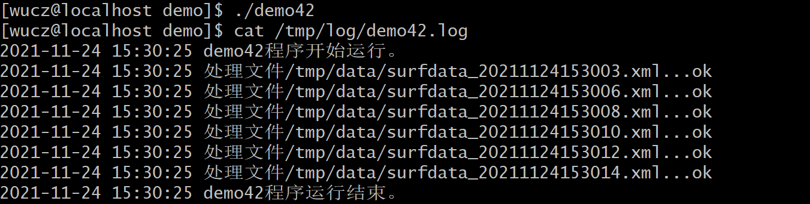
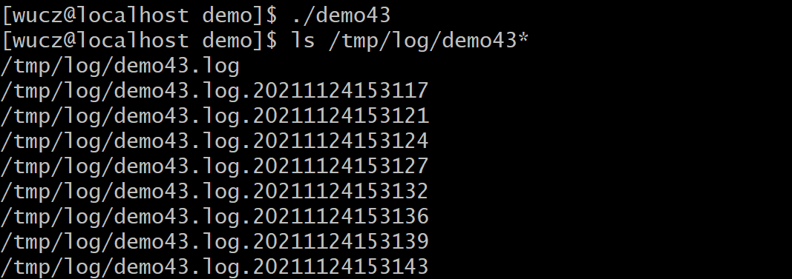

# 一、源代码说明

本文介绍的是开发框架中日志文件操作的方法。

开发框架函数和类的声明文件是/project/public/_public.h。

开发框架函数和类的定义文件是/project/public/_public.h.cpp。

示例程序位于/project/public/demo目录中。

编译规则文件是/project/public/demo/makefile。

# 二、日志文件的意义

对于C/C++服务程序来说，程序运行在后台，没有操作界面，无人值守，程序运行的状态、数据处理的日志、程序的异常等必须记录在日志文件中，运维人员根据日志文件的内容，查看程序运行和数据处理的情况。

# 三、CLogFile类

CLogFile类用于服务程序记录程序的运行日志。

## 1、类的声明

```c++
// 日志文件操作类

class CLogFile

{

public:

 FILE  *m_tracefp;      // 日志文件指针。

 char  m_filename[301];   // 日志文件名，建议采用绝对路径。

 char  m_openmode[11];   // 日志文件的打开方式，一般采用"a+"。

 bool  m_bEnBuffer;     // 写入日志时，是否启用操作系统的缓冲机制，缺省不启用。

 long  m_MaxLogSize;    // 最大日志文件的大小，单位M，缺省100M。

 bool  m_bBackup;      // 是否自动切换，日志文件大小超过m_MaxLogSize将自动切换，缺省启用。

 

 // MaxLogSize：最大日志文件的大小，单位M，缺省100M，最小为10M。

 CLogFile(const long MaxLogSize=100); 

 

 // 打开日志文件。

 // filename：日志文件名，建议采用绝对路径，如果文件名中的目录不存在，就先创建目录。

 // openmode：日志文件的打开方式，与fopen库函数打开文件的方式相同，缺省值是"a+"。

 // bBackup：是否自动切换，true-切换，false-不切换，在多进程的服务程序中，如果多个进行共用一个日志文件，bBackup必须为false。

 // bEnBuffer：是否启用文件缓冲机制，true-启用，false-不启用，如果启用缓冲区，那么写进日志文件中的内容不会立即写入文件，缺省是不启用。

 bool Open(const char *filename,const char *openmode=0,bool bBackup=true,bool bEnBuffer=false);

 

 // 如果日志文件大于100M，就把当前的日志文件备份成历史日志文件，切换成功后清空当前日志文件的内容。

 // 备份后的文件会在日志文件名后加上日期时间。

 // 注意，在多进程的程序中，日志文件不可切换，多线的程序中，日志文件可以切换。

 bool BackupLogFile();

 

 // 把内容写入日志文件，fmt是可变参数，使用方法与printf库函数相同。

 // Write方法会写入当前的时间，WriteEx方法不写时间。

 bool Write(const char *fmt,...);

 bool WriteEx(const char *fmt,...);

 

 // 关闭日志文件

 void Close();

 

 ~CLogFile(); // 析构函数会调用Close方法。

};
```


## 2、示例程序

**示例（demo42.cpp）**

```c++
/*

 \* 程序名：demo42.cpp，此程序演示采用开发框架的CLogFile类记录程序的运行日志。

 \* 本程序修改demo40.cpp把输出的printf语句改为写日志文件。

*/

\#include "../_public.h"

 

int main()

{

 CLogFile logfile;

 

 // 打开日志文件，如果"/tmp/log"不存在，就创建它，但是要确保当前用户具备创建目录的权限。

 if (logfile.Open("/tmp/log/demo42.log")==false)

 { printf("logfile.Open(/tmp/log/demo42.log) failed.\n"); return -1; }

 

 logfile.Write("demo42程序开始运行。\n");

 

 CDir Dir;

 

 // 扫描/tmp/data目录下文件名匹配"surfdata_*.xml"的文件。

 if (Dir.OpenDir("/tmp/data","surfdata_*.xml")==false)

 { logfile.Write("Dir.OpenDir(/tmp/data) failed.\n"); return -1; }

 

 CFile File;

 

 while (Dir.ReadDir()==true)

 {

  logfile.Write("处理文件%s...",Dir.m_FullFileName);

 

  if (File.Open(Dir.m_FullFileName,"r")==false)

  { logfile.WriteEx("failed.File.Open(%s) failed.\n",Dir.m_FullFileName); return -1; }

 

  // 这里可以插入读取数据文件的内容、解析xml字符串并把数据写入数据库的代码。

  // 读取文本数据用Fgets和FFGETS方法，读取二进制数据用Fread方法。

  // 具体的代码我就不写了。

 

  // 处理完文件中的数据后，关闭文件指针，并删除文件。

  File.CloseAndRemove();

 

  logfile.WriteEx("ok\n");

 }

 

 logfile.Write("demo42程序运行结束。\n");

}
```


先运行demo39程序，在/tmp/data目录中生成几个数据文件，然后运行demo42，将生成日志文件/tmp/log/demo42.log，内容如下：



## 3、日志文件的切换

我们通过一个示例程序的演示日志文件的切换功能，往日志文件中写入一千万数据，让它产生切换。

**示例（demo43.cpp）**

```c++
/*

 \* 程序名：demo43.cpp，此程序演示开发框架的CLogFile类的日志文件的切换。

*/

\#include "../_public.h"

 

int main()

{

 CLogFile logfile;

 

 // 打开日志文件，如果"/tmp/log"不存在，就创建它，但是要确保当前用户具备创建目录的权限。

 if (logfile.Open("/tmp/log/demo43.log")==false)

 { printf("logfile.Open(/tmp/log/demo43.log) failed.\n"); return -1; }

 

 logfile.Write("demo43程序开始运行。\n");

 

 // 让程序循环10000000，生成足够大的日志。

 for (int ii=0;ii<10000000;ii++)

 {

  logfile.Write("本程序演示日志文件的切换，这是第%010d条记录。\n",ii);

 }

 

 logfile.Write("demo43程序运行结束。\n");

}
```


运行demo43，将在/tmp/log目录中产生一批日志文件，用ls -l /tmp/log查看如下：



 

