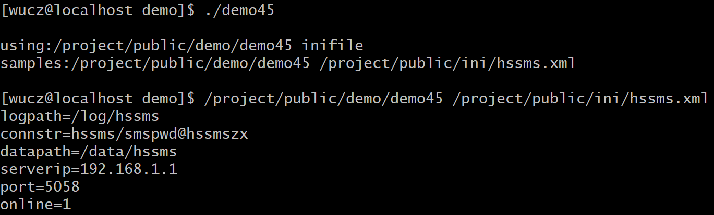

# 一、源代码说明

本文介绍的是开发框架中加载参数文件的方法。

开发框架函数和类的声明文件是/project/public/_public.h。

开发框架函数和类的定义文件是/project/public/_public.h.cpp。

示例程序位于/project/public/demo目录中。

编译规则文件是/project/public/demo/makefile。

# 二、参数文件的意义

在项目开发中，一个完整的系统由多个C/C++服务程序组成，这些服务程序有共同的参数，例如数据库的连接参数、日志文件存放的目录、数据文件存放的目录等。

传统的方法是把参数放在文本文件中，例如hssms.ini，格式如下：

```shell
logpath=/log/hssms       # 日志文件存放的目录。

connstr=hssms/smspwd@hssmszx # 数据库连接参数。

datapath=/data/hssms      # 数据文件存放的根目录。

serverip=192.168.1.1       # 中心服务器的ip地址。

port=5058             # 中心服务器的通信端口。

online=true            # 是否采用长连接。
```


现在有更好的方法是把参数放在xml文件中，例如hssms.xml，格式如下：

```xml
<?xml version="1.0" encoding="gbk" ?>

<root>

  <!-- 程序运行的日志文件名。 -->

  <logpath>/log/hssms</logpath>

 

  <!-- 数据库连接参数。 -->

  <connstr>hssms/smspwd@hssmszx</connstr>

 

  <!-- 数据文件存放的根目录。 -->

  <datapath>/data/hssms</datapath>

 

  <!-- 中心服务器的ip地址。 -->

  <serverip>192.168.1.1</serverip>

 

  <!-- 中心服务器的通信端口。 -->

  <port>5058</port>

 

  <!-- 是否采用长连接，true-是；false-否。 -->

  <online>true</online>

</root>
```


一般来说，一个项目是由多种语言开发完成，xml文件格式比传统的ini文件格式更方便。

# 三、CIniFile类

CIniFile类用于服务程序从参数文件中加载参数。

## 1、类的声明

```c++
// 参数文件操作类。

// CIniFile类操作的是xml格式的参数文件，并不是传统的ini文件。

class CIniFile

{

public:

 // 存放参数文件全部的内容，由LoadFile载入到本变量中。

 string m_xmlbuffer;

 

 CIniFile();

 

 // 把参数文件的内容载入到m_xmlbuffer变量中。

 bool LoadFile(const char *filename);

 

 // 获取参数文件字段的内容。

 // fieldname：字段的标签名。

 // value：传入变量的地址，用于存放字段内容，支持bool、int、insigned int、long、unsigned long、double和char[]。

 // 注意，当value参数的数据类型为char []时，必须保证value数组的内存足够，否则可能发生内存溢出的问题，

 // 也可以用ilen参数限定获取字段内容的长度，ilen的缺省值为0，表示不限定获取字段内容的长度。

 // 返回值：true-获取成功；false-获取失败。

 bool GetValue(const char *fieldname,bool *value);

 bool GetValue(const char *fieldname,int *value);

 bool GetValue(const char *fieldname,unsigned int *value);

 bool GetValue(const char *fieldname,long *value);

 bool GetValue(const char *fieldname,unsigned long *value);

 bool GetValue(const char *fieldname,double *value);

 bool GetValue(const char *fieldname,char *value,const int ilen=0);

};
```


## 2、示例程序

**示例（demo45.cpp）**

```c++
/*

 \* 程序名：demo45.cpp，此程序演示采用开发框架的CIniFile类加载参数文件。

*/

\#include "../_public.h"

 

// 用于存放本程序运行参数的数据结构。

struct st_args

{

 char logpath[301];

 char connstr[101];

 char datapath[301];

 char serverip[51];

 int port;

 bool online;

}stargs;

 

int main(int argc,char *argv[])

{

 // 如果执行程序时输入的参数不正确，给出帮助信息。

 if (argc != 2) 

 { 

  printf("\nusing:/project/public/demo/demo45 inifile\n"); 

  printf("samples:/project/public/demo/demo45 /project/public/ini/hssms.xml\n\n");

  return -1;

 }

 

 // 加载参数文件。

 CIniFile IniFile;

 if (IniFile.LoadFile(argv[1])==false)

 {

  printf("IniFile.LoadFile(%s) failed.\n",argv[1]); return -1;

 } 

 

 // 获取参数，存放在stargs结构中。

 memset(&stargs,0,sizeof(struct st_args));

 IniFile.GetValue("logpath",stargs.logpath,300);

 IniFile.GetValue("connstr",stargs.connstr,100);

 IniFile.GetValue("datapath",stargs.datapath,300);

 IniFile.GetValue("serverip",stargs.serverip,50);

 IniFile.GetValue("port",&stargs.port);

 IniFile.GetValue("online",&stargs.online);

 

 printf("logpath=%s\n",stargs.logpath);

 printf("connstr=%s\n",stargs.connstr);

 printf("datapath=%s\n",stargs.datapath);

 printf("serverip=%s\n",stargs.serverip);

 printf("port=%d\n",stargs.port);

 printf("online=%d\n",stargs.online);

 

 // 以下可以写更多的主程序的代码。

}
```


**运行效果**



